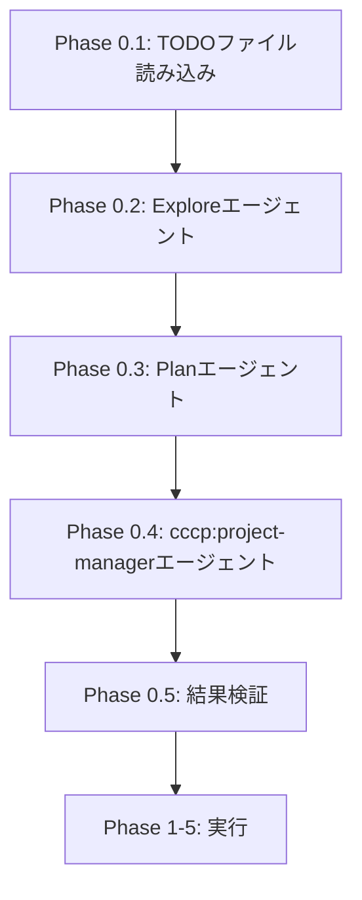
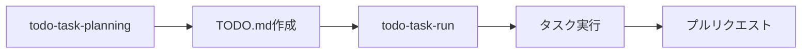
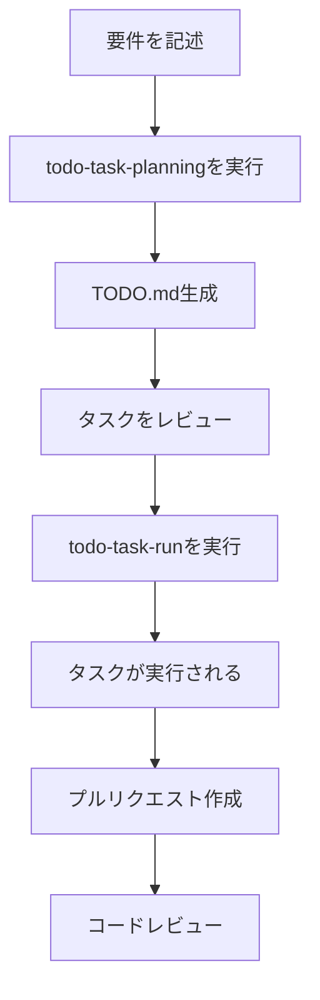

# TODOタスクワークフロー - 包括的ハウツーガイド

## 概要

[Phase 3で完成予定]

## TODO.mdファイルの作成

[Phase 2で完成予定]

### 基本的なTODO.mdフォーマット

[Phase 2.1で完成予定]

### タスク粒度のガイドライン

[Phase 2.2で完成予定]

### TODOタスクにおけるYAGNI原則

[Phase 2.3で完成予定]

### 完全なTODO.md実例

[Phase 2.4で完成予定]

## todo-task-planningコマンドの使用方法

[Phase 3で完成予定]

### コマンド概要

[Phase 3.1で完成予定]

### オプション: --branch と --pr

[Phase 3.2で完成予定]

### Phase 0処理フロー

[Phase 3.3で完成予定]

#### ワークフロー図

### 使用例とベストプラクティス

[Phase 3.4で完成予定]

## todo-task-runコマンドの使用方法

[Phase 4で完成予定]

### コマンド概要

[Phase 4.1で完成予定]

#### ワークフロー図

### 処理フロー

[Phase 4.2で完成予定]

### オプション: --no-pr と --no-push

[Phase 4.3で完成予定]

### micro-commit連携

[Phase 4.4で完成予定]

## ベストプラクティスと実例

[Phase 5で完成予定]

### 完全なワークフロー例

[Phase 5.1で完成予定]

#### 全体ワークフロー図

### よくある使用パターン

[Phase 5.2で完成予定]

### トラブルシューティング

[Phase 5.3で完成予定]

## 付録

### 参考資料

- [todo-task-planningコマンドドキュメント](commands/todo-task-planning.md)
- [todo-task-runコマンドドキュメント](commands/todo-task-run.md)
- [CCCP README](README.jp.md)
