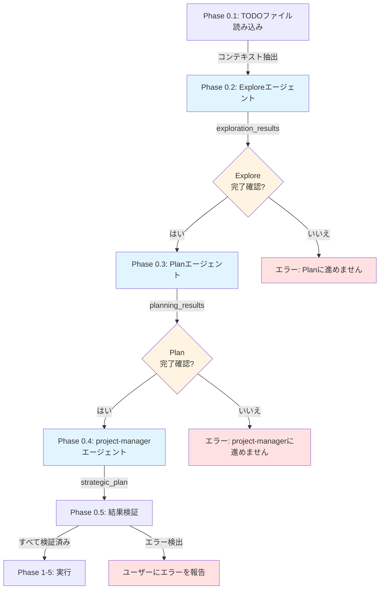
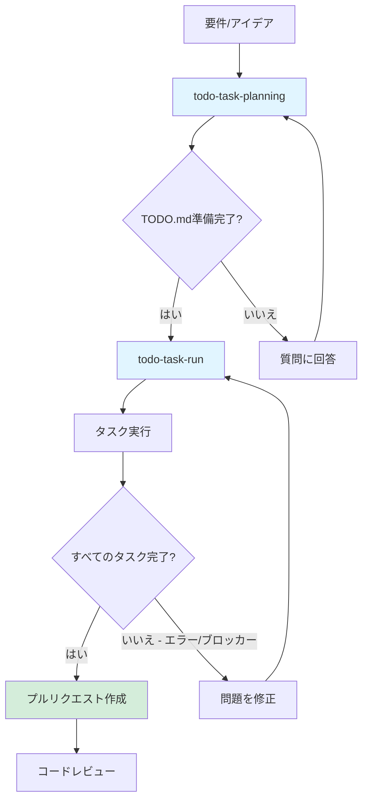

# TODOタスクワークフロー - 包括的ハウツーガイド

## 概要

[Phase 3で完成予定]

## TODO.mdファイルの作成

TODO.mdファイルは、開発タスクを整理し、進捗を追跡するための構造化されたMarkdownフォーマットです。このセクションでは、効果的なTODO.mdファイルの作成方法を説明します。

### 基本的なTODO.mdフォーマット

TODO.mdファイルは、タスクの進捗を追跡するためのチェックボックス付き構造化Markdownフォーマットを使用します。このフォーマットは、人間が読みやすく、かつtodo-task-runコマンドが機械的に解析できるように設計されています。

#### チェックボックスフォーマット

タスクはMarkdownのチェックボックス構文で表現します:

- `- [ ]` - 未完了タスク
- `- [x]` - 完了タスク
- `- [🔄]` - 進行中タスク (オプション)

**例:**
```markdown
- [ ] ユーザー認証を実装
- [x] データベーススキーマをセットアップ
- [🔄] APIエンドポイントを作成
```

#### ステータスマーカー

タスクの実行可能性を示すために、ステータスマーカーを接頭辞として使用できます:

- **✅ Ready** - 仕様が明確で、技術的問題が解決済み、即座に実行可能
- **⏳ Pending** - 依存関係を待機中 (具体的な待機理由と解除条件を明記)
- **🔍 Research** - 調査が必要 (具体的な調査項目と方法を明記)
- **🚧 Blocked** - 重要な仕様/技術詳細が不明確 (具体的なブロック要因と解決ステップを明記)

**例:**
```markdown
- [ ] ✅ API認証システムの実装
- [ ] ⏳ フロントエンドUI統合 - API完成後
- [ ] 🔍 サードパーティAPI統合 - 調査項目: APIドキュメント
- [ ] 🚧 決済統合 - ブロック要因: 決済プロバイダー未決定
```

#### タスクメタデータアイコン

タスクにコンテキストとメタデータを追加するために、これらのアイコンを使用します:

- **📁** - ファイル参照 (作成または変更されるファイル)
- **📊** - 技術的根拠または分析結果
- **📋** - 成果物または出力の説明
- **⏱️** - 時間見積もり
- **💡** - 実装ガイダンスまたはヒント

**例:**
```markdown
- [ ] ✅ データベーススキーマ更新 📁`prisma/schema.prisma` 📊MySQL対応
  - [ ] Prismaスキーマを更新
    - 💡 既存のUserモデルパターンに従う
    - ⏱️ 推定時間: 30分
  - [ ] マイグレーションを生成
    - 📋 マイグレーションファイルは`prisma/migrations/`に作成される
```

#### セクション分割のベストプラクティス

タスクを以下の基準で論理的なセクションに整理します:

1. **ステータス別** - 実行可能性マーカーでグループ化 (✅⏳🔍🚧)
2. **フェーズ別** - 実装フェーズでグループ化 (Phase 0, Phase 1, Phase 2, など)
3. **機能領域別** - 機能ドメインでグループ化 (認証, データベース, UI, など)
4. **優先度別** - 依存関係に基づく実行順序でグループ化

**構造例:**
```markdown
## タスクリスト

### Phase 1: データベースセットアップ ✅
- [ ] ✅ 1.1 データベーススキーマを作成
- [ ] ✅ 1.2 マイグレーションを実行

### Phase 2: API実装 ⏳
- [ ] ⏳ 2.1 APIエンドポイントを作成 - データベースセットアップ待ち
- [ ] ⏳ 2.2 認証ミドルウェアを追加

### 調査タスク 🔍
- [ ] 🔍 キャッシュ戦略を調査
```

#### 依存関係の記述

タスクに依存関係がある場合は、以下を明確に指定します:

1. **何に依存するか** - 具体的な前提タスクを明記
2. **なぜ依存するか** - 技術的または論理的な依存関係を説明
3. **いつ進行できるか** - 解除条件を明記

**例:**
```markdown
- [ ] ⏳ フロントエンドUI統合 📁`components/LoginForm.vue`
  - 依存: API認証システムの実装 (Phase 1)
  - 理由: `/api/auth/login`エンドポイントが利用可能である必要がある
  - 進行可能: Phase 1完了後、APIテスト成功後

- [ ] ✅ ユーザープロフィールページ実装 📁`pages/user/profile.vue`
  - 依存関係なし - 即座に開始可能
```

#### ネストされたサブタスク

2スペースインデントを使用してネストされたサブタスクを作成します:

```markdown
- [ ] ✅ API認証システムの実装
  - [ ] ログインエンドポイントを実装
    - [ ] POSTハンドラーを作成
    - [ ] バリデーションミドルウェアを追加
    - [ ] JWTトークンを生成
  - [ ] トークン検証ミドルウェアを実装
  - [ ] セッション管理を追加
```

### タスク粒度のガイドライン

適切なタスク粒度は、効果的なタスク実行と進捗追跡に不可欠です。タスクは、集中したセッションで完了できる程度に小さく、かつ意味のある進捗を表すのに十分な大きさである必要があります。

#### 1ファイル/1機能ルール

各タスクは、単一のファイルまたは単一の統合された機能に焦点を当てる必要があります:

**✅ 良い例:**
```markdown
- [ ] ✅ ユーザー認証モデルを作成 📁`models/User.ts`
- [ ] ✅ ログインAPIエンドポイントを実装 📁`api/auth/login.ts`
- [ ] ✅ メール検証ユーティリティを追加 📁`utils/validation.ts`
```

**❌ 悪い例:**
```markdown
- [ ] 認証システム全体を実装
  # 広すぎる - 複数のファイルと機能にまたがる

- [ ] User.tsとlogin.tsとvalidation.tsを更新
  # 複数ファイル - 別々のタスクに分割すべき
```

#### 推奨タスク所要時間: 30分〜2時間

タスクは、単一の集中した作業セッション内で完了可能である必要があります:

- **最小 (30分)** - タスクに意味のあるスコープがあることを保証
- **最大 (2時間)** - タスクが大きくなりすぎて扱いにくくなるのを防ぐ
- **最適 (45〜90分)** - ほとんどの実装タスクに理想的

**時間見積もりの例:**
```markdown
- [ ] ✅ usersテーブルのデータベースマイグレーションを作成
  - ⏱️ 推定時間: 30分

- [ ] ✅ バリデーション付きユーザー登録エンドポイントを実装
  - ⏱️ 推定時間: 1.5時間

- [ ] ⏳ 完全なユーザーダッシュボードUIを構築
  - ⏱️ 推定時間: 4時間
  # 長すぎる - より小さなタスクに分割すべき
```

#### 明確な依存関係

タスク間の依存関係は、簡単に識別でき、十分に文書化されている必要があります:

**✅ 良い依存関係ドキュメント:**
```markdown
### Phase 1: データベーススキーマ ✅
- [ ] ✅ 1.1 usersテーブルマイグレーションを作成 📁`migrations/001_users.sql`
  - 依存関係なし

- [ ] ✅ 1.2 postsテーブルマイグレーションを作成 📁`migrations/002_posts.sql`
  - 依存: 1.1 (外部キーのためusersテーブルが必要)

### Phase 2: APIレイヤー ⏳
- [ ] ⏳ 2.1 ユーザーCRUDエンドポイントを実装 📁`api/users.ts`
  - 依存: Phase 1完了 (データベーススキーマが存在する必要がある)

- [ ] ⏳ 2.2 投稿作成エンドポイントを実装 📁`api/posts.ts`
  - 依存: 1.2と2.1 (postsテーブルとユーザー認証が必要)
```

**❌ 悪い依存関係ドキュメント:**
```markdown
- [ ] ユーザーエンドポイントを実装
  - 依存: データベース関連
  # 曖昧 - 具体的に何が必要か不明確
```

#### 過度に広範なタスクを避ける

具体的なターゲットがないタスクは、具体的な実装ステップに分解する必要があります:

**❌ 広すぎる:**
```markdown
- [ ] ユーザー管理を実装
- [ ] 認証のバグを修正
- [ ] パフォーマンスを改善
```

**✅ 適切にスコープされた:**
```markdown
- [ ] ✅ バリデーション付きUserモデルを作成 📁`models/User.ts`
- [ ] ✅ JWTトークン有効期限バグを修正 📁`middleware/auth.ts`
  - 📊 問題: トークンが有効期限切れで適切に検証されない
- [ ] ✅ ユーザー検索のデータベースクエリキャッシュを追加 📁`repositories/UserRepository.ts`
  - 📊 パフォーマンス: 検索時間を50msから5msに短縮
```

#### タスク分解チェックリスト

タスクを確定する前に、各タスクが以下の基準を満たすことを確認してください:

- [ ] 特定のファイルまたは統合された機能をターゲットにしている
- [ ] 30分〜2時間で完了可能
- [ ] 明確に文書化された依存関係がある (ある場合)
- [ ] 具体的な実装詳細を含む (ファイルパス、技術的アプローチ)
- [ ] 過度に広範または曖昧ではない

#### 例: 大きなタスクを分解する

**元のタスク (広すぎる):**
```markdown
- [ ] ユーザー認証システムを実装
```

**分解後 (適切な粒度):**
```markdown
### Phase 1: 認証モデル ✅
- [ ] ✅ 1.1 Userモデルを作成 📁`models/User.ts`
  - ⏱️ 45分
  - 依存関係なし

- [ ] ✅ 1.2 Sessionモデルを作成 📁`models/Session.ts`
  - ⏱️ 30分
  - 依存: 1.1 (外部キーのためUserモデルが必要)

### Phase 2: 認証エンドポイント ✅
- [ ] ✅ 2.1 登録エンドポイントを実装 📁`api/auth/register.ts`
  - ⏱️ 1.5時間
  - 依存: 1.1 (Userモデル)

- [ ] ✅ 2.2 ログインエンドポイントを実装 📁`api/auth/login.ts`
  - ⏱️ 1時間
  - 依存: 1.1, 1.2 (UserとSessionモデル)

- [ ] ✅ 2.3 ログアウトエンドポイントを実装 📁`api/auth/logout.ts`
  - ⏱️ 30分
  - 依存: 1.2 (Sessionモデル)

### Phase 3: 認証ミドルウェア ✅
- [ ] ✅ 3.1 JWTトークン検証ミドルウェアを作成 📁`middleware/auth.ts`
  - ⏱️ 1時間
  - 依存: 1.2 (トークン検証のためSessionモデル)
```

### TODOタスクにおけるYAGNI原則

YAGNI (You Aren't Gonna Need It) は、TODOタスク計画における基本原則です。これは、**明示された目標を達成するために直接必要なタスクのみを含める**こと、そして既存の機能を改善または強化するタスクを明示的に除外することを意味します。

#### TODOコンテキストにおけるYAGNIとは?

TODO.mdファイルを作成する際は、以下にのみ焦点を当てます:

- **新機能の実装** - まだ存在しない機能を構築する
- **バグ修正** - 特定の報告された問題を解決する
- **必要なインフラストラクチャ** - 新機能をサポートするために必要なもののみ

**含めるべきではないタスク:**
- すでに動作している既存のコードを改善する
- 現在の目標を超える「あると良い」機能を追加する
- 明示された目標の一部ではないコードを最適化または強化する

#### TODOタスクから除外すべきもの

以下のタスクタイプは、明示された目標に絶対に必要でない限り、含めるべきでは**ありません**:

##### 1. リファクタリング

**❌ 除外:**
```markdown
- [ ] 保守性向上のためにユーザー認証コードをリファクタリング
- [ ] 明確性向上のためにファイル構造を再編成
- [ ] 共通ロジックをユーティリティ関数に抽出
```

**✅ 必要な場合のみ含める:**
```markdown
- [ ] ✅ 認証ユーティリティを作成 📁`utils/auth.ts`
  - 注: これは機能に必要な新しい機能であり、リファクタリングではない
```

##### 2. ログの追加または強化

**❌ 除外:**
```markdown
- [ ] 認証フローにデバッグログを追加
- [ ] より多くのコンテキストでエラーログを改善
- [ ] APIエンドポイントにパフォーマンスログを追加
```

**✅ 必要な場合のみ含める:**
```markdown
- [ ] ✅ ユーザーアクションの監査ログを実装 📁`services/AuditLog.ts`
  - 注: 監査ログはコア機能要件であり、オプションのログではない
```

##### 3. 既存機能のテスト追加

**❌ 除外:**
```markdown
- [ ] 既存のユーザー登録エンドポイントのテストを追加
- [ ] 認証モジュールのテストカバレッジを改善
- [ ] APIレイヤーの統合テストを追加
```

**✅ 必要な場合のみ含める:**
```markdown
- [ ] ✅ 新しいパスワードリセット機能のテストを作成 📁`tests/auth/passwordReset.test.ts`
  - 注: 新機能実装のテストであり、既存コードのテストではない
```

##### 4. エラーハンドリングの改善

**❌ 除外:**
```markdown
- [ ] 既存エンドポイントにより良いエラーハンドリングを追加
- [ ] バリデーションエラーメッセージを改善
- [ ] フォームの入力サニタイゼーションを強化
```

**✅ 必要な場合のみ含める:**
```markdown
- [ ] ✅ 新しい決済統合のエラーハンドリングを実装 📁`services/PaymentService.ts`
  - 注: 新機能に必要なエラーハンドリングであり、強化ではない
```

##### 5. ドキュメント

**❌ 除外:**
```markdown
- [ ] APIドキュメントを更新
- [ ] 既存関数にJSDocコメントを追加
- [ ] モジュールのREADMEを作成
```

**✅ 必要な場合のみ含める:**
```markdown
- [ ] ✅ 新しいWebhook統合を文書化 📁`docs/webhooks.md`
  - 注: 新しい外部向け機能に必要なドキュメント
```

##### 6. パフォーマンス最適化

**❌ 除外:**
```markdown
- [ ] ユーザー検索のデータベースクエリを最適化
- [ ] APIレスポンスのキャッシュレイヤーを追加
- [ ] コード分割でバンドルサイズを削減
```

**✅ 必要な場合のみ含める:**
```markdown
- [ ] ✅ 新しい検索機能のページネーションを実装 📁`api/search.ts`
  - 注: 大量の結果セットを処理するために新機能に必要なページネーション
```

##### 7. コード品質の改善

**❌ 除外:**
```markdown
- [ ] コードベースのESLint警告を修正
- [ ] より良い型安全性のためにTypeScript型を更新
- [ ] 未使用のインポートとデッドコードを削除
```

##### 8. セキュリティ強化 (必須でない場合)

**❌ 除外:**
```markdown
- [ ] 既存のAPIエンドポイントにレート制限を追加
- [ ] パスワード要件を強化
- [ ] フォームにCSRF保護を追加
```

**✅ 必要な場合のみ含める:**
```markdown
- [ ] ✅ 新しいSSO機能のOAuth認証を実装 📁`services/OAuth.ts`
  - 注: OAuthはコア機能要件であり、セキュリティ強化ではない
```

##### 9. 完璧の追求

**❌ 除外:**
```markdown
- [ ] UIアニメーションを洗練
- [ ] より良い美観のために配色を微調整
- [ ] すべてのボタンにローディング状態を追加
```

#### YAGNI検証チェックリスト

TODO.mdにタスクを含める前に、以下を確認してください:

1. **このタスクは明示された目標を達成するために直接必要ですか?**
   - はい → 含める
   - いいえ → 除外する

2. **このタスクは新しい機能を作成するか、特定のバグを修正しますか?**
   - はい → 含める
   - いいえ (既存コードの改善) → 除外する

3. **このタスクなしで機能は動作しますか?**
   - いいえ (必須) → 含める
   - はい (強化) → 除外する

4. **このタスクは要件または目標に記載されていますか?**
   - はい → 含める
   - いいえ (余分な作業) → 除外する

#### 例: 機能へのYAGNI適用

**目標:** パスワードリセット機能を実装

**❌ YAGNIなし (不要なタスクを含む):**
```markdown
## パスワードリセット機能

- [ ] 既存の認証コードをリファクタリング
- [ ] すべての認証エンドポイントに包括的なログを追加
- [ ] 既存のログイン機能のテストを更新
- [ ] パスワードリセットメール送信を実装 📁`services/PasswordReset.ts`
- [ ] パスワードリセットAPIエンドポイントを作成 📁`api/auth/reset.ts`
- [ ] すべてのエンドポイントにレート制限を追加
- [ ] APIドキュメントを更新
- [ ] 認証モジュール全体のエラーメッセージを改善
```

**✅ YAGNIあり (必須タスクのみ):**
```markdown
## パスワードリセット機能

### Phase 1: バックエンド実装 ✅
- [ ] ✅ 1.1 パスワードリセットトークン生成を実装 📁`services/PasswordReset.ts`
  - ⏱️ 1時間

- [ ] ✅ 1.2 パスワードリセットAPIエンドポイントを作成 📁`api/auth/reset.ts`
  - ⏱️ 1.5時間
  - 依存: 1.1

- [ ] ✅ 1.3 リセットリンクのメール送信を実装 📁`services/EmailService.ts`
  - ⏱️ 1時間
  - 依存: 1.1

### Phase 2: フロントエンド実装 ✅
- [ ] ✅ 2.1 パスワードリセットリクエストフォームを作成 📁`components/PasswordResetForm.vue`
  - ⏱️ 45分

- [ ] ✅ 2.2 パスワードリセット確認ページを作成 📁`pages/auth/reset.vue`
  - ⏱️ 1時間
  - 依存: 1.2
```

#### YAGNIの利点

TODOタスクでYAGNIに従うことで、以下が得られます:

1. **より速い納品** - 必要なものにのみ焦点を当てる
2. **より明確なスコープ** - スコープクリープと不要な作業を回避
3. **より良い時間見積もり** - スコープが明確に定義されている場合、予測がより正確
4. **複雑さの軽減** - よりシンプルな実装は保守が容易
5. **リスクの低減** - 変更が少ないほど、バグの機会が少ない

#### YAGNIを破るべき場合

「余分な」タスクを含めるべき稀なケース:

1. **重大なセキュリティ要件** - 新機能がセキュリティ脆弱性を導入する場合
2. **規制準拠** - 機能が特定の法的要件を満たす必要がある場合
3. **明示的なユーザーリクエスト** - ステークホルダーが具体的に改善を要求する場合
4. **前提条件インフラストラクチャ** - 新機能をサポートするために既存コードを変更する必要がある場合

**許容される「余分な」作業の例:**
```markdown
- [ ] ✅ 新しいユーザー登録エンドポイントを実装 📁`api/auth/register.ts`

- [ ] ✅ 登録にパスワードハッシュを追加 📁`utils/passwordHash.ts`
  - 注: これはセキュリティに不可欠であり、強化ではない
```

### 完全なTODO.md実例

以下は、このガイドで説明したすべての概念を示す、コピー&ペースト可能な完全なTODO.mdテンプレートです。この例は、タスク粒度、YAGNI原則、適切なフォーマットのベストプラクティスに従っています。

```markdown
# ユーザープロフィール強化機能

## 📊 プロジェクト概要

**目標**: アバターアップロード機能を備えたユーザープロフィール編集機能を追加

**成功基準**:
- ユーザーがプロフィール情報 (名前、自己紹介、メール) を編集できる
- ユーザーがプロフィールアバターをアップロードして変更できる
- 変更がバリデートされ、データベースに永続化される
- UIが成功/失敗の更新に対するフィードバックを提供する

**推定総時間**: 8〜10時間

**参照**:
- 📁 デザインモックアップ: `docs/designs/user-profile-v2.figma`
- 📁 API仕様: `docs/api/user-profile-endpoints.md`

## 📋 タスクリスト

### Phase 1: データベースとAPIセットアップ ✅

- [ ] ✅ 1.1 Userモデルスキーマを更新 📁`models/User.ts`
  - Userモデルに`avatarUrl`フィールドを追加
  - Userモデルに`bio`フィールドを追加 (最大500文字)
  - 📊 Userモデルの既存Sequelizeパターンを使用
  - ⏱️ 推定時間: 30分
  - 💡 `models/User.ts`の既存モデル構造に従う

- [ ] ✅ 1.2 データベースマイグレーションを作成 📁`migrations/YYYYMMDD_add_profile_fields.ts`
  - 依存: 1.1 (モデルスキーマを最初に定義する必要がある)
  - `avatar_url` VARCHAR(500)カラムを追加
  - `bio` TEXTカラムを追加
  - 📊 マイグレーションは`ALTER TABLE users`文を使用
  - ⏱️ 推定時間: 20分
  - 💡 `npm run migrate:up`と`migrate:down`でマイグレーションをテスト

- [ ] ✅ 1.3 データベースマイグレーションを実行
  - 依存: 1.2 (マイグレーションファイルが存在する必要がある)
  - 実行: `npm run migrate:up`
  - データベースクライアントでカラム追加を確認
  - ⏱️ 推定時間: 10分

- [ ] ✅ 1.4 プロフィール更新APIエンドポイントを実装 📁`api/users/profile.ts`
  - 依存: 1.3 (データベーススキーマが更新されている必要がある)
  - PATCH `/api/users/:id/profile`エンドポイントを作成
  - 入力をバリデート (名前の長さ、メールフォーマット、自己紹介の最大長)
  - 更新されたユーザーオブジェクトを返す
  - 📊 Express.jsリクエストバリデーションパターンを使用
  - ⏱️ 推定時間: 1.5時間
  - 💡 `api/users/index.ts`の既存エンドポイント構造を参照

### Phase 2: ファイルアップロード実装 ✅

- [ ] ✅ 2.1 ファイルアップロードミドルウェアをセットアップ 📁`middleware/upload.ts`
  - 画像アップロード用にmulterを設定
  - ファイルタイプをバリデート (jpeg, png, webpのみ)
  - ファイルサイズをバリデート (最大5MB)
  - 📊 メモリストレージでmulterミドルウェアを使用
  - ⏱️ 推定時間: 1時間
  - 💡 設定についてmulterドキュメントを参照

- [ ] ✅ 2.2 アバターアップロードエンドポイントを実装 📁`api/users/avatar.ts`
  - 依存: 2.1 (アップロードミドルウェアが存在する必要がある)
  - POST `/api/users/:id/avatar`エンドポイントを作成
  - アップロードミドルウェアを使用してmultipart/form-dataを処理
  - ファイルをクラウドストレージ (S3またはCloudinary) に保存
  - データベースでユーザーの`avatarUrl`を更新
  - 📊 AWS S3 SDKまたはCloudinary SDKを使用
  - ⏱️ 推定時間: 2時間
  - 💡 環境変数: `AWS_BUCKET_NAME`, `AWS_REGION`

- [ ] ✅ 2.3 cccp:micro-commitを実行してバックエンド変更をコミット
  - 依存: Phase 1とPhase 2の完了
  - コマンド: `/cccp:micro-commit`
  - 📋 コミットはコンテキスト別に分割される (モデル、マイグレーション、エンドポイント、ミドルウェア)
  - ⏱️ 推定時間: 5分

### Phase 3: フロントエンド実装 ✅

- [ ] ✅ 3.1 ProfileEditFormコンポーネントを作成 📁`components/ProfileEditForm.vue`
  - 依存: 1.4 (APIエンドポイントが存在する必要がある)
  - フォームフィールド: name (input), bio (textarea), email (input)
  - クライアント側バリデーション (必須フィールド、メールフォーマット)
  - 送信時にPATCH `/api/users/:id/profile`を呼び出す
  - 成功/エラーメッセージを表示
  - 📊 `<script setup>`でVue 3 Composition APIを使用
  - ⏱️ 推定時間: 2時間
  - 💡 `components/LoginForm.vue`の既存フォームパターンを参照

- [ ] ✅ 3.2 AvatarUploadコンポーネントを作成 📁`components/AvatarUpload.vue`
  - 依存: 2.2 (アバターアップロードエンドポイントが存在する必要がある)
  - デフォルト画像へのフォールバックで現在のアバターを表示
  - "アバターを変更"ボタン付きファイル入力
  - アップロード前の画像プレビュー
  - ファイル選択時にPOST `/api/users/:id/avatar`を呼び出す
  - アップロード進捗と成功/エラー状態を表示
  - 📊 プレビュー用にHTML5 FileReader APIを使用
  - ⏱️ 推定時間: 1.5時間
  - 💡 Vueファイルアップロードパターンを参照

- [ ] ✅ 3.3 コンポーネントをプロフィールページに統合 📁`pages/profile/edit.vue`
  - 依存: 3.1, 3.2 (コンポーネントが存在する必要がある)
  - ProfileEditFormとAvatarUploadコンポーネントをインポート
  - レイアウト: 左にアバター、右にフォーム
  - "変更を保存"と"キャンセル"ボタンを追加
  - 更新成功後のナビゲーションを処理
  - ⏱️ 推定時間: 45分
  - 💡 `pages/profile/index.vue`の既存ページレイアウトを使用

- [ ] ✅ 3.4 cccp:micro-commitを実行してフロントエンド変更をコミット
  - 依存: Phase 3の完了
  - コマンド: `/cccp:micro-commit`
  - 📋 コミットはコンポーネント別に分割される
  - ⏱️ 推定時間: 5分

### Phase 4: テストと改善 ✅

- [ ] ✅ 4.1 手動テストチェックリスト
  - [ ] 有効なデータでプロフィール更新をテスト
  - [ ] バリデーションエラーをテスト (無効なメール、自己紹介が長すぎる)
  - [ ] 有効な画像でアバターアップロードをテスト
  - [ ] アバターアップロードエラーケースをテスト (ファイルが大きすぎる、間違ったフォーマット)
  - [ ] モバイルとデスクトップでUIレスポンシブネスをテスト
  - 📋 テスト結果を`docs/testing/profile-edit-test-results.md`に文書化
  - ⏱️ 推定時間: 1時間

- [ ] ✅ 4.2 最終cccp:micro-commitを実行
  - コマンド: `/cccp:micro-commit`
  - 📋 最終調整や修正をコミット
  - ⏱️ 推定時間: 5分

## 📈 進捗状況

- **完了**: 0/14タスク (0%)
- **進行中**: Phase 1
- **次のアクション**: タスク1.1から開始 (Userモデルスキーマを更新)

## 🎯 次のアクション

1. Phase 1タスク (データベースとAPIセットアップ) から始める
2. 次のフェーズに移る前に、Postmanまたはcurlで各エンドポイントをテスト
3. バックエンド完了後、フロントエンド実装に進む
4. 完了と見なす前に、徹底的な手動テストを実施

## ❓ 質問と確認事項

- [x] **[仕様]** アバターアップロードにどのクラウドストレージサービスを使用すべきですか?
  - 回答: AWS S3を使用 (バケット名: `user-avatars-prod`)

- [x] **[UI]** 自己紹介フィールドに文字カウンターを表示すべきですか?
  - 回答: はい、textareaの下に"X/500文字"を表示

- [ ] **[UX]** ユーザーはアバターを削除できるべきですか (デフォルトにリセット)?
  - プロダクトチームの確認待ち

## 📚 関連ドキュメント

- Userモデルドキュメント: `docs/models/user.md`
- ファイルアップロードガイドライン: `docs/development/file-uploads.md`
- API認証: `docs/api/authentication.md`
```

この例は以下を示しています:

- **明確なプロジェクト概要** と目標、成功基準
- **適切なタスク粒度** (各タスクは20分〜2時間)
- **YAGNI準拠** (必須でない限り、リファクタリング、ログ、ドキュメントタスクなし)
- **ステータスマーカー** (すべてのタスクが明確に定義されているため✅)
- **ファイル参照** (すべての実装タスクに📁)
- **依存関係** が明確に文書化されている
- **時間見積もり** (⏱️) 計画用
- **実装ヒント** (💡) 実行をガイド
- **ネストされたサブタスク** 適切なインデント付き
- **進捗追跡** セクション
- **質問セクション** 確認事項用

## todo-task-planningコマンドの使用方法

`todo-task-planning`コマンドは、ファイル (通常は`TODO.md`) を読み込み、その内容を分析し、詳細な実装ガイダンスを含む包括的で構造化されたタスクリストを生成する強力なタスク計画ツールです。

### コマンド概要

`todo-task-planning`コマンドは、TODOタスクワークフローの**計画フェーズ**として機能します。ハイレベルな要件を、実行可能で整理されたタスクに変換します。

#### 主要機能

**1. 繰り返し実行**

コマンドは同じファイルに対して複数回実行できるように設計されています:
- 各実行は新鮮な視点でファイルを分析
- `docs/memory`に保存された過去の調査結果を活用して重複を回避
- 既存のタスクは保持され、新しいタスクが段階的に追加される
- 質問のステータスが実行をまたいで追跡される (回答済み/未回答)

```bash
# 最初の実行 - 初期計画
/cccp:todo-task-planning TODO.md

# 2回目の実行 - 洗練と更新
/cccp:todo-task-planning TODO.md

# 3回目の実行 - 新しい要件への対応
/cccp:todo-task-planning TODO.md
```

**2. Phase 0マルチエージェントオーケストレーション**

コマンドは3つの専門エージェントを**厳密な順次実行**で調整します:

- **Phase 0.2: Exploreエージェント** - コードベース探索を通じて関連ファイル、パターン、依存関係を発見
- **Phase 0.3: Planエージェント** - 探索結果に基づいて実装戦略を設計
- **Phase 0.4: cccp:project-managerエージェント** - 実行可能性 (✅⏳🔍🚧) でタスクを整理し、ユーザーの質問を抽出

**⚠️ 重要な要件: 順次実行**

エージェントは並列ではなく、**必ず順次実行する必要があります**:
- Planエージェントは、ExploreエージェントからExpect `exploration_results`が必要
- project-managerエージェントは`exploration_results`と`planning_results`の両方が必要
- エージェントを並列実行すると、依存関係の欠落により失敗します

**3. TODO.md更新動作**

コマンドは指定されたTODO.mdファイルを直接更新します:

- **既存コンテンツを保持** - 完了したタスクと回答済みの質問はそのまま残る
- **新しいタスクを追加** - 新しいタスク計画結果が構造化フォーマットで追加される
- **タスクステータスを更新** - 分析に基づいて実行可能性マーカー (✅⏳🔍🚧) が追加/更新される
- **調査履歴を記録** - 探索と計画結果の`docs/memory`ファイルへのリンク
- **質問を管理** - 新しい質問が追加され、回答済みの質問は完了としてマークされる

**4. docs/memory統合**

すべての調査と分析結果は`docs/memory`ディレクトリに保存されます:

```
docs/memory/
├── explorations/
│   └── 2025-01-21-feature-name-exploration.md
├── planning/
│   └── 2025-01-21-feature-name-plan.md
├── questions/
│   └── feature-name-questions.md
└── recommendations/
    └── feature-name-recommendations.md
```

これらのファイルは以下として機能します:
- **履歴記録** - 意思決定プロセスと根拠を追跡
- **重複防止** - 過去の調査をチェックして冗長な作業を回避
- **将来の実行のコンテキスト** - ファイルが再分析される際に過去の分析を参照
- **チーム知識ベース** - チームメンバー間でインサイトを共有

#### このコマンドを使用するタイミング

以下が必要な場合に`todo-task-planning`を使用します:

- **要件をタスクに変換** - ハイレベルな機能記述を具体的な実装ステップに変換
- **複雑なプロジェクトを分解** - 大規模なイニシアチブを管理可能で細分化されたタスクに分解
- **技術的実行可能性を分析** - 実装前にブロッカー、依存関係、調査ニーズを特定
- **自信を持って計画** - 徹底的な分析のためにマルチエージェントの探索と計画を活用
- **既存の計画を更新** - TODO.mdに対して再実行して新しい要件や変更を組み込む

#### コマンド構文

```bash
/cccp:todo-task-planning <file_path> [--branch [branch_name]] [--pr]
```

**パラメータ:**
- `<file_path>` (必須) - 分析して更新するTODOファイルへのパス
- `--branch [branch_name]` (オプション) - ブランチ作成タスクを追加 (省略時は自動生成)
- `--pr` (オプション) - プルリクエスト作成タスクを追加 (ブランチ作成を含む)

`--branch`と`--pr`オプションの詳細については次のセクションを参照してください。

### オプション: --branch と --pr

`todo-task-planning`コマンドは、TODO.mdファイルにブランチ作成とプルリクエストタスクを自動的に追加する2つのGitワークフローオプションをサポートしています。

#### オプションの動作

##### `--branch [branch_name]`オプション

`--branch`オプションは、タスクリストの**先頭にブランチ作成タスク**を追加します:

**ブランチ名を指定した場合:**
```bash
/cccp:todo-task-planning TODO.md --branch feature/user-authentication
```
- 指定したブランチ名をそのまま使用
- Git命名規則に対して検証
- タスクを作成: `git checkout -b feature/user-authentication`

**ブランチ名なし (自動生成):**
```bash
/cccp:todo-task-planning TODO.md --branch
```
- TODOファイルのコンテンツを分析して適切なブランチ名を決定
- Git命名規則に従う: `{type}/{descriptive-name}`
- タイプ: `feature/`, `bugfix/`, `refactor/`, `chore/`, `docs/`
- フォーマット: 小文字、ハイフン区切り、英語

**ブランチ名自動生成ルール:**

コマンドは以下によってインテリジェントにブランチ名を生成します:
1. TODOファイルのタイトルとコンテンツを読み取る
2. タスクの性質に基づいてブランチタイプを決定:
   - `feature/` - 新機能実装
   - `bugfix/` - バグ修正、問題解決
   - `refactor/` - 動作変更なしのコード再構築
   - `chore/` - 開発環境、依存関係、ツール
   - `docs/` - ドキュメント更新
3. TODOからキー機能/問題名を抽出 (最大2-4語)
4. 小文字、ハイフン区切りの英語に変換
5. Git命名規則に対して検証

**自動生成の例:**
```
TODOタイトル: "ActionLog Email Notification Implementation"
生成されたブランチ: feature/actionlog-email-notification

TODOタイトル: "Fix Authentication Token Expiration Bug"
生成されたブランチ: bugfix/auth-token-expiration

TODOタイトル: "Update API Documentation"
生成されたブランチ: docs/api-documentation-update
```

**TODO.mdに追加される内容:**

ブランチ作成タスクがPhase 0として (他のすべてのフェーズの前に) 挿入されます:

```markdown
### Phase 0: ブランチ作成 ✅

- [ ] ✅ **ブランチを作成**
  - コマンド: `git checkout -b feature/actionlog-email-notification`
  - 📋 すべての変更はこのブランチにコミットされます
  - 推定時間: 1分
```

**--branchのユースケース:**
- フィーチャーブランチで作業したいが、まだPRは不要
- 探索的作業をしており、mainブランチからの分離が必要
- ブランチで作業を整理したいが、PRは後で手動で作成する
- チェックリストにブランチ作成を明示的なタスクとして含めたい

##### `--pr`オプション

`--pr`オプションは、**すべての--branch機能**に加えて、**最後にプルリクエスト作成タスク**を追加します:

```bash
/cccp:todo-task-planning TODO.md --pr
```

**何が起こるか:**
1. ブランチ作成タスクが先頭に追加される (`--branch`も指定されていない場合は名前を自動生成)
2. すべての実装タスクはこのブランチでの作業を想定
3. プルリクエスト作成タスクが最終フェーズとして追加される

**TODO.mdに追加される内容:**

ブランチ作成 (Phase 0) とPR作成 (最終フェーズ) の両方のタスク:

```markdown
### Phase 0: ブランチ作成 ✅

- [ ] ✅ **ブランチを作成**
  - コマンド: `git checkout -b feature/user-profile-edit`
  - 📋 すべての変更はこのブランチにコミットされます
  - 推定時間: 1分

### Phase 3: プルリクエスト作成 ✅

- [ ] ✅ 3.1 プルリクエストを作成
  - [ ] `.github/PULL_REQUEST_TEMPLATE.md`からPRテンプレートを読み取る
  - [ ] PR説明を記述:
    - 開発理由 (なぜこの機能が必要か)
    - 開発内容 (何が実装されたか)
    - 影響分析 (何が影響を受けるか)
  - [ ] 実行: `gh pr create --title "..." --body "..."`
  - 📋 PRにはこのブランチからのすべてのコミットが含まれます
  - 推定時間: 10分

- [ ] ⏳ 3.2 コードレビューとマージ
  - [ ] チームレビューを待つ
  - [ ] 必要に応じてレビューフィードバックに対応
  - [ ] 承認後にマージを実行: `gh pr merge`
```

**PRテンプレート統合:**

プロジェクトに`CLAUDE.md`または`.github/PULL_REQUEST_TEMPLATE.md`にPRテンプレート指示がある場合、コマンドはPR作成時にそれらのテンプレートに従うように記載します。

**--prのユースケース:**
- 機能開始からPR作成までの完全なワークフローが必要
- レビューが必要な機能を実装している
- タスクチェックリストの一部として全体のGitワークフローが必要
- PRベースのワークフローを持つチーム環境で作業している

#### --branchと--prの組み合わせ使用

両方のオプションを組み合わせて、カスタムブランチ名を指定し、かつPRを作成できます:

```bash
/cccp:todo-task-planning TODO.md --pr --branch feature/custom-name
```

これにより以下が得られます:
- 指定した名前でのブランチ作成タスク
- すべての実装タスク
- 最後にプルリクエスト作成タスク

#### 5つの使用パターン

`todo-task-planning`の5つの一般的な使用パターン:

**パターン1: 基本計画 (Gitワークフローなし)**
```bash
/cccp:todo-task-planning TODO.md
```
- ブランチ作成タスクなし
- PR作成タスクなし
- 実装タスクにのみ焦点を当てる
- **使用タイミング:** mainブランチで直接作業するか、Gitワークフローを手動で管理

**パターン2: ブランチのみ (自動生成名)**
```bash
/cccp:todo-task-planning TODO.md --branch
```
- 自動生成名でブランチ作成タスクを追加
- PR作成タスクなし
- **使用タイミング:** ブランチ分離が必要だが、PRは後で手動で作成

**パターン3: ブランチのみ (カスタム名)**
```bash
/cccp:todo-task-planning TODO.md --branch feature/my-custom-feature
```
- 指定した名前でブランチ作成タスクを追加
- PR作成タスクなし
- **使用タイミング:** 特定のブランチ命名規則があるか、名前を制御したい

**パターン4: 完全なワークフロー (自動生成ブランチ)**
```bash
/cccp:todo-task-planning TODO.md --pr
```
- 自動生成名でブランチ作成タスクを追加
- 最後にPR作成タスクを追加
- 開始から終了までの完全なGitワークフロー
- **使用タイミング:** 完全な自動化が必要で、自動生成されたブランチ名を信頼する

**パターン5: 完全なワークフロー (カスタムブランチ)**
```bash
/cccp:todo-task-planning TODO.md --pr --branch feature/my-feature
```
- 指定した名前でブランチ作成タスクを追加
- 最後にPR作成タスクを追加
- ブランチ名の完全な制御と完全なワークフロー
- **使用タイミング:** ワークフローの自動化と特定のブランチ命名の両方が必要

#### 重要な注意事項

**Gitタスクのファイル参照:**
- ブランチ作成タスクには📁ファイル参照は含まれません (Git操作であり、ファイル操作ではない)
- PR作成タスクには📁ファイル参照は含まれません (Git操作であり、ファイル操作ではない)
- ファイルを変更する実装タスクのみに📁参照が含まれます

**タスク実行順序:**
- ブランチ作成 (Phase 0) は常に最初
- 実装タスクは中間
- PR作成は常に最後
- これにより適切なGitワークフローシーケンスが保証されます

### Phase 0処理フロー

Phase 0は**マルチエージェントオーケストレーションフェーズ**で、`todo-task-planning`コマンドが3つの専門エージェントを調整して、TODOファイルを徹底的に分析し、包括的な実装計画を作成します。

#### Phase 0が存在する理由

従来のタスク計画は、要件から直接タスクにジャンプすることが多く、重要な分析ステップを欠いていました:
- **コンテキストの欠落** - どのファイルが存在するか? どのパターンがすでに使用されているか?
- **不完全な計画** - 機能をどのように実装すべきか? トレードオフは何か?
- **不明確な実行可能性** - どのタスクが準備完了か? どのタスクがブロックされているか?

Phase 0は以下を体系的に行うことで、これらの問題を解決します:
1. **探索** - コードベースを探索して何が存在するかを理解
2. **計画** - 探索結果に基づいて実装戦略を計画
3. **整理** - 実行可能性でタスクを整理し、回答が必要な質問を抽出

#### 順次実行要件

**⚠️ 重要: エージェントは並列ではなく順次実行する必要があります**

Phase 0の3つのエージェントには厳格な依存関係があります:

```
Phase 0.2 (Explore) → exploration_results
                          ↓
Phase 0.3 (Plan) → planning_results
                          ↓
Phase 0.4 (project-manager) → strategic_plan
```

**順次実行が必要な理由:**

1. **Planエージェントには探索結果が必要** - Planエージェントは、どのファイル、パターン、依存関係が存在するかに基づいて実装戦略を設計するために`exploration_results`が必要
2. **project-managerエージェントには両方が必要** - project-managerエージェントは、タスクを実行可能性で整理し、質問を抽出するために`exploration_results`と`planning_results`の両方が必要

**並列実行した場合の結果:**
- Planエージェントが失敗するか、不完全な結果を生成 (探索コンテキストの欠落)
- project-managerエージェントが失敗するか、不完全な結果を生成 (両方のコンテキストの欠落)
- タスクが適切に整理されないか、重要な依存関係を見逃す

#### Phase 0ステップの詳細

##### Phase 0.1: TODOファイル読み込みとコンテキスト抽出

**目的:** エージェントオーケストレーションの準備のためにTODOファイルを読み取り分析

**何が起こるか:**
1. Readツールで指定されたファイルを読み取る
2. タスク、要件、技術スタックに関する情報を抽出
3. 探索の徹底度を決定 (quick/medium/very thorough)
4. `--branch`と`--pr`オプションをチェック
5. `--branch`が値なしで指定されている場合はブランチ名を生成

**出力:**
- 抽出された要件とコンテキスト
- ブランチワークフロー変数 (HAS_BRANCH_OPTION, HAS_PR_OPTION, BRANCH_NAME)
- 探索スコープの決定

##### Phase 0.2: Exploreエージェント実行

**目的:** 包括的なコードベース探索を通じて関連ファイル、パターン、依存関係を発見

**どのように機能するか:**
メインのClaude実行者がTaskツールを使用してExploreエージェントを呼び出します:

```typescript
const exploration_results = await Task({
  subagent_type: "Explore",
  description: "ユーザー認証機能のコードベース探索",
  prompt: `
    # コードベース探索リクエスト

    ## TODOファイルからのコンテキスト
    ユーザー認証システムの実装

    ## 探索目標
    以下を検索して整理:
    1. 関連ファイル - 認証用のモデル、コントローラー、ビュー
    2. 依存関係 - インポート/エクスポート関係
    3. テストファイル - 対応するテストパターン
    4. プロジェクト構造 - ファイル構造と命名規則

    ## 徹底度
    medium
  `
});
```

**Exploreエージェントが行うこと:**
- GlobとGrepツールを使用してコードベースで関連ファイルを検索
- 既存のパターンとアーキテクチャを分析
- 技術スタック (フレームワーク、ライブラリ) を特定
- 潜在的なブロッカーと制約を発見
- 計画フェーズのための推奨事項を提供

**出力の保存先:**
- 変数: `exploration_results` (Planエージェントが使用)
- ファイル: `docs/memory/explorations/YYYY-MM-DD-[feature]-exploration.md`

**探索結果の例:**
```markdown
# ユーザー認証機能 - 探索結果

## 概要
JWTトークンを使用する既存の認証パターンを発見。
プロジェクトはTypeScriptでExpress.jsを使用。

## 発見された主要ファイル
- `models/User.ts` - パスワードハッシュ付きUserモデル
- `middleware/auth.ts` - JWT検証ミドルウェア
- `controllers/auth.ts` - ログイン/ログアウトエンドポイント
- `tests/auth.test.ts` - 既存の認証テストパターン

## 既存パターン
- jsonwebtokenライブラリを使用したJWTトークン生成
- bcryptを使用したパスワードハッシュ
- Redisでのセッションストレージ

## 技術スタック
- Express.js 4.18.x
- TypeScript 5.x
- Sequelize ORM
- セッション用Redis

## 潜在的なブロッカー
- Redis接続設定が必要
- JWTシークレットは環境変数に必要

## 計画のための推奨事項
- 既存のJWTパターンに従う
- 新しいフィールドのためにUserモデルを拡張
- 既存の認証ミドルウェアパターンを使用
```

**⚠️ 待機: Phase 0.3に進む前に**

以下を確認:
- [ ] ExploreエージェントTaskが正常に完了
- [ ] `exploration_results`変数に有効なデータが含まれている
- [ ] `docs/memory/explorations/`ファイルが作成された
- [ ] 探索中にエラーが発生していない

**上記を確認した後にのみ、Phase 0.3に進んでください。**

##### Phase 0.3: Planエージェント実行

**目的:** 探索結果に基づいて実装戦略を設計

**⚠️ 必須前提条件: Phase 0.2が最初に完了している必要があります**

**どのように機能するか:**
メインのClaude実行者がTaskツールを使用してPlanエージェントを呼び出し、探索結果を渡します:

```typescript
// 続行する前にexploration_resultsが存在することを確認
if (!exploration_results) {
  throw new Error("Planエージェントに進めません: exploration_resultsが見つかりません");
}

const planning_results = await Task({
  subagent_type: "Plan",
  description: "ユーザー認証の実装計画",
  prompt: `
    # 実装計画リクエスト

    ## 探索結果からのコンテキスト

    ### 概要
    ${exploration_results.summary}

    ### 主要ファイル
    - models/User.ts - パスワードハッシュ付きUserモデル
    - middleware/auth.ts - JWT検証ミドルウェア

    ### 技術スタック
    Express.js, TypeScript, Sequelize, Redis

    ## 計画目標
    ユーザー認証機能を実装するための詳細な計画を設計

    ## 計画に含めるべき項目
    1. 実装アプローチ
    2. ステップバイステップのタスク
    3. 重要なファイル
    4. トレードオフと決定事項
    5. リスクと軽減策
    6. 実行可能性評価 (✅⏳🔍🚧)
  `
});
```

**Planエージェントが行うこと:**
- 探索結果を分析して既存のコードベースを理解
- 全体的な実装戦略を設計 (2-3段落)
- ステップバイステップのタスク分解を作成
- 作成または変更すべき重要なファイルを特定
- 複数のアプローチが存在する場合のトレードオフを評価
- リスクを評価し、軽減策を提案
- 各タスクに実行可能性マーカー (✅⏳🔍🚧) を割り当て

**出力の保存先:**
- 変数: `planning_results` (project-managerエージェントが使用)
- ファイル: `docs/memory/planning/YYYY-MM-DD-[feature]-plan.md`

**計画結果の例:**
```markdown
# ユーザー認証機能 - 実装計画

## アプローチ
既存のJWTベースのパターンを拡張してユーザー認証を実装します。
実装では、登録とログインエンドポイント、セッション管理、
パスワードリセット機能を追加します。

既存のUserモデルと認証ミドルウェアを活用し、新機能に必要な
ものだけを追加します。このアプローチはリスクを最小化し、
現在のアーキテクチャとの一貫性を維持します。

## タスク分解

### Phase 1: ユーザー登録 ✅
- ✅ タスク1.1: 登録エンドポイント追加 `controllers/auth.ts`
  - POST /api/auth/registerルートを作成
  - メールフォーマットとパスワード強度を検証
  - bcryptでパスワードをハッシュ
  - データベースにユーザーを作成
  - JWTトークンを返す

### Phase 2: ログインシステム ✅
- ✅ タスク2.1: ログインエンドポイント実装 `controllers/auth.ts`
  - POST /api/auth/loginルートを作成
  - 認証情報を検証
  - JWTトークンを生成
  - Redisにセッションを保存

- ⏳ タスク2.2: ログアウトエンドポイント追加
  - 依存: 2.1 (ログインが最初に機能する必要がある)
  - Redisからセッションをクリア

### Phase 3: パスワードリセット 🔍
- 🔍 タスク3.1: メールサービス統合を調査
  - 調査が必要: 使用するメールサービス (SendGrid vs AWS SES)
  - 推定調査時間: 1時間

## 重要なファイル
- `controllers/auth.ts` - 新しい登録、ログイン、ログアウトエンドポイント
- `models/User.ts` - メール検証フィールドを追加する必要があるかも
- `middleware/auth.ts` - 既存のミドルウェア、変更不要
- `services/EmailService.ts` - パスワードリセットメール用の新しいファイル

## トレードオフと決定事項
- JWT vs セッションクッキー: 既存コードとの一貫性のためJWTを使用
- メールによるパスワードリセット vs SMS: MVPにはメールで十分

## リスクと軽減策
- リスク: JWTシークレットの露出
  - 軽減策: 環境変数に保存、決してコミットしない
- リスク: Redis接続失敗
  - 軽減策: 接続再試行ロジックとフォールバックを追加

## 実行可能性評価
- ✅ Ready: 3タスク (登録、ログイン、ログアウト)
- ⏳ Pending: 1タスク (ログアウトはログインに依存)
- 🔍 Research: 1タスク (メールサービス選択)
- 🚧 Blocked: 0タスク
```

**⚠️ 待機: Phase 0.4に進む前に**

以下を確認:
- [ ] PlanエージェントTaskが正常に完了
- [ ] `planning_results`変数に有効なデータが含まれている
- [ ] `docs/memory/planning/`ファイルが作成された
- [ ] 計画中にエラーが発生していない

**上記を確認した後にのみ、Phase 0.4に進んでください。**

##### Phase 0.4: cccp:project-managerエージェント実行

**目的:** 探索と計画結果を統合し、戦略的に整理

**⚠️ 必須前提条件: Phase 0.2とPhase 0.3の両方が最初に完了している必要があります**

**どのように機能するか:**
メインのClaude実行者がproject-managerエージェントを呼び出し、探索と計画の両方の結果を渡します:

```typescript
// 続行する前に両方の結果が存在することを確認
if (!exploration_results || !planning_results) {
  throw new Error("project-managerエージェントに進めません");
}

const strategic_plan = await Task({
  subagent_type: "cccp:project-manager",
  description: "ユーザー認証の戦略的整理",
  prompt: `
    # 戦略的プロジェクト計画リクエスト

    ## コンテキスト

    ### 探索結果概要
    ${exploration_results.summary}
    詳細: docs/memory/explorations/2025-01-21-user-auth-exploration.md

    ### 計画結果概要
    ${planning_results.approach_summary}
    タスク数: ${planning_results.tasks.length}
    詳細: docs/memory/planning/2025-01-21-user-auth-plan.md

    ## 目標
    1. 実行可能性による整理 (✅⏳🔍🚧)
    2. ユーザー質問抽出
    3. チェックリスト構造準備
    4. YAGNI原則検証
  `
});
```

**project-managerエージェントが行うこと:**
- 実行可能性マーカー (✅ Ready, ⏳ Pending, 🔍 Research, 🚧 Blocked) でタスクを整理
- 即座実行のために✅ Readyタスクを優先
- ⏳ Pendingタスクの依存関係を明確化
- 🔍 Researchタスクの調査計画を作成
- 🚧 Blockedタスクのソリューションを提案
- ユーザー質問を抽出 (仕様の曖昧さ、技術的選択、UI/UX決定)
- TODO.mdフォーマットでチェックリスト構造を準備
- YAGNI原則を検証 (リファクタリング、ログ、既存コードのテストなどを除外)
- 実装推奨事項を提供

**出力の保存先:**
- 変数: `strategic_plan` (Phase 1-5で使用)
- 含まれる内容:
  - `tasks_by_feasibility` - ✅⏳🔍🚧で整理されたタスク
  - `user_questions` - ユーザー向けの構造化された質問
  - `checklist_structure` - 完全なTODO.md構造
  - `implementation_recommendations` - 次のアクションと品質メトリクス

##### Phase 0.5: 結果検証と準備

**目的:** すべてのエージェントが正常に完了したことを確認し、次のフェーズの準備

**何が起こるか:**
1. **順次実行順序を確認:**
   - [ ] Phase 0.2 (Explore) が最初に完了
   - [ ] Phase 0.3 (Plan) が2番目に完了 (Exploreの後)
   - [ ] Phase 0.4 (project-manager) が3番目に完了 (Planの後)

2. **すべての変数が存在することを確認:**
   - [ ] `exploration_results`が存在し、有効なデータを含む
   - [ ] `planning_results`が存在し、有効なデータを含む
   - [ ] `strategic_plan`が存在し、有効なデータを含む

3. **docs/memoryファイルが作成されたことを確認:**
   - [ ] `docs/memory/explorations/YYYY-MM-DD-[feature]-exploration.md`
   - [ ] `docs/memory/planning/YYYY-MM-DD-[feature]-plan.md`

4. **次のフェーズの準備:**
   - Phase 3用に`strategic_plan.user_questions`を抽出
   - Phase 4用に`strategic_plan.checklist_structure`を抽出
   - 参照として`exploration_results`と`planning_results`を保持

5. **エラーがあれば報告:**
   - どのフェーズが失敗したかを明確に述べる
   - 後続フェーズへの影響を説明
   - 是正措置を推奨

**検証後:**
エージェント結果を使用してPhase 1-5 (既存のフェーズ) に進む

#### ワークフロー図

この図は、Phase 0エージェントの順次フローとその依存関係を示しています:



**重要ポイント:**
- **青いボックス** - エージェント実行ステップ
- **黄色いダイヤモンド** - 検証チェックポイント
- **赤いボックス** - エラー状態 (実行が停止)
- **緑のボックス** - 成功状態 (次のフェーズに進む)

#### docs/memoryに保存される内容

Phase 0完了後、包括的なドキュメントが得られます:

```
docs/memory/
├── explorations/
│   └── 2025-01-21-user-auth-exploration.md
│       - コードベース探索の概要
│       - 発見された主要ファイル
│       - 既存のパターンとアーキテクチャ
│       - 技術スタック識別
│       - 潜在的なブロッカー
│       - 計画のための推奨事項
│
├── planning/
│   └── 2025-01-21-user-auth-plan.md
│       - 実装アプローチ (2-3段落)
│       - 実行可能性マーカー付きタスク分解
│       - 作成/変更すべき重要なファイル
│       - トレードオフと決定事項
│       - リスクと軽減戦略
│       - 実行可能性評価
│
├── questions/
│   └── user-auth-questions.md
│       - project-managerが抽出したユーザー質問
│       - 質問のステータス (回答済み/未回答)
│       - 実行をまたぐ質問履歴
│
└── recommendations/
    └── user-auth-recommendations.md
        - 技術的推奨事項
        - 仕様推奨事項
        - 根拠と reasoning
```

これらのファイルは以下として機能します:
- **決定ログ** - 特定の選択がなされた理由を追跡
- **チーム知識ベース** - チームメンバー間でコンテキストを共有
- **重複防止** - 同じトピックを再調査する前にチェック
- **将来の参照** - プロジェクトの進化を時間をかけて理解

### 使用例とベストプラクティス

このセクションでは、Phase 0の各エージェントをいつどのように使用するかについての実用的なガイダンスと、避けるべき一般的な間違いを提供します。

#### Exploreエージェントを使用するタイミング

Exploreエージェントは、メインのClaude実行者によって**Phase 0.2**で使用され、実装を計画する前にコードベースを発見して分析します。

**Exploreエージェントを使用する場合:**

1. **コードベース探索が必要**
   - プロジェクト全体でファイル、パターン、キーワードを検索
   - コードベースのさまざまな部分がどのように関連しているかを理解
   - 類似機能の既存実装を発見

   **例:**
   ```bash
   /cccp:todo-task-planning TODO.md
   # TODOに認証要件が含まれている場合、
   # Exploreエージェントは認証関連ファイルを検索します
   ```

2. **関係の発見が必要**
   - コンポーネント/モデル/コントローラーがどのように関連するかを理解
   - アプリケーション全体のデータフローを追跡
   - モジュール間の依存関係を特定

3. **ファイル構造分析が必要**
   - プロジェクト組織をマッピング
   - 命名規則を理解
   - 新しいファイルを配置すべき場所を特定

4. **依存関係の特定**
   - 他のファイルに依存する、または使用されているファイルを検索
   - インポート/エクスポート関係を理解
   - 潜在的な破壊的変更を特定

5. **テストファイルの発見**
   - 対応するテストファイルを見つける
   - 既存のテストパターンを理解
   - テストカバレッジのギャップを特定

**探索徹底度の設定:**

Exploreエージェントは異なる徹底度レベルをサポート:

- **"quick"** - シンプルな機能のための高速検索 (1-2分)
  - 使用タイミング: 小さな孤立した機能を追加する場合
  - 例: 単一のユーティリティ関数を追加

- **"medium"** - 標準的な探索 (3-5分)
  - 使用タイミング: ほとんどの機能実装
  - 例: 新しいAPIエンドポイントを追加
  - **これがデフォルトで推奨される設定です**

- **"very thorough"** - 包括的な分析 (10-15分)
  - 使用タイミング: 複数の領域に影響する大規模な機能
  - 例: 新しい認証システムの実装

#### Planエージェントを使用するタイミング

Planエージェントは、メインのClaude実行者によって**Phase 0.3**で使用され、Exploreエージェントの発見に基づいて実装戦略を設計します。

**⚠️ 前提条件: Exploreエージェントが最初に完了している必要があります**

Planエージェントは適切に機能するために探索結果を**必要とします**。Exploreを最初に実行せずにPlanエージェントを使用しようとしないでください。

#### cccp:project-managerエージェントを使用するタイミング

cccp:project-managerエージェントは、メインのClaude実行者によって**Phase 0.4**で使用され、実装計画を整理して構造化します。

**⚠️ 前提条件: ExploreエージェントとPlanエージェントの両方が最初に完了している必要があります**

project-managerエージェントは探索と計画の両方の結果を**必要とします**。これらの入力なしでは機能できません。

#### 避けるべき一般的な間違い

##### ❌ 間違い1: エージェントを並列実行する

**間違い:**
```typescript
// これをしてはいけません
const [explore, plan] = await Promise.all([
  Task({ subagent_type: "Explore", ... }),
  Task({ subagent_type: "Plan", ... })  // Planはexploration_resultsが必要!
]);
```

**なぜ失敗するか:**
- Planエージェントはプロンプトに`exploration_results`を期待
- 並列実行すると、ExploreがPlan完了する前にが開始
- Planエージェントが不完全または不正確な結果を生成

**正しい方法:**
```typescript
// エージェントを1つずつ実行
const exploration_results = await Task({
  subagent_type: "Explore",
  ...
});

// Exploreが完了したことを確認
if (!exploration_results) {
  throw new Error("Exploreエージェントが失敗しました");
}

// これでPlanエージェントを安全に実行できます
const planning_results = await Task({
  subagent_type: "Plan",
  prompt: `
    ## 探索結果からのコンテキスト
    ${exploration_results.summary}
    ...
  `
});
```

##### ❌ 間違い2: 探索フェーズをスキップする

**間違い:**
```bash
# ユーザーの考え: "コードベースを知っているから、直接計画するだけ"
# Exploreエージェントを実行せずに手動でTODO.mdを作成
```

**なぜ悪いか:**
- 再利用できる既存のパターンを見逃す
- 依存関係と制約を見落とす
- 既存のコードと競合する変更を計画する可能性
- docs/memoryに調査プロセスのドキュメントがない

**正しい方法:**
```bash
# コードベースを知っていると思っても、常に完全なPhase 0を実行
/cccp:todo-task-planning TODO.md

# Exploreエージェントに忘れているかもしれないパターンを発見させる
# Planエージェントに実際に存在するものに基づいてアプローチを設計させる
```

##### ❌ 間違い3: 実行可能性マーカーを無視する

**間違い:**
```
ユーザー: "タスク3.1から始めよう"
# タスク3.1は🚧 Blocked (APIキーが必要)
# ユーザーはとにかく実装しようとする
# 行き詰まって時間を無駄にする
```

**なぜ悪いか:**
- Blockedタスク (🚧) はブロッカーが解決されるまで完了できない
- Pendingタスク (⏳) は最初に依存関係の完了が必要
- Researchタスク (🔍) は実装前に調査が必要

**正しい方法:**
```
# 常に✅ Readyタスクから開始
# 🚧 Blockedタスクを試す前にブロッカーを解決
# 🔍 Researchタスクを試す前に調査を完了
# ⏳ Pendingタスクの依存関係を尊重
```

##### ❌ 間違い4: docs/memoryファイルを使用しない

**間違い:**
```bash
# ユーザーはtodo-task-planningを複数回実行
# docs/memoryの探索または計画ファイルを決して読まない
# すでに行われた調査を重複
```

**なぜ悪いか:**
- 同じトピックを再調査して時間を無駄にする
- 以前の計画セッションからのコンテキストを失う
- 決定の根拠を追跡できない
- チーム知識共有なし

**正しい方法:**
```bash
# todo-task-planning実行後、docs/memoryファイルを読む:
cat docs/memory/explorations/2025-01-21-auth-exploration.md
cat docs/memory/planning/2025-01-21-auth-plan.md

# 実装決定を行う際にこれらのファイルを参照
# コンテキストのためにチームメンバーと共有
# 新しい情報を発見した場合は更新
```

##### ❌ 間違い5: エージェントが前提条件なしで動作すると仮定する

**間違い:**
```
ユーザー: "cccp:project-managerエージェントを直接使用する"
# ExploreまたはPlanを最初に実行せずにproject-managerを呼び出す
# エージェントが失敗するか、不完全な結果を生成
```

**なぜ失敗するか:**
- project-managerエージェントは`exploration_results`と`planning_results`を期待
- これらの入力がないと、タスクを整理したり質問を抽出できない
- 作業するコンテキストがない

**正しい方法:**
```
# 常に完全なPhase 0シーケンスに従う:
# 1. Phase 0.2: Exploreエージェント (コードベースを発見)
# 2. Phase 0.3: Planエージェント (戦略を設計)
# 3. Phase 0.4: project-managerエージェント (整理して構造化)
#
# 各エージェントは前のエージェントの結果に基づいて構築されます
```

#### ベストプラクティスまとめ

**✅ 実行すべきこと:**
- 常にエージェントを順次実行 (Explore → Plan → project-manager)
- 各エージェントが正常に完了したことを確認してから続行
- コンテキストのためにdocs/memoryファイルを読んで参照
- ✅ Readyタスクから開始し、実行可能性マーカーを尊重
- 小さな機能でも完全なPhase 0フローを使用
- 自動生成されたブランチ名を信頼 (Git規則に従う)
- ブロックされたタスクを開始する前にユーザーの質問に回答

**❌ 実行すべきでないこと:**
- エージェントを並列実行
- 「コードベースを知っているから」探索フェーズをスキップ
- 実行可能性マーカーを無視 (✅⏳🔍🚧)
- ブロックされたタスクや調査タスクから開始
- docs/memoryファイルを削除 (貴重なコンテキスト)
- エージェントが前提条件なしで動作すると仮定
- ユーザーの質問を尋ねる代わりに仮定で進む

#### 実世界のワークフロー例

**シナリオ:** アクションログのメール通知機能の実装

**ステップ1: TODO.mdの作成**
```markdown
# アクションログのメール通知

重要なアクションログが作成された際のメール通知を追加する。
```

**ステップ2: todo-task-planningの実行**
```bash
/cccp:todo-task-planning TODO.md --pr
```

**ステップ3: フェーズ0.2 - 探索エージェントの実行**
- `ActionLog`モデルを発見
- `services/EmailService.ts`に既存のメールサービスを発見
- 他の機能の通知パターンを特定
- 技術スタック: Node.js, Express, PostgreSQL, SendGrid

**ステップ4: フェーズ0.3 - 計画エージェントの実行**
- アプローチの設計: ActionLogモデルの拡張、EmailServiceの再利用
- 5つのタスクを作成: 通知フラグの追加、メールテンプレートの作成、トリガーの実装、テスト、デプロイ
- トレードオフの特定: 即時メール送信 vs キュー送信
- 推奨: 既存のジョブプロセッサを使用してメールをキューに入れる

**ステップ5: フェーズ0.4 - プロジェクトマネージャーエージェントの実行**
- 整理: 4タスク ✅ 準備完了、1タスク 🔍 調査 (メールテンプレートの設計)
- 質問の抽出: 「すべてのアクションログでメール送信するのか、特定のタイプのみか?」
- TODO.mdのチェックリスト構造を作成
- YAGNIの検証: 「既存のEmailServiceのテストを追加」を削除

**ステップ6: TODO.mdの更新**
- ブランチ作成タスクを追加 (自動生成: `feature/actionlog-email-notification`)
- 4フェーズ、合計5タスク
- ユーザー質問セクションを追加
- 最後にPR作成タスクを追加
- docs/memoryファイルへのリンク

**ステップ7: ユーザーによる質問への回答**
ユーザーの回答: 「クリティカルなアクションログのみ (重要度 >= HIGH)」

**ステップ8: 実行準備完了**
```bash
# プランを実行するためにtodo-task-runを実行
/cccp:todo-task-run TODO.md
```

このワークフローは、フェーズ0のマルチエージェントオーケストレーションの威力を実証し、十分に調査され、徹底的に計画され、適切に構造化された実装プランを生成します。

## todo-task-runコマンドの使用方法

`todo-task-run`コマンドは、TODOタスクワークフローの**実行フェーズ**です。`todo-task-planning`が要件を実行可能なタスクに変換する一方で、`todo-task-run`はそれらのタスクを体系的に実行し、開始から完了までの実装ライフサイクル全体を管理します。

### コマンド概要

`todo-task-run`コマンドは、タスク実行の**オーケストレーションマネージャー**として機能します。単にタスクを実行するだけでなく、ワークフローを調整し、Git操作を管理し、進捗を追跡し、プルリクエストを作成します。

#### 役割と責任

このコマンドは、以下の中核的な責任を持つ**実行オーケストレーター**として機能します:

**1. タスク実行管理**
- TODO.mdファイルを読み込み、未完了のタスク(`- [ ]`)を特定
- タスクを順次実行し、タスク間でコンテキストを渡す
- 作業の進行に応じてタスクステータス(`- [ ]` → `- [x]`)を更新
- 進捗を追跡し、依存関係を管理

**2. Gitワークフロー自動化**
- プルリクエストの作成または更新(`--no-pr`フラグを使用しない場合)
- 専用のGitエージェントを通じてブランチ操作を管理
- `/cccp:micro-commit`スキルを使用して変更をコミット
- リモートリポジトリへのプッシュ(`--no-push`フラグを使用しない場合)

**3. 進捗追跡とコンテキスト蓄積**
- タスク間のコンテキスト共有のため、`docs/memory/`にメモリファイルを保持
- 実装の決定事項とブロッカーを記録
- 完了したタスクの結果を後続のタスクに渡す
- 実行の完全な監査証跡を提供

**このコマンドが実行すること:**
- ✅ 既存のTODO.mdからタスク実行をオーケストレート
- ✅ Git操作(ブランチ、コミット、プッシュ、PR)を管理
- ✅ 進捗を追跡し、完了ステータスでTODO.mdを更新
- ✅ 複数のエージェントタイプ(Explore、汎用、Git専門家)を調整
- ✅ 情報に基づいた意思決定のため、タスク間でコンテキストを蓄積

**このコマンドが実行しないこと:**
- ❌ タスクを作成したり、要件をTODO.mdに変換しない(それには`todo-task-planning`を使用)
- ❌ 要件を分析したり、実装戦略を設計しない
- ❌ Phase 0のマルチエージェントオーケストレーションを実行しない(それは計画フェーズ)

#### todo-task-planningとの違い

2つのコマンドは、完全なワークフローの補完的なフェーズとして連携します:

| 側面 | todo-task-planning | todo-task-run |
|--------|-------------------|---------------|
| **フェーズ** | 計画 | 実行 |
| **入力** | 高レベルの要件または既存のTODO.md | 実行可能なタスクを含む事前作成されたTODO.md |
| **出力** | タスクを含む構造化されたTODO.md | 完了した実装 + プルリクエスト |
| **マルチエージェント** | はい(Explore → Plan → project-manager) | はい(タスクごとにExplore/汎用/Gitエージェント) |
| **タスク作成** | はい | いいえ |
| **タスク実行** | いいえ | はい |
| **Git操作** | TODO.mdにGitタスクを追加 | 実際のGitコマンドを実行 |
| **PR作成** | PR作成タスクを追加 | 実際のPRを作成/更新 |
| **繰り返し可能** | はい(計画を洗練) | はい(エラー後に再開) |

**どちらを使用するか:**

```
todo-task-planningを使用するタイミング:
- 要件はあるがTODO.mdがまだない
- 実現可能性を分析し、複雑な作業を分解したい
- 既存のTODO.mdを新しい要件で更新したい
- マルチエージェントによる探索と計画が必要

todo-task-runを使用するタイミング:
- 明確に定義されたタスクを含むTODO.mdがある
- 実装を実行する準備ができている
- 自動化されたGitワークフロー管理が必要
- コンテキストを渡しながらタスクごとに体系的な実行が必要
```

#### 関係性: 計画 → 実行

2つのコマンドは**順次ワークフロー**を形成します:



**ワークフローの説明:**

1. **要件/アイデア** - 構築したいものから始める
2. **todo-task-planning** - 分析し、コードベースを探索し、構造化されたタスクを作成
3. **TODO.md準備完了?** - すべての質問に回答され、タスクが明確かチェック
4. **質問に回答** - ブロックされている場合、仕様の質問を解決
5. **todo-task-run** - タスクを体系的に実行
6. **タスク実行** - 各タスクで実装、コミット、プッシュ
7. **すべてのタスク完了?** - 作業が完了したか、ブロックされているかチェック
8. **問題を修正** - エラーが発生した場合、修正して再実行(フォワードオンリーポリシー)
9. **プルリクエスト作成** - 完了詳細を含む自動PR作成
10. **コードレビュー** - チームがレビューしてマージ

**重要な洞察:** 両方のコマンドは**繰り返し可能**です。実行が中断されたりエラーが発生した場合、`todo-task-run`を再実行して再開できます。完了したタスクをスキップし、中断した場所から続行します。

#### コマンド構文

```bash
/cccp:todo-task-run <file_path> [--no-pr] [--no-push]
```

**パラメータ:**
- `<file_path>` (必須) - 実行するタスクを含むTODO.mdファイルへのパス
- `--no-pr` (オプション) - プルリクエストの作成/更新をスキップ
- `--no-push` (オプション) - リモートへのgit pushをスキップ

**例:**

```bash
# 完全なGitワークフローでの標準実行
/cccp:todo-task-run TODO.md

# タスクを実行するがプルリクエストを作成/更新しない
/cccp:todo-task-run TODO.md --no-pr

# タスクを実行するがリモートにプッシュしない(ローカルコミットのみ)
/cccp:todo-task-run TODO.md --no-push

# Gitリモート操作なしでタスクを実行
/cccp:todo-task-run TODO.md --no-pr --no-push
```

これらのフラグの詳細な説明については、「オプション: --no-prと--no-push」セクションを参照してください。

### 処理フロー

`todo-task-run`コマンドは、初期セットアップ、タスク実行ループ、エラー処理、最終完了の4つの主要なフェーズを持つ構造化された実行フローに従います。このフローを理解することで、コマンドが何を行うか、エラーにどのように対応するかを予測できます。

#### フェーズ1: 初期セットアップ

タスクを実行する前に、コマンドは必須のセットアップ操作を実行します:

**1. TODO.mdの読み込みと解析**
```typescript
// 指定されたTODOファイルを読み込む
const todoContent = await Read({ file_path: $ARGUMENTS });

// タスクを解析してメタデータを抽出
const tasks = parseTasks(todoContent);
const incompleteTasks = tasks.filter(t => t.status === "incomplete");

console.log(`${incompleteTasks.length}個の未完了タスクが見つかりました`);
```

**2. Git Fetchの実行**
```bash
git fetch -a -p
```
- すべてのリモートブランチを取得し、削除された参照を削除
- ローカルのGit状態がリモートと同期されることを保証
- すべてのGit操作の前に必須

**3. エージェントタイプによるタスクの分類**

コマンドは各タスクの説明を分析し、どのエージェントが処理すべきかを決定します:

| タスクパターン | エージェントタイプ | 例 |
|--------------|------------|----------|
| Git操作(commit、push、branch、PR) | `cccp:git-operations-specialist` | "featureブランチを作成"、"変更をコミット"、"リモートにプッシュ" |
| 調査(explore、research、find) | `Explore` | "コードベースを調査"、"メールサービスオプションを調査" |
| 実装(implement、add、create、update) | `general-purpose` | "ログインエンドポイントを追加"、"Userモデルを作成"、"設定を更新" |

**分類ロジック:**
```typescript
function classifyTask(taskDescription: string): AgentType {
  const keywords = {
    git: ['commit', 'push', 'branch', 'merge', 'pr', 'pull request'],
    explore: ['investigate', 'explore', 'research', 'find', 'analyze'],
    implement: ['implement', 'add', 'create', 'update', 'modify', 'build']
  };

  if (keywords.git.some(kw => taskDescription.toLowerCase().includes(kw))) {
    return 'cccp:git-operations-specialist';
  } else if (keywords.explore.some(kw => taskDescription.toLowerCase().includes(kw))) {
    return 'Explore';
  } else {
    return 'general-purpose'; // 実装タスクのデフォルト
  }
}
```

**4. プルリクエストの作成(`--no-pr`フラグを使用しない場合)**

`--no-pr`フラグが指定されて**いない**場合、コマンドはプルリクエストを作成または更新します:

```typescript
if (!flags.includes('--no-pr')) {
  // /cccp:pull-requestスキルを使用
  await Skill({
    skill: 'cccp:pull-request',
    args: '' // Issue番号なし、現在のブランチのPRを作成
  });

  // スキルが処理する内容:
  // - featureブランチでない場合、ブランチを作成
  // - 空の初期コミット(必要な場合)
  // - テンプレートを使用してPRを作成
  // - 既にPRが開いている場合、既存のPRにリンク
}
```

**何が起こるか:**
- `main`ブランチにいる場合、新しいfeatureブランチが自動的に作成される
- PRの作成を可能にするため、空のコミットが作成される
- `.github/PULL_REQUEST_TEMPLATE.md`テンプレートを使用してプルリクエストが作成される
- ブランチのPRが既に存在する場合、リンクされる(重複PRは作成されない)

**`--no-pr`フラグが指定された場合:**
- PR作成を完全にスキップ
- 現在のブランチで作業を継続
- 後でPRを手動で作成するのはユーザーの責任

**5. メモリシステムの初期化**

コマンドはコンテキスト追跡のためのメモリファイルをセットアップします:

```typescript
// 進捗追跡ファイルを作成
const progressFile = 'docs/memory/todo-task-run-progress.md';
await Write({
  file_path: progressFile,
  content: `# タスク実行進捗 - ${new Date().toISOString()}

## 概要
実行中: ${$ARGUMENTS}
総タスク数: ${incompleteTasks.length}

## 実行ログ
(タスクが実行されるとここに記録されます)
`
});

// コンテキスト蓄積変数を初期化
TASK_CONTEXT = {};
MEMORY_FILES = {
  progress: progressFile,
  planning: findMemoryFile('docs/memory/planning/*.md'),
  exploration: findMemoryFile('docs/memory/explorations/*.md')
};
INVESTIGATION_FINDINGS = [];
```

**初期セットアップ後:**
- [ ] TODO.mdファイルがロードされ解析された
- [ ] Git状態がリモートと同期された
- [ ] すべてのタスクがエージェントタイプで分類された
- [ ] プルリクエストが作成された(または`--no-pr`でスキップ)
- [ ] メモリシステムが初期化された

コマンドはタスク実行を開始する準備が整いました。

#### フェーズ2: タスク実行ループ

タスクはTaskツールを使用して**順次**実行されます。各タスクは前のタスクからコンテキストを受け取り、情報の継続的な流れを作成します。

**順次実行パターン:**

```typescript
// タスク1
const task_1_result = await Task({
  subagent_type: "Explore", // 分類で決定
  description: "タスク1を実行: 認証パターンを調査",
  prompt: `
    ## タスクコンテキスト
    タスク1/8: 認証パターンを調査
    対象ファイル: ${$ARGUMENTS}

    ## 前のタスクの結果
    これは最初のタスクです - 前の結果はありません

    ## メモリファイル
    - 進捗: ${MEMORY_FILES.progress}
    - 計画: ${MEMORY_FILES.planning}

    [... 詳細なタスク指示 ...]
  `
});

// ⚠️ task_1が完了するまで待機してから続行

// タスク2
const task_2_result = await Task({
  subagent_type: "general-purpose",
  description: "タスク2を実行: ログインエンドポイントを実装",
  prompt: `
    ## タスクコンテキスト
    タスク2/8: ログインエンドポイントを実装
    対象ファイル: ${$ARGUMENTS}

    ## 前のタスクの結果
    ${task_1_result.summary}
    発見されたファイル: ${task_1_result.files_modified.join(', ')}
    主な発見: ${task_1_result.key_findings}

    ## メモリファイル
    - 進捗: ${MEMORY_FILES.progress}
    - 探索: ${task_1_result.investigation_file}

    [... 詳細なタスク指示 ...]
  `
});

// ⚠️ task_2が完了するまで待機してから続行

// タスク3(以降も同様)...
```

**各タスクでコマンドが実行すること:**

1. **エージェントタイプを決定**(フェーズ1の分類から)
2. **プロンプトを構築**:
   - 現在のタスクの説明とコンテキスト
   - 前のタスクからの結果
   - メモリファイルの参照
   - エージェントタイプに基づくタスク固有の指示
3. **タスクを実行**Taskツールを使用
4. **完了を検証**(以下の検証ゲートを参照)
5. **TODO.mdを更新** - `- [ ]`を`- [x]`に変更
6. **変更をコミット** - `/cccp:micro-commit`スキルを使用
7. **リモートにプッシュ**(`--no-push`フラグを使用しない場合)
8. **進捗メモリを更新** - `docs/memory/todo-task-run-progress.md`に完了を記録
9. **結果を保存** - 次のタスクのコンテキスト用に結果を保存

**検証ゲート:**

各タスク実行後、コマンドは成功を検証します:

```typescript
const task_N_result = await Task({ ... });

// 検証ゲート
if (!task_N_result) {
  throw new Error('タスクNが結果を返しませんでした');
}

if (task_N_result.blockers) {
  // TODO.mdでタスクをブロック済みとしてマーク
  await updateTodoStatus(taskId, '🚧', task_N_result.blockers);

  // 進捗メモリにブロッカーを記録
  await appendToProgressFile(`
## タスク${taskId} - ブロック済み
- ブロッカー: ${task_N_result.blockers}
- 試みた解決策: ${task_N_result.attempted_solutions}
- 次のステップ: ロールバックではなく新しいコミットで修正
  `);

  // 実行を停止してユーザーに報告
  throw new Error(`タスク${taskId}がブロックされました: ${task_N_result.blockers}`);
}

// 期待される出力が存在するか検証
if (!task_N_result.summary || !task_N_result.files_modified) {
  console.warn('タスクは完了しましたが、期待される出力形式がありません');
  // 実行を継続(重要でない警告)
}

// ✅ 検証に合格、次のタスクに進む
```

**コンテキストの蓄積:**

各タスクの結果は後続のタスクに渡されます:

```typescript
// タスクNはタスクN+1にコンテキストを提供
const task_N_plus_1_result = await Task({
  subagent_type: determineAgent(taskN_plus_1),
  description: taskN_plus_1.description,
  prompt: `
    ## 前のタスクの結果
    ${task_N_result.summary}

    変更されたファイル: ${task_N_result.files_modified.join(', ')}
    主な発見: ${task_N_result.key_findings}

    ## 蓄積されたコンテキスト
    ${TASK_CONTEXT[taskN_minus_1]?.summary || ''}

    [... プロンプトの残り ...]
  `
});

// 将来のタスクのために結果を保存
TASK_CONTEXT[taskN_plus_1] = task_N_plus_1_result;
```

**ループは以下まで続きます:**
- ✅ すべてのタスクが`- [x]`(完了)とマークされた、または
- 🚧 タスクがブロックされた(実行が停止し、ユーザーが介入する必要がある)

#### フェーズ3: エラー処理ワークフロー

タスクがエラーやブロッカーに遭遇した場合、コマンドは**フォワードオンリーのエラー回復ポリシー**に従います。

**重要 - フォワードオンリーのエラー回復:**

**❌ これらのコマンドは絶対に使用しないでください:**
- `git reset` - ロールバックなし
- `git restore` - 変更の取り消しなし
- `git revert` - コミットの取り消しなし

**✅ 常に前方に修正:**
- エラーを修正するために新しいコミットを作成
- 完全な履歴を透明に保つ
- 進捗メモリに修正を文書化

**エラー回復手順:**

**1. エラーの検出**
```typescript
const task_N_result = await Task({ ... });

if (task_N_result.blockers) {
  // エラーが検出された - 回復プロトコルを開始
}
```

**2. TODO.mdでタスクステータスをマーク**
```markdown
- [ ] 🚧 タスクN: 機能Xを実装(ブロック済み: APIエンドポイントが500エラーを返す)
```

**3. 進捗メモリに記録**
```markdown
## タスクN - ブロック済み

**ブロッカー:** APIエンドポイント`/api/auth/login`がテスト時に500エラーを返す
**試みた解決策:**
- エンドポイントの実装を確認 - エラー処理が欠落していることを発見
- データベース接続を検証 - 接続は安定

**根本原因:** ログインハンドラーにtry-catchブロックが欠落

**回復アプローチ:**
- ログインエンドポイントにエラー処理を追加(新しいコミット、ロールバックしない)
- エンドポイントを再テスト
- 検証後、TODO.mdを解決として更新

**次のステップ:**
1. 新しいコミットで修正を作成
2. ローカルでテスト
3. 検証後、タスクを完了としてマーク
```

**4. ユーザーに報告**

コマンドは明確な出力を提供します:
```
⚠️ タスク5がブロックされました

ブロッカーの詳細:
- タスク: ログインエンドポイントを実装
- エラー: テスト中にAPIが500エラーを返す
- 影響: タスク6(フロントエンド統合)に進めません

推奨される解決策:
1. ログインエンドポイントのエラー処理を修正
2. 修正で新しいコミットを作成(git resetを使用しないでください)
3. /cccp:todo-task-run TODO.mdを再実行して再開

コマンドは完了したタスクをスキップし、タスク5から続行します。
```

**5. 実行を停止**

コマンドは停止し、ユーザーの介入を待ちます:
- 次のタスクに進まない
- 自動ロールバックを試みない
- ユーザーが問題を修正するのを待つ

**6. ユーザーが問題を修正**

ユーザーはフォワードオンリーの修正を作成します:
```bash
# ユーザーがコードを手動で修正
# 修正をコミット
/cccp:micro-commit

# todo-task-runを再実行して再開
/cccp:todo-task-run TODO.md
```

**7. コマンドが再開**

再実行時、コマンドは:
- TODO.mdを読み込み、最後に完了したタスクを特定
- すべての`- [x]`完了済みタスクをスキップ
- 最初の`- [ ]`未完了タスクから再開
- 蓄積されたコンテキストをそのままに実行を継続

**エラー回復の例:**

```
初回実行:
✅ タスク1: 完了
✅ タスク2: 完了
✅ タスク3: 完了
🚧 タスク4: ブロック済み(データベースマイグレーション失敗)
⏸️  実行停止

ユーザーがマイグレーションを修正:
- マイグレーションSQL構文を修正
- /cccp:micro-commitで修正をコミット
- マイグレーションを手動で実行: npm run migrate:up

再実行:
⏭️  タスク1: スキップ(既に完了)
⏭️  タスク2: スキップ(既に完了)
⏭️  タスク3: スキップ(既に完了)
✅ タスク4: 完了(再試行成功)
✅ タスク5: 完了
... 実行継続
```

#### フェーズ4: 最終完了プロセス

すべてのタスクが完了すると、コマンドは最終的なラップアップ操作を実行します:

**1. 最終プッシュの確認(`--no-push`を使用しない場合)**

`--no-push`フラグが指定されて**いない**場合:
```bash
# すべての変更がコミットされているか検証
git status

# リモートにプッシュ
git push

# プッシュが成功したか検証
git log --oneline -5
```

`--no-push`フラグが指定され**ている**場合:
- すべてのプッシュ操作をスキップ
- すべてのコミットはローカルに残る
- ユーザーは準備ができたら手動でプッシュする必要がある

**2. TODO.mdファイルの更新**

すべてのタスクを完了としてマークし、完了メタデータを追加:
```markdown
## 📈 進捗状況

- **完了**: 14/14タスク(100%) ✅
- **完了日**: 2025-01-21 14:30:00 UTC
- **総実行時間**: 3時間45分

## 🎯 実装概要

計画されたすべての機能が正常に実装されました:
- ユーザープロファイルフィールドでデータベーススキーマを更新
- ファイルアップロードミドルウェアを設定
- アバターアップロードエンドポイントを作成
- フロントエンドコンポーネントを統合
- 手動テストを完了

## 📚 作成された参照ファイル

- `docs/memory/todo-task-run-progress.md` - 実行監査証跡
- `docs/memory/investigation-2025-01-21-file-upload.md` - ファイルアップロード調査
- `docs/memory/patterns/avatar-upload-pattern.md` - 再利用可能なパターンドキュメント
```

**3. 最終メモリの統合**

最終サマリーで進捗メモリファイルを更新:
```markdown
# タスク実行完了 - 2025-01-21 14:30:00 UTC

## 実行サマリー
- 総タスク数: 14
- 完了: 14
- ブロック済み: 0
- 実行時間: 3時間45分

## 主な成果
- ユーザープロファイル編集が完全に機能
- S3ストレージでアバターアップロードが動作
- フロントエンドコンポーネントが統合およびテスト済み

## 技術的決定
- CloudinaryよりS3を選択(チームが既にAWSに精通)
- ファイル処理にmulterミドルウェアを使用
- FileReader APIでクライアント側の画像プレビューを実装

## 作成/変更されたファイル
- models/User.ts(更新)
- migrations/20250121_add_profile_fields.ts(作成)
- api/users/profile.ts(作成)
- api/users/avatar.ts(作成)
- middleware/upload.ts(作成)
- components/ProfileEditForm.vue(作成)
- components/AvatarUpload.vue(作成)
- pages/profile/edit.vue(更新)

## 学んだ教訓
- S3バケットのCORS設定は手動セットアップが必要
- 画像プレビューはユーザーエクスペリエンスを大幅に向上
- Multerのメモリストレージは5MB未満のファイルで良好に動作

## 今後のメンテナンスノート
- アバターファイルはS3バケットに保存: user-avatars-prod
- 画像サイズ制限: 5MB(middleware/upload.tsで設定)
- サポートされる形式: jpeg、png、webp
```

**4. プルリクエストの更新(`--no-pr`を使用しない場合)**

`--no-pr`フラグが指定されて**いない**場合:
```typescript
// /cccp:pull-requestスキルを使用してPRを更新
await Skill({
  skill: 'cccp:pull-request',
  args: '' // 既存のPRを更新
});

// スキルが実行する内容:
// - 必要に応じてPRタイトルを更新
// - 以下を含むPR説明を更新:
//   - 完了した機能リスト
//   - 変更されたファイルのサマリー
//   - テストノート
//   - 提供された技術的価値
// - PRに完了コメントを追加
// - PRをレビュー準備完了としてマーク
```

**PR更新の例:**
```markdown
# ユーザープロファイル拡張機能

## サマリー
✅ すべての14タスクが正常に完了しました

アバターアップロードを含むユーザープロファイル編集を実装:
- データベース: UserモデルにavatarUrlとbioフィールドを追加
- API: プロファイル更新とアバターアップロードエンドポイントを作成
- フロントエンド: ProfileEditFormとAvatarUploadコンポーネントを構築
- テスト: 手動テストを完了、すべてのシナリオを検証

## 変更されたファイル(8ファイル)
- models/User.ts
- migrations/20250121_add_profile_fields.ts
- api/users/profile.ts
- api/users/avatar.ts
- middleware/upload.ts
- components/ProfileEditForm.vue
- components/AvatarUpload.vue
- pages/profile/edit.vue

## 技術的価値
- ユーザープロファイル編集: ✅ 完了
- S3でのアバターアップロード: ✅ 完了
- フロントエンド統合: ✅ 完了
- 手動テスト: ✅ 合格

## 品質メトリクス
- コード品質: ✅ 既存のパターンに従う
- エラー処理: ✅ 包括的
- ユーザーエクスペリエンス: ✅ スムーズなワークフロー

コードレビューの準備ができました! 🚀
```

`--no-pr`フラグが指定され**ている**場合:
- PR更新を完全にスキップ
- PR管理はユーザーの責任

**5. ユーザーへの最終レポート**

コマンドは包括的な完了レポートを提供します:
```
✅ タスク実行完了!

サマリー:
- 総タスク数: 14
- 完了: 14(100%)
- ブロック済み: 0
- 実行時間: 3時間45分

Git操作:
- コミット: 14(/cccp:micro-commit経由)
- プッシュ: 14(リモートへ)
- プルリクエスト: 完了詳細で更新

変更されたファイル:
- models/User.ts
- migrations/20250121_add_profile_fields.ts
- api/users/profile.ts
- api/users/avatar.ts
- middleware/upload.ts
- components/ProfileEditForm.vue
- components/AvatarUpload.vue
- pages/profile/edit.vue

メモリファイル:
- docs/memory/todo-task-run-progress.md(実行監査証跡)
- docs/memory/investigation-2025-01-21-file-upload.md(調査結果)
- docs/memory/patterns/avatar-upload-pattern.md(再利用可能パターン)

次のステップ:
1. プルリクエストをレビュー: [PR URL]
2. チームにコードレビューを依頼
3. 必要に応じてレビューフィードバックに対応
4. 承認後にマージ

機能が完成し、レビューの準備ができました! 🎉
```

**実行フローのサマリー:**

```
フェーズ1: 初期セットアップ
  ├─ TODO.mdを読み込む
  ├─ Git fetch
  ├─ タスクを分類
  ├─ PRを作成(--no-prを使用しない場合)
  └─ メモリを初期化

フェーズ2: タスク実行ループ
  ├─ 各タスクについて:
  │   ├─ Taskツールで実行
  │   ├─ 完了を検証
  │   ├─ TODO.mdを更新
  │   ├─ コミット(micro-commit)
  │   ├─ プッシュ(--no-pushを使用しない場合)
  │   └─ 次のタスク用に結果を保存
  └─ すべて完了またはブロックまで継続

フェーズ3: エラー処理(必要な場合)
  ├─ タスクをブロック済みとしてマーク
  ├─ メモリに記録
  ├─ ユーザーに報告
  ├─ 実行を停止
  └─ ユーザーが修正するのを待つ(フォワードオンリー)

フェーズ4: 最終完了
  ├─ 最終プッシュ(--no-pushを使用しない場合)
  ├─ サマリーでTODO.mdを更新
  ├─ メモリファイルを統合
  ├─ PRを更新(--no-prを使用しない場合)
  └─ ユーザーに完了を報告
```

### オプション: --no-prと--no-push

`todo-task-run`コマンドは、Gitワークフロー自動化を制御する2つのオプションフラグを提供します。これらのフラグにより、プルリクエストの作成とリモートプッシュ操作をきめ細かく制御できます。

#### フラグの概要

| フラグ | デフォルトの動作 | フラグあり | 使用例 |
|------|-----------------|-----------|----------|
| (なし) | PR作成/更新 + リモートにプッシュ | 完全な自動化 | 標準チームワークフロー |
| `--no-pr` | PR作成/更新をスキップ | ローカル/リモートコミットのみ | 探索的ブランチでの作業 |
| `--no-push` | リモートプッシュをスキップ | ローカルコミットのみ | オフライン作業またはローカルテスト |
| `--no-pr --no-push` | 両方をスキップ | 完全にローカルなワークフロー | 実験的作業 |

#### --no-prフラグの動作

`--no-pr`フラグは、タスク実行中の**プルリクエストの作成と更新を無効化**します。

**デフォルトの動作(--no-prなし):**
```bash
/cccp:todo-task-run TODO.md
```

**何が起こるか:**
1. **初期セットアップフェーズ:**
   - `/cccp:pull-request`スキルを使用してPRを作成
   - `main`ブランチにいる場合、新しいfeatureブランチを自動的に作成
   - PRを有効にするため空の初期コミットを作成
   - `.github/PULL_REQUEST_TEMPLATE.md`からのテンプレートでプルリクエストを開く
   - ブランチのPRが既に開いている場合、既存のPRにリンク

2. **タスク実行中:**
   - タスクがコミットされプッシュされる
   - PR説明は実行中には更新されない(完了時のみ)

3. **最終完了フェーズ:**
   - `/cccp:pull-request`スキルを使用してPRを更新
   - 以下を含むPRタイトルと説明を更新:
     - 完了した機能のリスト
     - 変更されたファイルのサマリー
     - テストステータス
     - 提供された技術的価値
   - PRに完了コメントを追加
   - PRをレビュー準備完了としてマーク
   - ユーザーにPR URLを出力

**--no-prフラグあり:**
```bash
/cccp:todo-task-run TODO.md --no-pr
```

**何が変わるか:**
1. **初期セットアップフェーズ:**
   - `/cccp:pull-request`スキルを**完全にスキップ**
   - 現在のブランチで作業(ブランチ作成なし)
   - 空のコミットは作成されない
   - PRは開かれない

2. **タスク実行中:**
   - タスクは通常通り実行される
   - 変更がコミットされる(`/cccp:micro-commit`経由)
   - 変更がリモートにプッシュされる(`--no-push`も使用しない限り)
   - **PR説明の更新なし**

3. **最終完了フェーズ:**
   - PR更新を**スキップ**
   - **PR関連の出力なし**
   - 後でPRを手動で作成するのはユーザーの責任

**--no-prを使用するタイミング:**

✅ **--no-prを使用する場合:**
- 探索的作業をしていて、まだPRが不要
- PRを開かずにブランチでコミットを保持したい
- 個人のフォークで作業していて、手動でPRを作成する予定
- PRを作成する前に複数のTODO.md実行を蓄積したい
- ワークフローをローカルでテストしていて、PRが不要
- 別の方法でマージされるブランチで作業している

❌ **--no-prを使用しない場合:**
- 標準のチームPRワークフローに従っている
- 自動化されたPR作成と更新が必要
- PRテンプレートを自動的に埋める必要がある
- 完全なGitワークフロー自動化が必要

**--no-prを使用したワークフローの例:**

```bash
# シナリオ: メール通知機能の探索的作業

# ステップ1: タスクを含むTODO.mdを作成
cat > TODO.md << 'EOF'
# メール通知調査

- [ ] 既存のメールライブラリを調査
- [ ] SendGrid vs AWS SESの価格を調査
- [ ] 概念実証メール送信を作成
EOF

# ステップ2: PRなしで実行(探索的作業)
/cccp:todo-task-run TODO.md --no-pr

# 実行:
# - タスクが実行される
# - 変更がローカルでコミットされる
# - 変更が現在のブランチにプッシュされる
# - PRは作成されない

# ステップ3: 後で、PRの準備ができたら
gh pr create --title "メール通知実装" --body "..."

# または: 次のフェーズのために--prでtodo-task-planningを実行
/cccp:todo-task-planning TODO-phase2.md --pr
/cccp:todo-task-run TODO-phase2.md
```

#### --no-pushフラグの動作

`--no-push`フラグは、タスク実行中の**リモートプッシュ操作を無効化**します。

**デフォルトの動作(--no-pushなし):**
```bash
/cccp:todo-task-run TODO.md
```

**何が起こるか:**
1. **タスク実行中:**
   - 各タスク完了後:
     - `/cccp:micro-commit`経由で変更がコミットされる
     - **即座にリモートにプッシュ:** `git push`
     - 次のタスクに進む前にプッシュが検証される

2. **最終完了フェーズ:**
   - 最終検証プッシュ: `git push`
   - すべてのコミットがリモートにあることを確認

**--no-pushフラグあり:**
```bash
/cccp:todo-task-run TODO.md --no-push
```

**何が変わるか:**
1. **タスク実行中:**
   - 各タスク完了後:
     - `/cccp:micro-commit`経由で変更がコミットされる
     - **リモートへのプッシュをスキップ**(`git push`なし)
     - すべてのコミットはローカルのみに残る

2. **最終完了フェーズ:**
   - **最終プッシュをスキップ**
   - ユーザーは準備ができたら手動でプッシュする必要がある: `git push`

**重要な注意事項:**
- コミットは依然として作成される(`/cccp:micro-commit`経由)
- PRは依然として作成/更新される(`--no-pr`も使用しない限り)
- すべての変更は手動でプッシュするまでローカルブランチに残る

**--no-pushを使用するタイミング:**

✅ **--no-pushを使用する場合:**
- オフラインで作業しているか、間欠的なインターネット接続
- プッシュする前にすべてのコミットをローカルでレビューしたい
- 変更をテストしていて、コミットを変更する必要があるかもしれない
- 最後にすべてのコミットを一度にバッチプッシュしたい
- 機密性の高いブランチで作業していて、手動プッシュ制御が必要
- ネットワーク状態が悪く、繰り返しプッシュ試行を避けたい

❌ **--no-pushを使用しない場合:**
- 各コミットで継続的インテグレーションテストを実行したい
- チームで作業していて、他の人に進捗を見せたい
- 作業のバックアップをリモートサーバーに即座に保存したい
- 標準の継続的デプロイワークフローに従っている

**--no-pushを使用したワークフローの例:**

```bash
# シナリオ: 飛行機でオフライン作業

# ステップ1: プッシュなしでタスク実行を実行
/cccp:todo-task-run TODO.md --no-push

# 実行:
# - すべてのタスクが実行される
# - 14個のコミットがローカルで作成される
# - 変更がローカルブランチにステージングされる
# - リモートへのプッシュなし

# ステップ2: ローカルコミットを確認
git log --oneline -14

# 出力:
# abc1234 AvatarUploadコンポーネントを追加
# abc1235 ProfileEditFormコンポーネントを作成
# abc1236 アバターアップロードエンドポイントを実装
# ... (合計14コミット)

# ステップ3: オンラインに戻ったら、すべてを一度にプッシュ
git push

# または: PR更新にプッシュさせる
/cccp:pull-request  # これによりプッシュされ、PRが更新される
```

#### 両方のフラグの組み合わせ

完全にローカルなワークフローのために、`--no-pr`と`--no-push`の両方を一緒に使用できます。

**コマンド:**
```bash
/cccp:todo-task-run TODO.md --no-pr --no-push
```

**動作:**
- **初期セットアップ:** PR作成なし、現在のブランチで作業
- **タスク実行:** タスクが実行され、変更がローカルでコミットされ、プッシュなし
- **最終完了:** PR更新なし、プッシュなし、すべての作業がローカルに残る

**両方を使用するタイミング:**

✅ **--no-pr --no-pushを使用する場合:**
- 破棄される可能性のある実験的作業をしている
- 完全にオフラインで作業している
- すべてのGit操作を完全に手動で制御したい
- リモートに影響を与えずにコマンドの動作をテストしている
- ローカルのみのブランチで開発している

**両方のフラグを使用したワークフローの例:**

```bash
# シナリオ: 出荷されない可能性のある実験的機能

# ステップ1: 実験的TODOを作成
cat > TODO-experiment.md << 'EOF'
# 実験: リアルタイム通知

- [ ] WebSocketライブラリを調査
- [ ] WebSocketサーバープロトタイプを作成
- [ ] 100同時接続でテスト
EOF

# ステップ2: 完全にローカルで実行
/cccp:todo-task-run TODO-experiment.md --no-pr --no-push

# 実行:
# - すべてのタスクがローカルで実行される
# - 現在のブランチでコミットが作成される
# - PRは作成されない
# - リモートへのプッシュなし
# - ローカルマシンに完全に含まれる

# ステップ3: 決定ポイント

# 実験が成功した場合:
git push
gh pr create --title "リアルタイム通知" --body "..."

# 実験が失敗した場合:
git reset --hard origin/main  # 何もプッシュしていないので安全
# または将来の参照のためにコミットを保持
```

#### 比較表: フラグの組み合わせ

| フラグ | PR作成 | コミット | プッシュ | 使用例 |
|-------|------------|---------|------|----------|
| (なし) | ✅ はい | ✅ はい | ✅ はい | **標準チームワークフロー** - 完全な自動化 |
| `--no-pr` | ❌ いいえ | ✅ はい | ✅ はい | **探索的作業** - コミットを保持、PRを延期 |
| `--no-push` | ✅ はい | ✅ はい | ❌ いいえ | **オフライン作業** - PRを作成、コミットはローカル |
| `--no-pr --no-push` | ❌ いいえ | ✅ はい | ❌ いいえ | **実験的** - 完全にローカル、リモート操作なし |

#### フラグの順序と構文

**フラグは任意の順序で指定できます:**
```bash
# 両方とも同等:
/cccp:todo-task-run TODO.md --no-pr --no-push
/cccp:todo-task-run TODO.md --no-push --no-pr

# ファイルパスは最初、フラグは後:
✅ /cccp:todo-task-run TODO.md --no-pr
❌ /cccp:todo-task-run --no-pr TODO.md  # 動作しません
```

#### 重要な考慮事項

**1. PR作成にはプッシュが必要**

`--no-push`を使用するが`--no-pr`は使用しない場合、注意が必要です:
- PRは初期コミットで作成される
- PR説明は完了時に更新される
- ただし、**タスクコミットは手動でプッシュするまでPRに表示されない**
- `git push`を実行するまで、GitHub PRには最新の変更が表示されない

**推奨事項:** `--no-push`を使用する場合、`--no-pr`も使用することを検討し、手動プッシュ後にPRを作成してください。

**2. エラー後の再開**

エラーにより実行が停止した場合:
```bash
# エラーを手動で修正
# 修正をコミット
/cccp:micro-commit

# 元の実行と同じフラグで再開
/cccp:todo-task-run TODO.md --no-pr  # 元々--no-prを使用した場合
```

**重要:** 一貫した動作を維持するため、再開時に同じフラグを使用してください。

**3. プルリクエストの更新**

`--no-pr`なしでは、PRは**完了時**に更新され、実行中ではありません:
- 開始時に初期PRが作成される(空または初期コミット付き)
- タスクが実行され、コミット/プッシュされる
- **PR説明はすべてのタスク完了時にのみ最終サマリーで更新される**

つまり、PRにはプッシュされたコミットが表示されますが、説明はすべてのタスクが完了するまで進捗を反映しません。

#### クイックリファレンスガイド

**ワークフローを選択:**

**完全な自動化(チームに推奨):**
```bash
/cccp:todo-task-run TODO.md
# PRを作成、コミット、プッシュ、完了時にPRを更新
```

**探索的作業(コミットを保持、まだPRなし):**
```bash
/cccp:todo-task-run TODO.md --no-pr
# コミットしてプッシュするが、PRは作成されない
```

**オフライン作業(PRを作成、後でバッチプッシュ):**
```bash
/cccp:todo-task-run TODO.md --no-push
# PRを作成、ローカルでコミット、後で手動プッシュ
```

**実験的作業(完全にローカル):**
```bash
/cccp:todo-task-run TODO.md --no-pr --no-push
# すべてローカルに保持、完全な手動制御
```

### micro-commit連携

`todo-task-run`コマンドは、`/cccp:micro-commit`スキルと緊密に統合され、**Lucas Rochaのマイクロコミット方法論**を実装します。この統合により、すべてのタスク実行が「1つの変更、1つのコミット」の原則に従った、クリーンで意味のあるコミット履歴を生成することが保証されます。

#### マイクロコミット方法論とは?

Lucas Rochaによって先駆けられたマイクロコミット方法論は、各コミットが単一のアトミックな変更を表す**テスト駆動開発サイクル**に基づくGitワークフローです。中核的な原則は:

> **1つの変更 = 1つのコミット**

このアプローチにより作成されるもの:
- **粒度の細かい履歴** - 何が変更され、なぜ変更されたかを理解しやすい
- **可逆的な変更** - 各コミットは独立して元に戻せる
- **レビュー可能なコード** - レビュアーは変更を段階的に調べることができる
- **追跡可能なバグ** - `git bisect`はバグが導入された時期を効果的に見つける
- **クリーンなタイムライン** - プロジェクトの進化が明確で論理的

#### Lucas Rochaの原則

この方法論は厳格なテスト駆動変更サイクルに従います:

**1. 1コミットあたり1つの変更**
- 各コミットは正確に1つの論理的な変更を含む
- 変更は複数のコミットに分割されない
- 複数の無関係な変更が1つのコミットにまとめられない

**2. テスト駆動サイクル**
- テストを書く → 実装 → コミット(Red-Green-Refactor)
- 各サイクルが1つのコミットを生成
- コミットは常にコードを動作状態に保つ

**3. コンテキストベースのグループ化**
- 変更はコンテキスト(機能、ファイル、コンポーネント)でグループ化される
- 関連する変更は論理的にまとまる
- 無関係な変更は異なるコミットに分離される

**4. 意味のあるメッセージ**
- 各コミットメッセージは変更を明確に説明
- メッセージは従来のコミット形式に従う
- コミット履歴にコンテキストが保存される

#### todo-task-runが/cccp:micro-commitを使用する方法

`todo-task-run`コマンドは、各タスク完了後に**自動的に**`/cccp:micro-commit`スキルを呼び出します:

**自動統合フロー:**

```typescript
// タスク実行が完了した後
const task_result = await Task({
  subagent_type: "general-purpose",
  description: "ログインエンドポイントを実装",
  prompt: `...`
});

// タスクが成功したか検証
if (!task_result.blockers) {
  // micro-commitスキルを自動的に呼び出す
  await Skill({
    skill: 'cccp:micro-commit',
    args: '' // 引数不要、スキルがステージングされた変更を分析
  });

  // スキルが実行する内容:
  // 1. すべてのステージングされた変更を分析(git diff --staged)
  // 2. コンテキストで変更をグループ化(ファイル、機能、コンポーネント)
  // 3. コンテキストごとに1つのきめ細かいコミットを作成
  // 4. 意味のあるコミットメッセージを生成
  // 5. 従来のコミット形式に従う
}
```

**スキルが実行すること:**

1. **ステージングされた変更を分析**
   ```bash
   git diff --staged
   ```
   - ステージングエリアのすべてのファイルを調査
   - 変更コンテキストを特定(モデル、コントローラー、ビュー、テストなど)

2. **コンテキストで変更をグループ化**
   - モデルの変更 → 1つのコミット
   - コントローラーの変更 → 別のコミット
   - ビューの変更 → 別のコミット
   - テストの変更 → 別のコミット(新機能の場合)
   - 設定の変更 → 別のコミット

3. **コミットを作成**
   - コンテキストグループごとに1つのコミット
   - 各コミットはアトミックで自己完結
   - コミットは従来の形式に従う: `type(scope): description`

4. **メッセージを生成**
   - コード差分を分析して意図を理解
   - 明確で説明的なコミットメッセージを書く
   - プロジェクトのコミットメッセージ規約に従う

**例: 単一タスク → 複数コミット**

**タスク:** ユーザー登録エンドポイントを実装

**変更されたファイル:**
- `models/User.ts` - 検証メソッドを追加
- `controllers/auth.ts` - 登録エンドポイントを追加
- `tests/auth.test.ts` - 登録テストを追加
- `config/routes.ts` - 新しいルートを登録

**Micro-Commitスキルが作成:**

```bash
# コミット1: モデルの変更
feat(models): Userモデルにメールとパスワード検証を追加

- メール形式検証用のisValidEmail()メソッドを追加
- パスワード強度チェック用のisStrongPassword()メソッドを追加
- 検証を組み合わせたvalidateRegistration()メソッドを追加

# コミット2: コントローラーの変更
feat(auth): ユーザー登録エンドポイントを実装

- POST /api/auth/registerルートハンドラーを作成
- User.validateRegistration()を使用して登録データを検証
- 保存前にbcryptでパスワードをハッシュ化
- 成功時にJWTトークンとユーザーデータを返す
- 409レスポンスで重複メールエラーを処理

# コミット3: ルート設定
chore(routes): ユーザー登録エンドポイントを登録

- POST /api/auth/registerをルートテーブルに追加
- auth.registerコントローラーメソッドにルートをマッピング

# コミット4: テストの変更(YAGNIに準拠している場合)
test(auth): ユーザー登録機能のテストを追加

- 有効なデータでの成功した登録をテスト
- 無効なメールの検証エラーをテスト
- 弱いパスワードの検証エラーをテスト
- 重複メール処理をテスト
```

**結果:** 1つのモノリシックなコミットの代わりに4つのコミット。各コミットは:
- ✅ アトミック - 独立して元に戻せる
- ✅ 焦点を絞った - 1コミットあたり1つの変更
- ✅ 意味がある - 明確な目的と説明
- ✅ レビュー可能 - PRで理解しやすい

#### todo-task-runでのMicro-Commitの利点

**1. タスクごとにクリーンな履歴**

各タスク実行は論理的にグループ化されたコミットを作成します:
```
タスク1: 認証パターンを調査
└─ (コミットなし - 調査タスク)

タスク2: ログインエンドポイントを実装
├─ feat(models): User.authenticate()メソッドを追加
├─ feat(auth): ログインエンドポイントを実装
└─ chore(routes): ログインルートを登録

タスク3: セッション管理を追加
├─ feat(models): Sessionモデルを作成
├─ feat(auth): ログインにセッションストレージを統合
└─ chore(config): Redisセッションストアを設定
```

**2. より良いコードレビュー**

レビュアーはコミットを個別に調べることができます:
- 各コミットには明確な目的がある
- 変更は分離して理解しやすい
- レビューフィードバックは特定のコミットを参照できる

**3. より簡単なデバッグ**

バグが見つかったとき:
```bash
# git bisectを使用してバグを導入したコミットを見つける
git bisect start
git bisect bad HEAD
git bisect good v1.0.0

# Gitはコミットをバイナリ検索
# マイクロコミットにより、問題を起こした正確な変更を簡単に特定できる
```

**4. 柔軟なロールバック**

特定の変更を元に戻す必要がある場合:
```bash
# セッションストレージコミットのみを元に戻す
git revert abc123  # "feat(auth): セッションストレージを統合"を元に戻す

# 他のコミットはそのまま
# モノリシックなコミットでははるかに困難
```

#### Micro-Commit vs 手動コミット

**Micro-Commitなし(手動):**
```bash
# ユーザーがすべての変更をステージング
git add .

# ユーザーが一般的なコミットメッセージを書く
git commit -m "ユーザー登録を実装"

# 結果: すべての変更を含む1つのモノリシックなコミット
# - レビューが困難
# - 特定の変更を元に戻すのが困難
# - どこで何が変更されたかのコンテキストが失われる
```

**Micro-Commitあり(todo-task-run経由で自動):**
```bash
# todo-task-runが自動的に:
# 1. 変更をステージング
# 2. /cccp:micro-commitスキルを呼び出す
# 3. スキルが変更を分析してグループ化
# 4. 4つの焦点を絞ったコミットを作成

# 結果: 4つのアトミックなコミット
# - レビューが容易(コミットごとに1つのコンテキスト)
# - 元に戻すのが容易(特定のコミットを選択)
# - コンテキストを保存(各ファイルで何が変更されたかが明確)
```

#### Micro-Commitが作成されるタイミング

**タスク実行中:**

`/cccp:micro-commit`スキルは以下の場合に呼び出されます:
- **各タスクが正常に完了した後**
- **リモートにプッシュする前**(`--no-push`を使用しない場合)
- **ステージングされた変更がある場合のみ**

**以下の場合は呼び出されない:**
- 調査タスク(コード変更なし)
- 失敗またはブロックされたタスク
- ファイル変更のないタスク

**実行フロー:**

```
タスクNの実行:
1. タスクを実行(ファイルを変更)
2. 変更をステージング(git add)
3. /cccp:micro-commitスキルを呼び出す ✅
4. スキルがコミットを作成(1つ以上)
5. リモートにプッシュ(--no-pushを使用しない限り)
6. TODO.mdステータスを更新
7. 進捗メモリを更新
8. タスクN+1に進む
```

#### Micro-Commitスキルの詳細

**完全なコマンドリファレンス:**
```bash
/cccp:micro-commit

# 引数は不要
# スキルはステージングされた変更を自動的に分析してコミットを作成
```

**スキルが分析する内容:**
- ファイルパスと拡張子(コンテキストを決定)
- コード差分の内容(何が変更されたかを理解)
- プロジェクト構造(既存のパターンに従う)
- コミットメッセージの規約(従来の形式に準拠)

**コミットメッセージ形式:**

スキルは[Conventional Commits](https://www.conventionalcommits.org/)に従ってコミットを生成します:

```
<type>(<scope>): <description>

[optional body]

[optional footer]
```

**使用されるタイプ:**
- `feat` - 新機能の実装
- `fix` - バグ修正
- `refactor` - コードの再構築(必須の場合のみ)
- `test` - テストの追加(新機能の場合)
- `chore` - 設定、依存関係、ツール
- `docs` - ドキュメント(必須の場合のみ)

**スコープの例:**
- `(models)` - モデル層の変更
- `(auth)` - 認証機能
- `(api)` - APIエンドポイント
- `(ui)` - ユーザーインターフェース
- `(config)` - 設定ファイル

**説明のルール:**
- 小文字の動詞で始める(add、implement、update、fix)
- 簡潔だが説明的
- 「何を」と「なぜ」に焦点を当て、「どのように」ではない

#### 例: 複数ファイルのタスク → マイクロコミット

**シナリオ:** アバターアップロード機能を実装するタスク

**変更されたファイル:**
```
models/User.ts              (avatarUrlフィールドを追加)
api/users/avatar.ts         (アップロードエンドポイントを作成)
middleware/upload.ts        (multer設定を作成)
config/s3.ts                (S3クライアントを作成)
components/AvatarUpload.vue (アップロードコンポーネントを作成)
```

**手動アプローチ(1コミット):**
```bash
git add .
git commit -m "アバターアップロード機能を追加"
# 5ファイルすべてが1コミットに
```

**Micro-Commitアプローチ(5コミット):**

```bash
# コミット1
feat(models): UserモデルにavatarUrlフィールドを追加

# コミット2
feat(middleware): multerでアップロードミドルウェアを作成

- メモリストレージ用にmulterを設定
- 画像ファイルタイプを検証(jpeg、png、webp)
- 5MBファイルサイズ制限を強制

# コミット3
chore(config): AWS S3クライアントを設定

- envからの資格情報でS3クライアントを作成
- バケット名とリージョンを設定
- アップロードと削除のヘルパーメソッドを追加

# コミット4
feat(api): アバターアップロードエンドポイントを実装

- POST /api/users/:id/avatarエンドポイントを作成
- マルチパート処理にアップロードミドルウェアを使用
- 画像をS3バケットにアップロード
- データベースのユーザーavatarUrlを更新
- 更新されたユーザーオブジェクトを返す

# コミット5
feat(ui): AvatarUploadコンポーネントを作成

- 画像プレビュー付きファイル入力を追加
- フォールバック付きで現在のアバターを表示
- アップロード進捗インジケーターを表示
- ユーザーフィードバック付きでアップロードエラーを処理
- アバターアップロードAPIエンドポイントと統合
```

**利点:**
- ✅ 各コミットは単一の責任を持つ
- ✅ コミットは独立してレビューできる
- ✅ UIに影響を与えずにS3設定を簡単に元に戻せる
- ✅ バックエンドからフロントエンドへの明確な進行
- ✅ Git履歴が実装のストーリーを語る

#### Micro-Commitのベストプラクティス

**1. スキルを信頼する**

`/cccp:micro-commit`にコミット作成を処理させます:
- ✅ **実行:** スキルに変更を自動的に分析してグループ化させる
- ❌ **実行しない:** スキルを実行する前にファイルを手動でステージング
- ❌ **実行しない:** スキルのグループ化ロジックを出し抜こうとする

**2. スキル前にすべての変更をステージング**

スキルはすべてのタスク変更がステージングされることを期待します:
```bash
# これはtodo-task-runによって自動的に実行される:
git add <task_で変更されたfiles>

# その後スキルが呼び出される
/cccp:micro-commit
```

**3. 1タスク = 1スキル呼び出し**

タスクごとにスキルを複数回呼び出さないでください:
- ✅ **実行:** タスクを完了、すべての変更をステージング、スキルを1回呼び出す
- ❌ **実行しない:** 部分的な変更のためにスキルを複数回呼び出す

**4. 生成されたコミットをレビュー**

スキル完了後、コミットを検証:
```bash
# 作成されたコミットを確認
git log --oneline -5

# 各コミットの変更をレビュー
git show abc123
git show def456
```

**5. フォワードオンリーポリシー**

`git reset`や`git revert`を使用してコミットを元に戻さないでください:
- ✅ **実行:** 新しいコミットで問題を修正
- ❌ **実行しない:** コミットをロールバックまたは修正(マイクロコミット原則を破る)

#### タスクワークフローとの統合

**完全なワークフローの例:**

```
1. todo-task-planningがTODO.mdを作成:
   - タスク1: ログインエンドポイントを実装
   - タスク2: セッション管理を追加
   - タスク3: フロントエンドログインフォームを作成

2. todo-task-runがタスクを実行:

   タスク1: ログインエンドポイントを実装
   ├─ 実装を実行
   ├─ 変更されたファイル: models/User.ts、controllers/auth.ts、routes.ts
   ├─ 変更をステージング: git add models/ controllers/ routes.ts
   ├─ /cccp:micro-commitを呼び出す ✅
   │   ├─ コミット1: feat(models): User.authenticate()メソッドを追加
   │   ├─ コミット2: feat(auth): ログインエンドポイントを実装
   │   └─ コミット3: chore(routes): ログインルートを登録
   ├─ コミットをプッシュ: git push
   └─ TODO.mdを更新: タスク1完了 ✅

   タスク2: セッション管理を追加
   ├─ 実装を実行
   ├─ 変更されたファイル: models/Session.ts、services/SessionStore.ts、config/redis.ts
   ├─ 変更をステージング: git add models/ services/ config/
   ├─ /cccp:micro-commitを呼び出す ✅
   │   ├─ コミット4: feat(models): Sessionモデルを作成
   │   ├─ コミット5: feat(services): Redisでセッションストアを実装
   │   └─ コミット6: chore(config): Redis接続を設定
   ├─ コミットをプッシュ: git push
   └─ TODO.mdを更新: タスク2完了 ✅

   タスク3: フロントエンドログインフォームを作成
   ├─ 実装を実行
   ├─ 変更されたファイル: components/LoginForm.vue、pages/login.vue
   ├─ 変更をステージング: git add components/ pages/
   ├─ /cccp:micro-commitを呼び出す ✅
   │   ├─ コミット7: feat(components): LoginFormコンポーネントを作成
   │   └─ コミット8: feat(pages): ログインページにLoginFormを統合
   ├─ コミットをプッシュ: git push
   └─ TODO.mdを更新: タスク3完了 ✅

3. 最終結果:
   - 3タスク完了
   - 8つのアトミックなマイクロコミットを作成
   - クリーンでレビュー可能なGit履歴
   - 意味のあるコミット履歴でPRをレビュー準備完了
```

#### Micro-Commitのトラブルシューティング

**問題: "コミットする変更がありません"**

**原因:** タスクによってファイルが変更またはステージングされなかった

**解決策:** タスクが実際に変更を加えたか検証:
```bash
git status
git diff
```

---

**問題: "コミットが細かすぎる"**

**原因:** スキルが正しく動作している - マイクロコミットは意図的に細かい

**解決策:** これは期待される動作です。細かいコミットは以下に有益です:
- コードレビュー(小さなコミットをレビューしやすい)
- デバッグ(git bisectがより良く機能)
- ロールバック(特定の変更を元に戻せる)

---

**問題: "プッシュ前にコミットを結合したい"**

**原因:** コミットを1つにスカッシュしたい欲求

**解決策:** **コミットをスカッシュしないでください** - これはマイクロコミット方法論を無効にします:
- ❌ 細かい履歴を破壊
- ❌ コードレビューを困難にする
- ❌ 個々の変更に関するコンテキストを失う

スカッシュが必要な場合は、PRマージ時に行ってください(GitHubの「スカッシュしてマージ」オプション)。

---

**問題: "コミットメッセージが意図と一致しない"**

**原因:** スキルがコード変更から意図を推測した

**解決策:** `git commit --amend`を慎重に使用:
```bash
# コミットを表示
git log -1 --stat

# メッセージが不正確な場合、修正
git commit --amend -m "より良い説明"

# 注意: まだプッシュしていない場合のみ修正
# プッシュ後は、メッセージを受け入れるか、修正コミットを作成
```

#### まとめ: Micro-Commit統合が重要な理由

`/cccp:micro-commit`の`todo-task-run`への統合により提供されるもの:

1. **自動的な卓越性** - 手動でコミットを作成する必要なし、スキルが完璧に実行
2. **一貫した履歴** - すべてのタスクが同じコミットパターンに従う
3. **レビュー可能な変更** - 各コミットは小さく、焦点を絞り、理解しやすい
4. **追跡可能な進化** - Git履歴がプロジェクトの進化を明確に示す
5. **柔軟なロールバック** - 個々の変更を他に影響を与えずに元に戻せる
6. **ベストプラクティスの強制** - Lucas Rochaの方法論が自動的に適用される

**重要なポイント:**

> `todo-task-run`(タスクオーケストレーション)と`/cccp:micro-commit`(コミット作成)の組み合わせにより、手動の努力なしに**プロフェッショナルグレードのGit履歴**が生成されます。各タスク実行は、実装のストーリーを語る意味のあるアトミックなコミットの証跡を残します。

## ベストプラクティスと実例

### 完全なワークフロー例

このセクションでは、todo-task-planningとtodo-task-runコマンドを使用した、要件からプルリクエストまでの完全なワークフローを示します。

#### ステップ1: 要件を含むTODO.mdを作成

機能要件を記載したTODO.mdファイルを作成します。シンプルに - 達成したいことを説明するだけです。

**例: `TODO.md`**
```markdown
# メール通知機能を追加

ユーザーがタスクを完了したときにメール通知機能を追加。

## ゴール
ユーザーがタスクを完了としてマークしたときにメールを送信する。
```

#### ステップ2: todo-task-planningコマンドを実行

計画コマンドを実行して要件を分析し、実行可能なタスクリストを生成します。

**コマンド:**
```bash
/cccp:todo-task-planning TODO.md --pr
```

**期待される出力:**

コマンドはマルチエージェントオーケストレーションを実行します:

1. **Phase 0.2: Exploreエージェント** - 関連ファイルとパターンをコードベースで検索
   - 既存のmailerクラス、メール設定を見つける
   - コントローラーのタスク完了ロジックを特定
   - メール関連の依存関係を発見

2. **Phase 0.3: Planエージェント** - 実装戦略を設計
   - ステップバイステップのタスク分解を作成
   - 変更すべき重要なファイルを定義
   - 技術的アプローチを評価

3. **Phase 0.4: project-managerエージェント** - タスクを戦略的に整理
   - 実現可能性でタスクに優先順位を付ける(✅⏳🔍🚧)
   - ユーザーの質問を抽出
   - チェックリスト構造を準備

4. **Phase 1-5: Main Claude Executor** - TODO.mdを更新
   - エージェントの結果を統合
   - チェックボックス付きの構造化されたタスクリストを追加
   - 調査結果を`docs/memory/`に記録
   - `/cccp:micro-commit`で変更をコミット

**計画後に更新されたTODO.md:**
```markdown
# メール通知機能を追加

ユーザーがタスクを完了したときにメール通知機能を追加。

## ゴール
ユーザーがタスクを完了としてマークしたときにメールを送信する。

## 📋 タスクリスト

### Phase 0: ブランチ作成 ✅

- [ ] ✅ ブランチを作成
  - コマンド: `git checkout -b feature/task-completion-email`
  - 📋 すべての変更はこのブランチにコミットされます
  - 推定時間: 1分

### Phase 1: 調査 ✅

- [ ] ✅ 1.1 既存のメール通知パターンを調査
  - 📁 `docs/memory/investigation-2026-01-21-email-notifications.md`
  - 📊 既存のmailerクラスとパターンを見つける
  - 推定時間: 20分

### Phase 2: 実装 ✅

- [ ] ✅ 2.1 TaskMailerにタスク完了通知メソッドを追加
  - 📁 `app/mailers/task_mailer.rb`
  - 📊 調査から既存のmailerパターンに従う
  - 実装: `task_completed(task, user)`メソッドを追加
  - 推定時間: 30分

- [ ] ✅ 2.2 TasksControllerでメール通知をトリガー
  - 📁 `app/controllers/tasks_controller.rb`
  - 📊 タスク完了時にupdateアクションでmailerを呼び出す
  - 実装: `TaskMailer.task_completed(task, current_user).deliver_later`を追加
  - 推定時間: 15分

- [ ] ✅ 2.3 cccp:micro-commitを実行
  - 📋 実装の変更をコミット
  - 推定時間: 2分

### Phase 3: テスト ✅

- [ ] ✅ 3.1 mailerテストを追加
  - 📁 `spec/mailers/task_mailer_spec.rb`
  - 📊 メールの内容と受信者をテスト
  - 推定時間: 20分

- [ ] ✅ 3.2 cccp:micro-commitを実行
  - 📋 テストの変更をコミット
  - 推定時間: 2分

### Phase 4: PRとマージ ✅

- [ ] ✅ 4.1 PRテンプレートに従ってプルリクエストを作成
  - `.github/PULL_REQUEST_TEMPLATE.md`を読む
  - PR説明を作成(開発理由、内容、影響)
  - `gh pr create --title "..." --body "..."`を実行
  - 推定時間: 10分

- [ ] ⏳ 4.2 レビューとマージ
  - チームレビューを待つ
  - 承認後にマージ: `gh pr merge`

## 📚 調査結果

- 探索: `docs/memory/explorations/2026-01-21-email-notification-exploration.md`
- 計画: `docs/memory/planning/2026-01-21-email-notification-plan.md`
```

#### ステップ3: todo-task-runコマンドを実行

タスク実行コマンドを実行してすべてのタスクを実装します。

**コマンド:**
```bash
/cccp:todo-task-run TODO.md
```

**実行フロー:**

1. **初期セットアップ**
   - TODO.mdファイルを読み込む
   - `git fetch -a -p`を実行
   - エージェントタイプでタスクを分類(Git/実装/調査)
   - プルリクエストを作成または更新(ブランチ + 空のコミット + PR)
   - メモリファイルを初期化: `docs/memory/todo-task-run-progress.md`

2. **順次タスク実行**(Taskツールを使用)

   **タスク1: ブランチを作成**
   - エージェント: `cccp:git-operations-specialist`
   - featureブランチを作成: `git checkout -b feature/task-completion-email`
   - リモートにプッシュ: `git push -u origin feature/task-completion-email`
   - TODO.mdを更新: `- [x]` ✓
   - `/cccp:micro-commit`でコミット

   **タスク2: 調査**
   - エージェント: `Explore`
   - 既存のmailerパターンを検索
   - 調査ファイルを作成: `docs/memory/investigation-2026-01-21-email-notifications.md`
   - 発見を文書化: `UserMailer`と`OrderMailer`クラスを発見
   - TODO.mdを更新: `- [x]` ✓
   - `/cccp:micro-commit`でコミット

   **タスク3: TaskMailerを実装**
   - エージェント: general-purpose
   - `TaskMailer`に`task_completed`メソッドを追加
   - 調査からのパターンに従う
   - TODO.mdを更新: `- [x]` ✓

   **タスク4: コントローラーで通知をトリガー**
   - エージェント: general-purpose
   - `TasksController#update`アクションを変更
   - `TaskMailer.task_completed(...).deliver_later`を追加
   - TODO.mdを更新: `- [x]` ✓
   - `/cccp:micro-commit`でコミット

   **タスク5: mailerテストを追加**
   - エージェント: general-purpose
   - テストファイルを作成: `spec/mailers/task_mailer_spec.rb`
   - メールの内容と受信者をテスト
   - TODO.mdを更新: `- [x]` ✓
   - `/cccp:micro-commit`でコミット

   **タスク6: プルリクエストを作成**
   - エージェント: general-purpose
   - `/cccp:pull-request`スキルを使用
   - テンプレートに従ってPR説明を生成
   - 実行: `gh pr create --title "..." --body "..."`
   - TODO.mdを更新: `- [x]` ✓

3. **実行全体を通じた進捗追跡**
   - 各タスク後: TODO.mdチェックボックスが`- [ ]` → `- [x]`に更新される
   - コンテキスト蓄積: 各タスクが前のタスクの結果を受け取る
   - メモリ更新: 進捗が`docs/memory/todo-task-run-progress.md`に追跡される
   - 検証ゲート: 次に進む前に各タスクが検証される
   - フォワードオンリーコミット: すべての変更が`/cccp:micro-commit`でコミットされる

4. **最終完了**
   - 最終プッシュ: `git push`(すべてのコミットをリモートへ)
   - PR更新: 完了詳細とサマリーを追加
   - TODO.mdを確定: すべてのタスクを`- [x]`としてマーク
   - 完了レポート: すべての変更とファイルのサマリー

**実行後の最終TODO.md:**
```markdown
# メール通知機能を追加

ユーザーがタスクを完了したときにメール通知機能を追加。

## ゴール
ユーザーがタスクを完了としてマークしたときにメールを送信する。

## 📋 タスクリスト

### Phase 0: ブランチ作成 ✅

- [x] ✅ ブランチを作成
  - コマンド: `git checkout -b feature/task-completion-email`
  - 📋 すべての変更はこのブランチにコミットされます
  - ファイル: ブランチが正常に作成されました
  - 完了: 2026-01-21 10:05

### Phase 1: 調査 ✅

- [x] ✅ 1.1 既存のメール通知パターンを調査
  - ファイル: `docs/memory/investigation-2026-01-21-email-notifications.md`
  - ノート: UserMailerとOrderMailerクラス、ActionMailerが設定済みを発見
  - 完了: 2026-01-21 10:15

### Phase 2: 実装 ✅

- [x] ✅ 2.1 TaskMailerにタスク完了通知メソッドを追加
  - ファイル: `app/mailers/task_mailer.rb`
  - ノート: 既存のパターンに従ってtask_completedメソッドを追加
  - 完了: 2026-01-21 10:35

- [x] ✅ 2.2 TasksControllerでメール通知をトリガー
  - ファイル: `app/controllers/tasks_controller.rb`
  - ノート: deliver_laterでupdateアクションにmailer呼び出しを追加
  - 完了: 2026-01-21 10:45

- [x] ✅ 2.3 cccp:micro-commitを実行
  - ファイル: 実装がコミットされました
  - 完了: 2026-01-21 10:47

### Phase 3: テスト ✅

- [x] ✅ 3.1 mailerテストを追加
  - ファイル: `spec/mailers/task_mailer_spec.rb`
  - ノート: task_completed mailerの包括的テストを追加
  - 完了: 2026-01-21 11:00

- [x] ✅ 3.2 cccp:micro-commitを実行
  - ファイル: テストがコミットされました
  - 完了: 2026-01-21 11:02

### Phase 4: PRとマージ ✅

- [x] ✅ 4.1 PRテンプレートに従ってプルリクエストを作成
  - ファイル: PR #123が作成されました
  - URL: https://github.com/org/repo/pull/123
  - 完了: 2026-01-21 11:10

- [ ] ⏳ 4.2 レビューとマージ
  - チームレビューを待つ
  - 承認後にマージ: `gh pr merge`

## 📚 調査結果

- 探索: `docs/memory/explorations/2026-01-21-email-notification-exploration.md`
- 計画: `docs/memory/planning/2026-01-21-email-notification-plan.md`
- 調査: `docs/memory/investigation-2026-01-21-email-notifications.md`
- 進捗: `docs/memory/todo-task-run-progress.md`

## ✅ 完了サマリー

- 総タスク数: 8
- 完了: 7
- 保留中: 1(レビュー待ち)
- 変更されたファイル: 3
- 追加されたテスト: 1
- コミット: 4マイクロコミット
- PR: #123
```

#### 全体ワークフロー図

```mermaid
graph TD
    A[TODO.mdに要件を記述] --> B[/cccp:todo-task-planningを実行]
    B --> C{Phase 0: マルチエージェントオーケストレーション}
    C --> D[Phase 0.2: Exploreエージェント<br/>ファイルとパターンを発見]
    D --> E[Phase 0.3: Planエージェント<br/>実装を設計]
    E --> F[Phase 0.4: project-managerエージェント<br/>タスクを整理]
    F --> G[Phase 1-5: Main Executor<br/>TODO.mdを更新]
    G --> H[docs/memoryを作成<br/>explorations, planning]
    H --> I[TODO.mdを更新<br/>タスクチェックリスト付き]
    I --> J[タスクをレビューしてコミット<br/>/cccp:micro-commit]
    J --> K[/cccp:todo-task-runを実行]
    K --> L{初期セットアップ}
    L --> M[PR作成/更新<br/>ブランチ + 空のコミット]
    M --> N[メモリを初期化<br/>todo-task-run-progress.md]
    N --> O{順次タスク実行}
    O --> P[タスク1: Git操作<br/>cccp:git-operations-specialist]
    P --> Q[タスク2: 調査<br/>Exploreエージェント]
    Q --> R[タスク3-N: 実装<br/>general-purposeエージェント]
    R --> S{各タスク後}
    S --> T[コミット: /cccp:micro-commit]
    T --> U[プッシュ: git push]
    U --> V[TODO.mdチェックボックスを更新]
    V --> W[PR説明を更新]
    W --> X{さらにタスク?}
    X -->|はい| O
    X -->|いいえ| Y[最終完了]
    Y --> Z[PRがレビュー準備完了]
    Z --> AA[コードレビューとマージ]

    style C fill:#e1f5ff
    style O fill:#fff4e1
    style S fill:#e8f5e9
    style Y fill:#f3e5f5
```

#### 主要なワークフローの特性

**計画フェーズの機能:**
- **マルチエージェントオーケストレーション**: Explore → Plan → project-managerエージェントが順次動作
- **メモリシステム**: 調査結果が再利用のため`docs/memory/`に保存される
- **タスク検証**: 各タスクが実現可能性で検証される(✅⏳🔍🚧)
- **YAGNI準拠**: 必要なタスクのみが含まれ、早すぎる最適化なし

**実行フェーズの機能:**
- **順次実行**: タスクがTaskツールを使用して1つずつ実行される
- **コンテキスト蓄積**: 各タスクが前のタスクの結果を受け取る
- **フォワードオンリーコミット**: すべての変更が`/cccp:micro-commit`で段階的にコミットされる
- **進捗追跡**: 各タスク後にTODO.mdとメモリファイルが更新される
- **エージェント選択**: タスクタイプに基づいて適切なエージェントが選択される(Git/実装/調査)
- **検証ゲート**: 次に進む前に各タスクが検証される

**品質保証:**
- **マイクロコミット**: Lucas Rochaの方法論に従った小さなコンテキストベースのコミット
- **メモリ保存**: すべての調査と探索結果が文書化される
- **プルリクエスト統合**: 実行全体を通じてPRが作成および更新される
- **ロールバック安全性**: フォワードオンリーポリシーがクリーンな履歴を保証

### よくある使用パターン

このセクションでは、todo-task-planningとtodo-task-runコマンドのよくある使用パターンを、様々なシナリオとオプションの組み合わせをカバーして説明します。

#### パターン1: ブランチのみ(PRなし)

**使用例:** featureブランチで作業したいが、まだプルリクエストは不要。

**計画コマンド:**
```bash
/cccp:todo-task-planning TODO.md --branch
```

**何が起こるか:**
- TODO内容に基づいてブランチ名を自動生成(例: `feature/user-authentication`)
- ブランチ作成タスクをタスクリストの**最初のタスク**として追加
- PR作成タスクは**追加しない**
- すべての実装タスクはブランチで作業することを前提

**いつ使用するか:**
- 早期開発段階でPRがまだ準備できていない
- 分離したい実験的機能
- まだチームコラボレーションなしで自分で作業している
- 正式なPRを作成せずに段階的にコミットしたい

**実行コマンド:**
```bash
/cccp:todo-task-run TODO.md --no-pr
```

**結果:**
- ブランチが作成され、すべての変更がそれにコミットされる
- PRは作成されない
- すべてのコミットがリモートブランチにプッシュされる
- 準備ができたら後で手動でPRを作成できる

---

#### パターン2: 特定の名前のブランチ(PRなし)

**使用例:** 特定のブランチ命名規則またはチケット番号に従う必要がある。

**計画コマンド:**
```bash
/cccp:todo-task-planning TODO.md --branch feature/TICKET-123-user-auth
```

**何が起こるか:**
- 指定されたブランチ名を正確に使用
- 指定したブランチ名でブランチ作成タスクを追加
- PR作成タスクは**追加しない**
- Git命名規則に対してブランチ名を検証

**いつ使用するか:**
- チームのブランチ命名規則に従っている
- 特定のチケット/Issue番号にリンクする(例: JIRA、GitHub Issues)
- 複数の開発者間で一貫した命名が必要
- 組織が特定のブランチプレフィックスを要求する

**実行コマンド:**
```bash
/cccp:todo-task-run TODO.md --no-pr
```

**結果:**
- ブランチ`feature/TICKET-123-user-auth`が作成される
- すべての変更がこの特定のブランチにコミットされる
- PRは作成されない

---

#### パターン3: 自動生成ブランチでのPR

**使用例:** PRを含む完全なワークフローを作成したいが、特定のブランチ命名は気にしない。

**計画コマンド:**
```bash
/cccp:todo-task-planning TODO.md --pr
```

**何が起こるか:**
- ブランチ名を自動生成(例: `feature/add-user-profile`)
- ブランチ作成タスクを**最初のタスク**として追加
- PR作成タスクを**最後のタスク**として追加
- `.github/PULL_REQUEST_TEMPLATE.md`が存在する場合、PRテンプレート統合を含む

**いつ使用するか:**
- チームレビュー付きの完全な機能開発
- 機能説明に基づく自動ブランチ命名が必要
- コードレビュープロセスにPRが必要
- 標準開発ワークフロー

**実行コマンド:**
```bash
/cccp:todo-task-run TODO.md
```

**結果:**
- ブランチが自動生成され作成される
- すべての変更がコミットされプッシュされる
- テンプレートに従った適切な説明でPRが作成される
- チームレビューの準備ができたPR

---

#### パターン4: 特定のブランチ名でのPR

**使用例:** 特定のブランチ命名とプルリクエスト作成の両方が必要。

**計画コマンド:**
```bash
/cccp:todo-task-planning TODO.md --pr --branch feature/TICKET-456-email-notif
```

**何が起こるか:**
- 指定されたブランチ名を使用
- 指定したブランチ名でブランチ作成タスクを追加
- PR作成タスクを**最後のタスク**として追加
- 指定したブランチからPRが作成される

**いつ使用するか:**
- チームが特定のブランチ命名規則を要求する
- PRを特定のチケット/Issueにリンクする必要がある
- 制御されたブランチ名で完全なPRワークフローが必要
- チーム標準での共同開発

**実行コマンド:**
```bash
/cccp:todo-task-run TODO.md
```

**結果:**
- ブランチ`feature/TICKET-456-email-notif`が作成される
- すべての変更がこのブランチにコミットされプッシュされる
- この特定のブランチからPRが作成される
- PRタイトルと説明がテンプレートに従う

---

#### パターン5: オプションなし(現在のブランチ、PRなし)

**使用例:** すでに正しいブランチにいて、PR作成なしでタスクを実行したいだけ。

**計画コマンド:**
```bash
/cccp:todo-task-planning TODO.md
```

**何が起こるか:**
- ブランチ作成タスクは追加されない
- PR作成タスクは追加されない
- タスクは現在のブランチで作業することを前提
- 最小限のワークフロー - タスク実行のみ

**いつ使用するか:**
- すでにfeatureブランチで作業している
- 既存のPRに貢献している
- ブランチ切り替えなしでローカル開発
- 現在の作業への迅速な修正または更新

**実行コマンド:**
```bash
/cccp:todo-task-run TODO.md --no-pr
```

**結果:**
- 現在のブランチでタスクが実行される
- `/cccp:micro-commit`で変更がコミットされる
- ブランチ作成なし、PR作成なし
- 既存の作業を続けるのに便利

---

#### パターン6: プッシュなしで実行(ローカル開発)

**使用例:** タスクを実行してローカルでコミットしたいが、まだリモートにプッシュしたくない。

**計画コマンド:**
```bash
/cccp:todo-task-planning TODO.md --branch
```

**実行コマンド:**
```bash
/cccp:todo-task-run TODO.md --no-pr --no-push
```

**何が起こるか:**
- ブランチがローカルで作成される
- タスクが実行されローカルでコミットされる
- 各タスク後に**リモートへのプッシュなし**
- **PRは作成されない**

**いつ使用するか:**
- オフライン開発または低速ネットワーク
- プッシュする前にすべてのコミットをレビューしたい
- タスク実行ワークフローをテストしている
- プッシュする前にコミットをスカッシュ/リベースする必要がある

**結果:**
- すべての作業がコミット付きでローカルで完了
- 後で手動でプッシュできる: `git push -u origin [branch-name]`
- 共有する前にコミット履歴をレビューできる

---

#### パターン7: PRなしで既存のブランチで実行

**使用例:** 新しいPRを作成せずに既存のブランチで作業を続ける。

**計画コマンド:**
```bash
/cccp:todo-task-planning TODO.md
# 注: すでにfeature/existing-featureブランチにいます
```

**実行コマンド:**
```bash
/cccp:todo-task-run TODO.md --no-pr
```

**何が起こるか:**
- ブランチ作成なし(現在のブランチで作業)
- 既存のブランチでタスクが実行される
- 現在のブランチにコミットが追加される
- 変更がリモートにプッシュされる
- 新しいPRは作成されない

**いつ使用するか:**
- 既存のfeatureブランチにさらにタスクを追加
- 進行中のPRでの開発を継続
- 既存の実装を更新
- 同じブランチでの反復的開発

**結果:**
- 既存のブランチに追加のコミット
- 既存のPRが自動的に更新される(存在する場合)
- 新しいタスクの進捗でTODO.mdが更新される

---

#### パターン比較表

| パターン | 計画コマンド | 実行コマンド | ブランチ作成 | ブランチ名 | PR作成 | リモートにプッシュ |
|---------|------------------|-------------------|----------------|-------------|------------|----------------|
| **1. ブランチのみ** | `--branch` | `--no-pr` | ✅ | 自動生成 | ❌ | ✅ |
| **2. 名前付きブランチ** | `--branch NAME` | `--no-pr` | ✅ | ユーザー指定 | ❌ | ✅ |
| **3. PR + 自動ブランチ** | `--pr` | (デフォルト) | ✅ | 自動生成 | ✅ | ✅ |
| **4. PR + 名前付きブランチ** | `--pr --branch NAME` | (デフォルト) | ✅ | ユーザー指定 | ✅ | ✅ |
| **5. オプションなし** | (なし) | `--no-pr` | ❌ | 現在のブランチ | ❌ | ✅ |
| **6. ローカル開発** | `--branch` | `--no-pr --no-push` | ✅ | 自動生成 | ❌ | ❌ |
| **7. 既存のブランチ** | (なし) | `--no-pr` | ❌ | 現在のブランチ | ❌ | ✅ |

---

#### 正しいパターンの選択

**自問自答:**

1. **新しいブランチが必要か?**
   - はい → 計画で`--branch`を使用
   - いいえ → `--branch`を省略(現在のブランチで作業)

2. **プルリクエストが必要か?**
   - はい → 計画で`--pr`を使用
   - いいえ → 実行で`--no-pr`を使用

3. **特定のブランチ名が必要か?**
   - はい → 計画で`--branch [name]`を使用
   - いいえ → `--branch`(自動生成)または省略

4. **すぐにリモートにプッシュしたいか?**
   - はい → デフォルトの動作
   - いいえ → 実行で`--no-push`を使用

**決定ツリー:**

```
新しいブランチが必要?
├─ はい
│  ├─ 特定の名前が必要?
│  │  ├─ はい → --branch [name]
│  │  └─ いいえ → --branch (自動生成)
│  │
│  └─ PRが必要?
│     ├─ はい → --prを追加
│     └─ いいえ → 実行で--no-prを使用
│
└─ いいえ (現在のブランチで作業)
   └─ PRが必要?
      ├─ はい → --pr
      └─ いいえ → 実行で--no-prを使用
```

---

#### ベストプラクティスの推奨事項

**チームコラボレーションの場合:**
- パターン4(PR + 名前付きブランチ)をチケット番号付きで使用
- チームのブランチ命名規則に従う
- コードレビューのため常にPRを作成

**個人プロジェクトの場合:**
- シンプルさのためパターン3(PR + 自動ブランチ)を使用
- システムに自動的にブランチ名を生成させる
- 機能履歴を追跡するためPRを作成

**実験的作業の場合:**
- パターン1または2(ブランチのみ)を使用
- ブランチを作成するが最初はPRをスキップ
- 実験が成功したら手動でPRを作成

**迅速な修正の場合:**
- パターン5(オプションなし)を使用
- 現在のブランチで作業
- 小さな変更のためブランチ作成をスキップ

**オフライン開発の場合:**
- パターン6(ローカル開発)を使用
- プッシュせずにローカルでコミット
- オンラインに戻ったらプッシュ

### トラブルシューティング

このセクションでは、todo-task-planningとtodo-task-runコマンドを使用する際のよくある問題、エラー、間違いを、解決策と回復戦略とともに説明します。

---

#### 問題1: 並列エージェント実行エラー

**症状:**
```
エラー: Planエージェントが失敗 - exploration_resultsが未定義
エラー: undefined のプロパティ 'summary' を読み取れません
```

**根本原因:**
todo-task-planningのPhase 0のエージェントが順次ではなく並列で実行されました。Planエージェントは Exploreエージェントからの`exploration_results`が必要ですが、両方のエージェントが同時に実行されたため利用できませんでした。

**なぜこれが起こるか:**
複数のTaskツール呼び出しが並列で行われた場合(例: `Promise.all`を使用)、Exploreエージェントが完了する前にPlanエージェントが開始され、依存関係が欠落します。

**解決策:**

❌ **間違い: 並列実行**
```typescript
// これはしないでください
const [exploration, planning] = await Promise.all([
  Task({ subagent_type: "Explore", ... }),
  Task({ subagent_type: "Plan", ... })  // Planは探索結果が必要!
]);
```

✅ **正しい: 順次実行**
```typescript
// 次を開始する前に各エージェントが完了するまで待つ
const exploration_results = await Task({
  subagent_type: "Explore",
  ...
});

// 探索が完了したか検証
if (!exploration_results) {
  throw new Error("Exploreエージェントが失敗しました");
}

// 今すぐ探索結果を使ってPlanエージェントを実行
const planning_results = await Task({
  subagent_type: "Plan",
  prompt: `
    ## 探索結果からのコンテキスト
    ${exploration_results.summary}
    ...
  `
});

// 計画が完了したか検証
if (!planning_results) {
  throw new Error("Planエージェントが失敗しました");
}

// 今すぐproject-managerエージェントを実行
const strategic_plan = await Task({
  subagent_type: "cccp:project-manager",
  prompt: `
    ## コンテキスト
    ${exploration_results.summary}
    ${planning_results.approach_summary}
    ...
  `
});
```

**予防:**
- Phase 0エージェントを常に順次実行: Explore → Plan → project-manager
- 次に進む前に各エージェントの結果が存在するか検証
- エージェント間で検証チェックポイントを使用

---

#### 問題2: フォワードオンリーポリシー違反

**症状:**
```
エラー: git resetは許可されていません - フォワードオンリーポリシーに違反
タスク実行が停止: git restoreの使用を試みました
```

**根本原因:**
タスク実行中に`git reset`、`git restore`、`git revert`、または類似のロールバックコマンドの使用を試みました。これはtodo-task-runによって強制されるフォワードオンリーGitポリシーに違反します。

**なぜこれが起こるか:**
エラーや間違いに遭遇したとき、変更を「元に戻す」誘惑があります。しかし、フォワードオンリーポリシーは履歴を消すのではなく、新しいコミットでエラーを修正することを要求します。

**解決策:**

❌ **間違い: ロールバックアプローチ**
```bash
# これはしないでください
git reset --hard HEAD~1      # コミットを消去
git restore path/to/file.rb  # 変更を破棄
git revert abc123            # リバートコミットを作成(時々許容されるが、フォワード修正を推奨)
```

✅ **正しい: フォワードオンリー修正**
```bash
# 1. コードのエラーを特定
# 2. ファイルで直接エラーを修正
# 3. /cccp:micro-commitで修正をコミット

# 例: メソッド名のタイプミスを修正
/cccp:micro-commit
# 結果: 新しいコミット "fix: UserControllerのメソッド名のタイプミスを修正"
```

**回復戦略:**
1. **エラーを特定**: 何が間違っていたかを理解
2. **その場で修正**: 問題のあるファイルを直接変更
3. **修正をコミット**: `/cccp:micro-commit`を使用して修正コミットを作成
4. **修正を文書化**: 何を修正し、なぜかを進捗メモリファイルに更新
5. **実行を継続**: 停止した場所からタスク実行を再開

**予防:**
- ロールバックコマンド(`reset`、`restore`、`revert`)を絶対に使用しない
- 常に新しいコミットで前方に修正
- すべてのコミットに`/cccp:micro-commit`を使用
- メモリファイルに修正を文書化

---

#### 問題3: メモリファイルの欠落

**症状:**
```
警告: docs/memory/explorations/ ファイルが見つかりません
警告: 参照する調査結果がありません
コンテキストなしでタスクを続行
```

**根本原因:**
Phase 0(探索、計画)または前のタスク実行からのメモリファイルが欠落しているか、適切に作成されていません。

**なぜこれが起こるか:**
- Phase 0エージェントが`docs/memory/`に結果を保存しなかった
- プロンプトのファイルパスが実際のファイルの場所と一致しない
- todo-task-runでメモリファイルの初期化がスキップされた

**解決策:**

**todo-task-planningの場合:**

1. **Phase 0.2(Explore)がファイルを作成したか検証:**
   ```bash
   ls -la docs/memory/explorations/
   # 表示されるべき: YYYY-MM-DD-[feature]-exploration.md
   ```

2. **Phase 0.3(Plan)がファイルを作成したか検証:**
   ```bash
   ls -la docs/memory/planning/
   # 表示されるべき: YYYY-MM-DD-[feature]-plan.md
   ```

3. **欠落している場合、手動でメモリディレクトリを作成:**
   ```bash
   mkdir -p docs/memory/explorations
   mkdir -p docs/memory/planning
   mkdir -p docs/memory/questions
   mkdir -p docs/memory/recommendations
   ```

**todo-task-runの場合:**

1. **進捗ファイルの初期化を検証:**
   ```bash
   ls -la docs/memory/todo-task-run-progress.md
   # タスク実行の開始時に作成されるべき
   ```

2. **欠落している場合、初期セットアップフェーズが完了したか確認:**
   - Taskツール実行ログを確認
   - メモリファイル初期化ステップを検証
   - 必要に応じて手動で作成

**回復戦略:**
1. メモリファイルが期待される場所に存在するか確認
2. 欠落している場合、todo-task-planningを再実行して再生成
3. todo-task-runが進行中の場合、進捗ファイルを手動で作成
4. 手動介入を文書化

**予防:**
- Phase 0完了後、常にメモリファイルを検証
- エージェントプロンプトと実際のファイル間でファイルパスが一致するか確認
- ワークフローチェックリストにメモリファイル検証を含める

---

#### 問題4: タスク実行が停止またはブロック

**症状:**
```
タスク3: 🚧 ブロック済み - 続行できません
依存関係が満たされていません: タスク2が未完了
ユーザー入力を待っていますが質問が尋ねられていません
```

**根本原因:**
タスク実行は以下のために続行できません:
- TODO.mdでブロッカーがマークされている(🚧)
- 前のタスクからの依存関係が欠落
- ユーザーの明確化なしで不明確な仕様

**なぜこれが起こるか:**
- タスクが失敗した別のタスクに依存している
- 仕様が曖昧でユーザー入力が必要
- 実行中に技術的ブロッカーが発見された

**解決策:**

**依存関係ブロッカーの場合:**

1. **前のタスクのステータスを確認:**
   ```markdown
   - [x] タスク2: データベースマイグレーション ✅ (完了であるべき)
   - [ ] タスク3: APIエンドポイントを追加 🚧 (タスク2を待ってブロック済み)
   ```

2. **前のタスクが実際に完了したか検証:**
   - TODO.mdの`- [x]`チェックボックスを確認
   - タスク完了ノートのメモリファイルを確認
   - ファイルが実際に作成/変更されたか検証

3. **前のタスクが未完了の場合、最初に完了させる:**
   - ブロックしているタスクを再実行
   - TODO.mdで完了としてマーク
   - メモリファイルを更新

**仕様ブロッカーの場合:**

1. **不明確な仕様を特定:**
   ```markdown
   - [ ] 🚧 メール通知機能を追加
     - ブロッカー: メールプロバイダーが決まっていない(SendGrid vs AWS SES)
   ```

2. **ユーザーに明確化を求める:**
   - 明確なオプションでAskUserQuestionツールを使用
   - 技術的トレードオフを提示
   - メモリファイルに決定を文書化

3. **明確化後、TODO.mdを更新:**
   ```markdown
   - [ ] ✅ メール通知機能を追加
     - 決定: SendGridを使用(ユーザーの好み)
     - ファイル: app/mailers/notification_mailer.rb
   ```

**技術的ブロッカーの場合:**

1. **ブロッカーを文書化:**
   - `docs/memory/todo-task-run-progress.md`に記録
   - 技術的制約を説明
   - 潜在的な解決策を提案

2. **解決策を調査:**
   - アプローチを調査するためExploreエージェントを使用
   - 既存のコードベースパターンを確認
   - ドキュメントを参照

3. **回避策または解決策を実装:**
   - 新しいコミットで修正を適用
   - タスクステータスを🚧から✅に更新
   - 実行を継続

**予防:**
- 明確な依存関係でタスクを計画
- Phase 0計画を使用して早期にブロッカーを特定
- 計画フェーズ中に明確化質問を尋ねる
- 適切な実現可能性インジケーターでタスクをマーク(✅⏳🔍🚧)

---

#### 問題5: PR作成失敗

**症状:**
```
エラー: gh pr createが失敗しました
エラー: mainとfeature/user-auth間にコミットがありません
エラー: このブランチのプルリクエストが既に存在します
```

**根本原因:**
プルリクエスト作成が以下のために失敗しました:
- ブランチにコミットがない(空のPR)
- ブランチのPRが既に存在する
- ネットワーク問題またはGitHub APIエラー

**なぜこれが起こるか:**
- ブランチが作成されたがまだ変更がコミットされていない
- 前のPR実行が中断された
- 重複PRを作成しようとしている

**解決策:**

**空のブランチエラーの場合:**

1. **コミットが存在するか検証:**
   ```bash
   git log origin/main..HEAD
   # 現在のブランチのコミットを表示すべき
   ```

2. **コミットがない場合、初期コミットを作成:**
   ```bash
   # todo-task-runは/cccp:pull-requestスキル経由でこれを自動的に処理すべき
   # スキルは必要に応じて空のコミットを作成
   ```

3. **--no-prフラグを使用している場合、これは期待される動作:**
   - PR作成を有効にするため`--no-pr`フラグを削除
   - またはコミット後に手動でPRを作成: `gh pr create`

**重複PRエラーの場合:**

1. **既存のPRを確認:**
   ```bash
   gh pr list --head feature/user-auth
   # このブランチの既存のPRを表示
   ```

2. **PRが存在する場合、代わりに更新:**
   - 同じブランチで作業を継続
   - 新しいコミットが既存のPRを自動的に更新
   - PR説明を更新するため`/cccp:pull-request`スキルを使用

3. **新しいPRが必要な場合、異なるブランチを使用:**
   - 異なる名前の新しいブランチを作成
   - 新しいブランチ名でtodo-task-planningを再実行

**GitHub APIエラーの場合:**

1. **GitHub CLI認証を検証:**
   ```bash
   gh auth status
   # 表示されるべき: [username]としてgithub.comにログイン済み
   ```

2. **認証されていない場合、ログイン:**
   ```bash
   gh auth login
   ```

3. **ネットワーク接続を確認:**
   ```bash
   ping github.com
   ```

**予防:**
- todo-task-runに自動的にPR作成を処理させる
- --prフラグを使用する際は手動でPRを作成しない
- 実行前にGitHub CLIが設定されているか検証
- PR作成をスキップすべき場合は--no-prフラグを使用

---

#### 問題6: コミットメッセージ生成失敗

**症状:**
```
エラー: /cccp:micro-commitがコミットメッセージの生成に失敗しました
警告: コミットするステージングされた変更がありません
コミットが中止されました: コンテキストを決定できません
```

**根本原因:**
Micro-commitスキルが以下のために適切なコミットメッセージを生成できませんでした:
- ステージングされた変更がない
- 変更が多様すぎて論理的にグループ化できない
- コミットコンテキストを決定できない

**なぜこれが起こるか:**
- ファイルがステージングされていない: `git add`が実行されていない
- ステージングエリアに無関係な変更が多すぎる
- Micro-commitスキルには明確で焦点を絞った変更が必要

**解決策:**

**ステージングされた変更がない場合:**

1. **ファイルが変更されたか検証:**
   ```bash
   git status
   # 変更されたファイルを表示すべき
   ```

2. **コミット前に変更をステージング:**
   ```bash
   git add path/to/modified/file.rb
   # 次に/cccp:micro-commitを実行
   ```

3. **todo-task-runを使用している場合、これは自動であるべき:**
   - タスク実行が変更をステージングすべき
   - タスクが正常に完了したか検証
   - エラーのタスクログを確認

**変更が多様すぎる場合:**

1. **ステージングされた変更をレビュー:**
   ```bash
   git diff --staged
   # ステージングされているものを確認
   ```

2. **無関係な変更をアンステージ:**
   ```bash
   git reset path/to/unrelated/file.rb
   # 関連する変更のみをステージングに保持
   ```

3. **関連する変更を一緒にコミット:**
   ```bash
   /cccp:micro-commit
   # 焦点を絞った変更セットのコミットを作成
   ```

4. **他の変更を繰り返し:**
   ```bash
   git add path/to/other/changes.rb
   /cccp:micro-commit
   # 異なるコンテキストの別のコミット
   ```

**予防:**
- 変更を焦点を絞り関連性を保つ
- /cccp:micro-commitにグループ化を処理させる
- 手動で多様なファイルを多くステージングしない
- 1コミット1変更の原則に従う

---

#### 問題7: メモリファイルの蓄積

**症状:**
```
警告: docs/memory/ ディレクトリが大きくなっています(100+ファイル)
パフォーマンス: メモリファイルの読み取りが遅い
混乱: どの調査ファイルが関連しているか?
```

**根本原因:**
時間の経過とともに、`docs/memory/`に多くの探索、計画、調査ファイルが蓄積され、関連情報を見つけにくくなります。

**なぜこれが起こるか:**
- 各計画セッションが新しいメモリファイルを作成
- 時間の経過とともに複数の機能が調査される
- クリーンアップやアーカイブプロセスがない

**解決策:**

**機能/日付で整理:**

1. **サブディレクトリを作成:**
   ```bash
   mkdir -p docs/memory/explorations/2026-01
   mkdir -p docs/memory/planning/2026-01
   mkdir -p docs/memory/archive
   ```

2. **古いファイルをアーカイブに移動:**
   ```bash
   # 完了した機能のメモリファイルを移動
   mv docs/memory/explorations/2025-12-* docs/memory/archive/
   mv docs/memory/planning/2025-12-* docs/memory/archive/
   ```

**インデックスファイルを作成:**

1. **メモリインデックスを作成:**
   ```bash
   touch docs/memory/INDEX.md
   ```

2. **各メモリファイルを文書化:**
   ```markdown
   # メモリファイルインデックス

   ## アクティブな調査
   - `explorations/2026-01-21-email-notification-exploration.md` - メール通知機能
   - `planning/2026-01-21-email-notification-plan.md` - メール通知実装計画

   ## アーカイブ済み
   - `archive/explorations/2025-12-15-user-auth-exploration.md` - ユーザー認証(完了)
   ```

**関連ファイルをリンク:**

1. **TODO.mdに参照を追加:**
   ```markdown
   ## 📚 調査結果
   - 探索: `docs/memory/explorations/2026-01-21-email-notification-exploration.md`
   - 計画: `docs/memory/planning/2026-01-21-email-notification-plan.md`
   - 関連: 完全なリストはINDEX.mdを参照
   ```

**予防:**
- 大規模プロジェクトのインデックスファイルを作成
- 完了した機能のメモリファイルをアーカイブ
- 一貫した命名を使用: `YYYY-MM-DD-feature-type.md`
- 日付または機能のサブディレクトリで整理

---

#### 問題8: タスクの粒度が広すぎるまたは狭すぎる

**症状:**
```
タスクの完了に4時間以上かかる(広すぎる)
簡単な機能に10以上のタスク(狭すぎる)
タスクの範囲が不明確または複数の責任がある
```

**根本原因:**
タスクが適切にサイズされていない - 大きすぎる(30分〜2時間のガイドラインに違反)か、小さすぎる(不必要なオーバーヘッドを作成)。

**なぜこれが起こるか:**
- 計画が複雑なタスクを十分に分解しなかった
- 過度のタスク分割による過剰エンジニアリング
- 明確なタスク境界の欠如

**解決策:**

**タスクが広すぎる場合:**

❌ **広すぎる:**
```markdown
- [ ] ユーザー認証機能を実装
  # これは数日かかる可能性がある! 広すぎる。
```

✅ **適切な粒度:**
```markdown
- [ ] password digestカラムを持つUserモデルを追加
  # 〜30分、1ファイル: app/models/user.rb

- [ ] SessionsControllerでログインエンドポイントを実装
  # 〜45分、1ファイル: app/controllers/sessions_controller.rb

- [ ] 認証ミドルウェアを追加
  # 〜30分、1ファイル: app/middleware/authenticate.rb

- [ ] ログインフォームコンポーネントを作成
  # 〜1時間、1ファイル: components/LoginForm.vue
```

**タスクが狭すぎる場合:**

❌ **狭すぎる:**
```markdown
- [ ] Userモデルをインポート
- [ ] password_digestフィールドを追加
- [ ] has_secure_passwordを追加
- [ ] メールの検証を追加
- [ ] パスワードの検証を追加
- [ ] メールの一意性検証を追加
  # これらはすべて1つの論理単位の一部 - やりすぎ!
```

✅ **適切に結合:**
```markdown
- [ ] 認証でUserモデルを設定
  # 〜30分、1ファイル: app/models/user.rb
  # 含む: password_digest、has_secure_password、検証
```

**粒度ガイドライン:**

**✅ 良いタスクの特性:**
- 1つのファイルまたは1つの機能をターゲット
- 30分から2時間で完了可能
- 明確な成果物がある
- 依存関係が明確
- 独立して検証可能

**❌ 悪いタスクの特性:**
- 多くの無関係なファイルに影響
- 2時間以上かかる
- 「完了」が何を意味するか不明確
- 依存関係が多すぎる
- 独立してテストできない

**予防:**
- 計画中にYAGNIに従う(必要なタスクのみ)
- Phase 0.4でタスク粒度チェックリストを使用
- ファイルまたは機能の境界でタスクを分解
- タスクごとに30分〜2時間の見積もりを目指す

---

#### 問題9: YAGNI違反

**症状:**
```
TODO.mdが簡単な機能に30以上のタスクを含む
タスクに「包括的なログを追加」が含まれる
タスクに「既存のコードをリファクタリング」が含まれる
タスクに「パフォーマンスを最適化」が含まれる
```

**根本原因:**
タスク計画にYAGNI(You Aren't Gonna Need It)原則に違反する不要なタスクが含まれている - 必要な機能を実装するのではなく、既存のコードを改善するタスク。

**なぜこれが起こるか:**
- Phase 0での過剰計画
- 「あったらいい」改善を含める
- タスク分解での完璧主義

**解決策:**

**YAGNIチェックリストに対してタスクをレビュー:**

❌ **YAGNI違反(これらを削除):**
```markdown
- [ ] UserControllerをサービスオブジェクトを使用するようリファクタリング  # 既存コードの改善
- [ ] 包括的なエラーログを追加  # 機能に必要ない
- [ ] データベースクエリを最適化  # 早すぎる最適化
- [ ] 既存機能の統合テストを追加  # 既存を補完
- [ ] 古い機能のドキュメントを更新  # 新機能に必要ない
```

✅ **YAGNI準拠(これらを保持):**
```markdown
- [ ] TaskMailerにメール通知メソッドを追加  # 機能に必要
- [ ] TasksControllerで通知をトリガー  # 機能に必要
- [ ] 新しい通知mailerのテストを追加  # 新しいコードのテスト
```

**YAGNI検証質問:**

各タスクについて尋ねる:
1. **これは機能に直接必要か?** いいえ → 削除
2. **これは既存のコードを改善するか?** はい → 削除
3. **これなしで機能は動作するか?** はい → 削除
4. **これは早すぎる最適化か?** はい → 削除

**YAGNIを破ってもよい場合:**

これらを**明示的に要求された場合のみ**含める:
- 新しいコードのテスト(既存コードではなく)
- 新機能のエラー処理(既存機能ではなく)
- 新しいAPIのドキュメント(既存APIではなく)
- 新機能に必須のセキュリティ対策

**予防:**
- Phase 0.4(project-manager)でYAGNI検証を使用
- 機能要件のみに焦点を当てる
- 「ついでに改善」の誘惑に抵抗
- 後で必要な場合はリファクタリング用の別のTODOを作成

---

#### クイックトラブルシューティングチェックリスト

問題に遭遇したときに確認:

- [ ] **エージェントが順次実行されたか?** (Explore → Plan → project-manager)
- [ ] **メモリファイルが作成されたか?** (`docs/memory/explorations/`、`docs/memory/planning/`)
- [ ] **フォワードオンリーポリシーに従ったか?** (`git reset`、`git restore`なし)
- [ ] **タスクが適切な粒度か?** (30分〜2時間、タスクごとに1ファイル/機能)
- [ ] **YAGNI準拠か?** (リファクタリング、最適化、完璧化タスクなし)
- [ ] **依存関係が明確か?** (次に進む前に前のタスクが完了)
- [ ] **GitHub CLIが認証されたか?** (`gh auth status`)
- [ ] **コミット前に変更がステージングされたか?** (`git status`)
- [ ] **メモリファイルがインデックス化されたか?** (関連する調査を簡単に見つけられる)

---

#### ヘルプを得る

トラブルシューティング後も問題が続く場合:

1. **コマンドドキュメントを確認:**
   - [todo-task-planning.md](commands/todo-task-planning.md)
   - [todo-task-run.md](commands/todo-task-run.md)
   - [CCCP README](README.md)

2. **メモリファイルをレビュー:**
   - 実行履歴のため`docs/memory/todo-task-run-progress.md`を確認
   - コンテキストのため探索と計画ファイルをレビュー

3. **git履歴を調査:**
   ```bash
   git log --oneline -10
   # 手がかりのため最近のマイクロコミットをレビュー
   ```

4. **TODO.mdの状態を検査:**
   - チェックボックスの状態を検証(`- [ ]` vs `- [x]`)
   - ブロッカーマーカーを確認(🚧)
   - タスクの依存関係をレビュー

5. **問題を報告:**
   - TODO.mdの内容を含める
   - メモリファイルのパスを共有
   - git logの出力を提供
   - 期待される動作と実際の動作を説明

## 付録

### 参考資料

- [todo-task-planningコマンドドキュメント](commands/todo-task-planning.md)
- [todo-task-runコマンドドキュメント](commands/todo-task-run.md)
- [CCCP README](README.jp.md)
