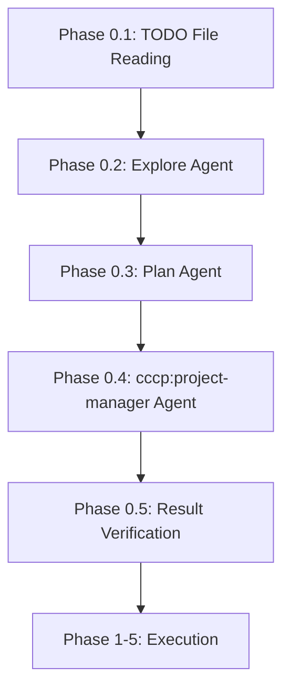
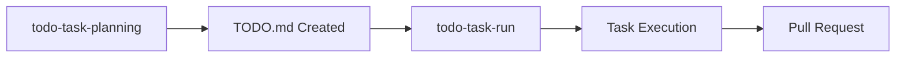
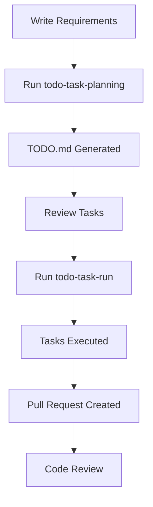

# TODO Task Workflow - Comprehensive How-To Guide

## Overview

[To be completed in Phase 3]

## Creating TODO.md Files

[To be completed in Phase 2]

### Basic TODO.md Format

TODO.md files use a structured Markdown format with checkboxes to track task progress. This format is designed to be both human-readable and machine-parsable by the todo-task-run command.

#### Checkbox Format

Tasks are represented using Markdown checkbox syntax:

- `- [ ]` - Incomplete task
- `- [x]` - Completed task
- `- [🔄]` - In-progress task (optional)

**Example:**
```markdown
- [ ] Implement user authentication
- [x] Set up database schema
- [🔄] Create API endpoints
```

#### Status Markers

Tasks can be prefixed with status markers to indicate their feasibility:

- **✅ Ready** - Clear specifications, technical issues clarified, immediately executable
- **⏳ Pending** - Waiting for dependencies (specify concrete waiting reason and release condition)
- **🔍 Research** - Research required (specify concrete research items and methods)
- **🚧 Blocked** - Important specifications/technical details unclear (specify concrete blocking factors and resolution steps)

**Example:**
```markdown
- [ ] ✅ API authentication system implementation
- [ ] ⏳ Frontend UI integration - After API completion
- [ ] 🔍 Third-party API integration - To research: API documentation
- [ ] 🚧 Payment integration - Blocking factor: Payment provider not decided
```

#### Task Metadata Icons

Use these icons to add context and metadata to tasks:

- **📁** - File references (which files will be created or modified)
- **📊** - Technical rationale or analysis results
- **📋** - Deliverables or output description
- **⏱️** - Time estimation
- **💡** - Implementation guidance or hints

**Example:**
```markdown
- [ ] ✅ Database schema update 📁`prisma/schema.prisma` 📊MySQL support
  - [ ] Update Prisma schema
    - 💡 Follow existing User model pattern
    - ⏱️ Estimated time: 30 minutes
  - [ ] Generate migration
    - 📋 Migration file will be created in `prisma/migrations/`
```

#### Section Division Best Practices

Organize tasks into logical sections based on:

1. **By Status** - Group by feasibility markers (✅⏳🔍🚧)
2. **By Phase** - Group by implementation phases (Phase 0, Phase 1, Phase 2, etc.)
3. **By Feature Area** - Group by functional domain (Authentication, Database, UI, etc.)
4. **By Priority** - Group by execution order based on dependencies

**Example Structure:**
```markdown
## Task List

### Phase 1: Database Setup ✅
- [ ] ✅ 1.1 Create database schema
- [ ] ✅ 1.2 Run migrations

### Phase 2: API Implementation ⏳
- [ ] ⏳ 2.1 Create API endpoints - Waiting for database setup
- [ ] ⏳ 2.2 Add authentication middleware

### Research Tasks 🔍
- [ ] 🔍 Investigate caching strategy
```

#### Describing Dependencies

When tasks have dependencies, clearly specify:

1. **What they depend on** - Name the specific prerequisite task
2. **Why they depend on it** - Explain the technical or logical dependency
3. **When they can proceed** - Specify the release condition

**Example:**
```markdown
- [ ] ⏳ Frontend UI integration 📁`components/LoginForm.vue`
  - Depends on: API authentication system implementation (Phase 1)
  - Reason: Requires `/api/auth/login` endpoint to be available
  - Can proceed: After Phase 1 completion and successful API testing

- [ ] ✅ User profile page implementation 📁`pages/user/profile.vue`
  - No dependencies - can start immediately
```

#### Nested Subtasks

Use 2-space indentation to create nested subtasks:

```markdown
- [ ] ✅ API authentication system implementation
  - [ ] Implement login endpoint
    - [ ] Create POST handler
    - [ ] Add validation middleware
    - [ ] Generate JWT token
  - [ ] Implement token verification middleware
  - [ ] Add session management
```

### Task Granularity Guidelines

Proper task granularity is essential for effective task execution and progress tracking. Tasks should be small enough to complete in a focused session, but large enough to represent meaningful progress.

#### The One File/One Feature Rule

Each task should focus on a single file or a single cohesive feature:

**✅ Good Examples:**
```markdown
- [ ] ✅ Create user authentication model 📁`models/User.ts`
- [ ] ✅ Implement login API endpoint 📁`api/auth/login.ts`
- [ ] ✅ Add email validation utility 📁`utils/validation.ts`
```

**❌ Bad Examples:**
```markdown
- [ ] Implement entire authentication system
  # Too broad - spans multiple files and features

- [ ] Update User.ts and login.ts and validation.ts
  # Multiple files - should be split into separate tasks
```

#### Recommended Task Duration: 30 Minutes to 2 Hours

Tasks should be completable within a single focused work session:

- **Minimum (30 minutes)** - Ensures task has meaningful scope
- **Maximum (2 hours)** - Prevents tasks from becoming too large and unwieldy
- **Sweet spot (45-90 minutes)** - Ideal for most implementation tasks

**Time Estimation Examples:**
```markdown
- [ ] ✅ Create database migration for users table
  - ⏱️ Estimated time: 30 minutes

- [ ] ✅ Implement user registration endpoint with validation
  - ⏱️ Estimated time: 1.5 hours

- [ ] ⏳ Build complete user dashboard UI
  - ⏱️ Estimated time: 4 hours
  # Too long - should be split into smaller tasks
```

#### Clear Dependencies

Dependencies between tasks must be easily identifiable and well-documented:

**✅ Good Dependency Documentation:**
```markdown
### Phase 1: Database Schema ✅
- [ ] ✅ 1.1 Create users table migration 📁`migrations/001_users.sql`
  - No dependencies

- [ ] ✅ 1.2 Create posts table migration 📁`migrations/002_posts.sql`
  - Depends on: 1.1 (requires users table for foreign key)

### Phase 2: API Layer ⏳
- [ ] ⏳ 2.1 Implement user CRUD endpoints 📁`api/users.ts`
  - Depends on: Phase 1 completion (database schema must exist)

- [ ] ⏳ 2.2 Implement post creation endpoint 📁`api/posts.ts`
  - Depends on: 1.2 and 2.1 (requires posts table and user authentication)
```

**❌ Bad Dependency Documentation:**
```markdown
- [ ] Implement user endpoints
  - Depends on: database stuff
  # Vague - unclear what specifically is needed
```

#### Avoiding Overly Broad Tasks

Tasks without specific targets should be broken down into concrete implementation steps:

**❌ Too Broad:**
```markdown
- [ ] Implement user management
- [ ] Fix bugs in authentication
- [ ] Improve performance
```

**✅ Properly Scoped:**
```markdown
- [ ] ✅ Create User model with validation 📁`models/User.ts`
- [ ] ✅ Fix JWT token expiration bug 📁`middleware/auth.ts`
  - 📊 Issue: Tokens not properly validated for expiration
- [ ] ✅ Add database query caching for user lookups 📁`repositories/UserRepository.ts`
  - 📊 Performance: Reduces lookup time from 50ms to 5ms
```

#### Task Breakdown Checklist

Before finalizing tasks, verify each one meets these criteria:

- [ ] Targets a specific file or cohesive feature
- [ ] Can be completed in 30 minutes to 2 hours
- [ ] Has clear, documented dependencies (if any)
- [ ] Includes concrete implementation details (file paths, technical approach)
- [ ] Is not overly broad or vague

#### Example: Breaking Down a Large Task

**Original (too broad):**
```markdown
- [ ] Implement user authentication system
```

**Broken down (proper granularity):**
```markdown
### Phase 1: Authentication Models ✅
- [ ] ✅ 1.1 Create User model 📁`models/User.ts`
  - ⏱️ 45 minutes
  - No dependencies

- [ ] ✅ 1.2 Create Session model 📁`models/Session.ts`
  - ⏱️ 30 minutes
  - Depends on: 1.1 (User model required for foreign key)

### Phase 2: Authentication Endpoints ✅
- [ ] ✅ 2.1 Implement registration endpoint 📁`api/auth/register.ts`
  - ⏱️ 1.5 hours
  - Depends on: 1.1 (User model)

- [ ] ✅ 2.2 Implement login endpoint 📁`api/auth/login.ts`
  - ⏱️ 1 hour
  - Depends on: 1.1, 1.2 (User and Session models)

- [ ] ✅ 2.3 Implement logout endpoint 📁`api/auth/logout.ts`
  - ⏱️ 30 minutes
  - Depends on: 1.2 (Session model)

### Phase 3: Authentication Middleware ✅
- [ ] ✅ 3.1 Create JWT token verification middleware 📁`middleware/auth.ts`
  - ⏱️ 1 hour
  - Depends on: 1.2 (Session model for token validation)
```

### YAGNI Principle in TODO Tasks

YAGNI (You Aren't Gonna Need It) is a fundamental principle in TODO task planning. It means including **only tasks directly necessary to achieve the stated objective**, and explicitly excluding tasks that improve or enhance existing functionality.

#### What is YAGNI in the TODO Context?

When creating TODO.md files, focus exclusively on:

- **New feature implementation** - Building functionality that doesn't exist yet
- **Bug fixes** - Resolving specific reported issues
- **Required infrastructure** - Only what's needed to support the new feature

**Do NOT include tasks that:**
- Improve existing code that already works
- Add "nice to have" features beyond the current objective
- Optimize or enhance code that isn't part of the stated goal

#### What to Exclude from TODO Tasks

The following task types should **NOT** be included unless they are absolutely essential to the stated objective:

##### 1. Refactoring

**❌ Exclude:**
```markdown
- [ ] Refactor user authentication code for better maintainability
- [ ] Reorganize file structure for improved clarity
- [ ] Extract common logic into utility functions
```

**✅ Include only if essential:**
```markdown
- [ ] ✅ Create authentication utility 📁`utils/auth.ts`
  - Note: This is NEW functionality required for the feature, not refactoring
```

##### 2. Log Addition or Enhancement

**❌ Exclude:**
```markdown
- [ ] Add debug logging to authentication flow
- [ ] Improve error logging with more context
- [ ] Add performance logging for API endpoints
```

**✅ Include only if essential:**
```markdown
- [ ] ✅ Implement audit logging for user actions 📁`services/AuditLog.ts`
  - Note: Audit logging is a core feature requirement, not optional logging
```

##### 3. Test Addition for Existing Features

**❌ Exclude:**
```markdown
- [ ] Add tests for existing user registration endpoint
- [ ] Improve test coverage for authentication module
- [ ] Add integration tests for API layer
```

**✅ Include only if essential:**
```markdown
- [ ] ✅ Create tests for new password reset feature 📁`tests/auth/passwordReset.test.ts`
  - Note: Tests for NEW feature implementation, not existing code
```

##### 4. Error Handling Improvements

**❌ Exclude:**
```markdown
- [ ] Add better error handling to existing endpoints
- [ ] Improve validation error messages
- [ ] Strengthen input sanitization in forms
```

**✅ Include only if essential:**
```markdown
- [ ] ✅ Implement error handling for new payment integration 📁`services/PaymentService.ts`
  - Note: Error handling is required for NEW feature, not enhancement
```

##### 5. Documentation

**❌ Exclude:**
```markdown
- [ ] Update API documentation
- [ ] Add JSDoc comments to existing functions
- [ ] Create README for the module
```

**✅ Include only if essential:**
```markdown
- [ ] ✅ Document new webhook integration 📁`docs/webhooks.md`
  - Note: Documentation is required for NEW external-facing feature
```

##### 6. Performance Optimization

**❌ Exclude:**
```markdown
- [ ] Optimize database queries in user lookup
- [ ] Add caching layer for API responses
- [ ] Reduce bundle size with code splitting
```

**✅ Include only if essential:**
```markdown
- [ ] ✅ Implement pagination for new search feature 📁`api/search.ts`
  - Note: Pagination is required for NEW feature to handle large result sets
```

##### 7. Code Quality Improvement

**❌ Exclude:**
```markdown
- [ ] Fix ESLint warnings in codebase
- [ ] Update TypeScript types for better type safety
- [ ] Remove unused imports and dead code
```

##### 8. Security Strengthening (when not essential)

**❌ Exclude:**
```markdown
- [ ] Add rate limiting to existing API endpoints
- [ ] Strengthen password requirements
- [ ] Add CSRF protection to forms
```

**✅ Include only if essential:**
```markdown
- [ ] ✅ Implement OAuth authentication for new SSO feature 📁`services/OAuth.ts`
  - Note: OAuth is the core feature requirement, not a security enhancement
```

##### 9. Pursuit of Perfection

**❌ Exclude:**
```markdown
- [ ] Polish UI animations
- [ ] Fine-tune color scheme for better aesthetics
- [ ] Add loading states to all buttons
```

#### YAGNI Validation Checklist

Before including a task in your TODO.md, ask:

1. **Is this task directly necessary to achieve the stated objective?**
   - Yes → Include it
   - No → Exclude it

2. **Does this task create NEW functionality or fix a specific bug?**
   - Yes → Include it
   - No (it improves existing code) → Exclude it

3. **Would the feature work without this task?**
   - No (it's essential) → Include it
   - Yes (it's an enhancement) → Exclude it

4. **Is this task mentioned in the requirements or objectives?**
   - Yes → Include it
   - No (it's extra work) → Exclude it

#### Example: Applying YAGNI to a Feature

**Objective:** Implement password reset functionality

**❌ Without YAGNI (includes unnecessary tasks):**
```markdown
## Password Reset Feature

- [ ] Refactor existing authentication code
- [ ] Add comprehensive logging to all auth endpoints
- [ ] Update tests for existing login functionality
- [ ] Implement password reset email sending 📁`services/PasswordReset.ts`
- [ ] Create password reset API endpoint 📁`api/auth/reset.ts`
- [ ] Add rate limiting to all endpoints
- [ ] Update API documentation
- [ ] Improve error messages across authentication module
```

**✅ With YAGNI (only essential tasks):**
```markdown
## Password Reset Feature

### Phase 1: Backend Implementation ✅
- [ ] ✅ 1.1 Implement password reset token generation 📁`services/PasswordReset.ts`
  - ⏱️ 1 hour

- [ ] ✅ 1.2 Create password reset API endpoint 📁`api/auth/reset.ts`
  - ⏱️ 1.5 hours
  - Depends on: 1.1

- [ ] ✅ 1.3 Implement email sending for reset link 📁`services/EmailService.ts`
  - ⏱️ 1 hour
  - Depends on: 1.1

### Phase 2: Frontend Implementation ✅
- [ ] ✅ 2.1 Create password reset request form 📁`components/PasswordResetForm.vue`
  - ⏱️ 45 minutes

- [ ] ✅ 2.2 Create password reset confirmation page 📁`pages/auth/reset.vue`
  - ⏱️ 1 hour
  - Depends on: 1.2
```

#### Benefits of YAGNI

Following YAGNI in TODO tasks provides:

1. **Faster delivery** - Focus only on what's needed
2. **Clearer scope** - Avoid scope creep and unnecessary work
3. **Better time estimates** - Predictions are more accurate when scope is well-defined
4. **Reduced complexity** - Simpler implementations are easier to maintain
5. **Lower risk** - Fewer changes mean fewer opportunities for bugs

#### When to Break YAGNI

There are rare cases where you might include "extra" tasks:

1. **Critical security requirements** - If a new feature introduces security vulnerabilities
2. **Regulatory compliance** - If the feature must meet specific legal requirements
3. **Explicit user request** - If the stakeholder specifically asks for improvements
4. **Prerequisite infrastructure** - If existing code must be modified to support the new feature

**Example of acceptable "extra" work:**
```markdown
- [ ] ✅ Implement new user registration endpoint 📁`api/auth/register.ts`

- [ ] ✅ Add password hashing to registration 📁`utils/passwordHash.ts`
  - Note: This is essential for security, not an enhancement
```

### Complete TODO.md Example

Below is a complete, copy-paste ready TODO.md template that demonstrates all the concepts covered in this guide. This example follows best practices for task granularity, YAGNI principles, and proper formatting.

```markdown
# User Profile Enhancement Feature

## 📊 Project Overview

**Goal**: Add user profile editing capability with avatar upload functionality

**Success Criteria**:
- Users can edit their profile information (name, bio, email)
- Users can upload and change their profile avatar
- Changes are validated and persisted to database
- UI provides feedback for successful/failed updates

**Estimated Total Time**: 8-10 hours

**References**:
- 📁 Design mockups: `docs/designs/user-profile-v2.figma`
- 📁 API specification: `docs/api/user-profile-endpoints.md`

## 📋 Task List

### Phase 1: Database and API Setup ✅

- [ ] ✅ 1.1 Update User model schema 📁`models/User.ts`
  - Add `avatarUrl` field to User model
  - Add `bio` field to User model (max 500 chars)
  - 📊 Uses existing Sequelize pattern from User model
  - ⏱️ Estimated time: 30 minutes
  - 💡 Follow existing model structure in `models/User.ts`

- [ ] ✅ 1.2 Create database migration 📁`migrations/YYYYMMDD_add_profile_fields.ts`
  - Depends on: 1.1 (model schema must be defined first)
  - Add `avatar_url` VARCHAR(500) column
  - Add `bio` TEXT column
  - 📊 Migration uses `ALTER TABLE users` statement
  - ⏱️ Estimated time: 20 minutes
  - 💡 Test migration with `npm run migrate:up` and `migrate:down`

- [ ] ✅ 1.3 Run database migration
  - Depends on: 1.2 (migration file must exist)
  - Execute: `npm run migrate:up`
  - Verify columns added with database client
  - ⏱️ Estimated time: 10 minutes

- [ ] ✅ 1.4 Implement profile update API endpoint 📁`api/users/profile.ts`
  - Depends on: 1.3 (database schema must be updated)
  - Create PATCH `/api/users/:id/profile` endpoint
  - Validate input (name length, email format, bio max length)
  - Return updated user object
  - 📊 Uses Express.js request validation pattern
  - ⏱️ Estimated time: 1.5 hours
  - 💡 Reference existing endpoint structure in `api/users/index.ts`

### Phase 2: File Upload Implementation ✅

- [ ] ✅ 2.1 Set up file upload middleware 📁`middleware/upload.ts`
  - Configure multer for image uploads
  - Validate file type (jpeg, png, webp only)
  - Validate file size (max 5MB)
  - 📊 Uses multer middleware with memory storage
  - ⏱️ Estimated time: 1 hour
  - 💡 Reference multer documentation for configuration

- [ ] ✅ 2.2 Implement avatar upload endpoint 📁`api/users/avatar.ts`
  - Depends on: 2.1 (upload middleware must exist)
  - Create POST `/api/users/:id/avatar` endpoint
  - Use upload middleware to handle multipart/form-data
  - Store file in cloud storage (S3 or Cloudinary)
  - Update user's `avatarUrl` in database
  - 📊 Uses AWS S3 SDK or Cloudinary SDK
  - ⏱️ Estimated time: 2 hours
  - 💡 Environment variables: `AWS_BUCKET_NAME`, `AWS_REGION`

- [ ] ✅ 2.3 Execute cccp:micro-commit to commit backend changes
  - Depends on: Phase 1 and Phase 2 completion
  - Command: `/cccp:micro-commit`
  - 📋 Commits will be split by context (model, migration, endpoints, middleware)
  - ⏱️ Estimated time: 5 minutes

### Phase 3: Frontend Implementation ✅

- [ ] ✅ 3.1 Create ProfileEditForm component 📁`components/ProfileEditForm.vue`
  - Depends on: 1.4 (API endpoint must exist)
  - Form fields: name (input), bio (textarea), email (input)
  - Client-side validation (required fields, email format)
  - Call PATCH `/api/users/:id/profile` on submit
  - Display success/error messages
  - 📊 Uses Vue 3 Composition API with `<script setup>`
  - ⏱️ Estimated time: 2 hours
  - 💡 Reference existing form patterns in `components/LoginForm.vue`

- [ ] ✅ 3.2 Create AvatarUpload component 📁`components/AvatarUpload.vue`
  - Depends on: 2.2 (avatar upload endpoint must exist)
  - Display current avatar with fallback to default image
  - File input with "Change Avatar" button
  - Image preview before upload
  - Call POST `/api/users/:id/avatar` on file selection
  - Display upload progress and success/error states
  - 📊 Uses HTML5 FileReader API for preview
  - ⏱️ Estimated time: 1.5 hours
  - 💡 Reference Vue file upload patterns

- [ ] ✅ 3.3 Integrate components into profile page 📁`pages/profile/edit.vue`
  - Depends on: 3.1, 3.2 (components must exist)
  - Import ProfileEditForm and AvatarUpload components
  - Layout: Avatar on left, form on right
  - Add "Save Changes" and "Cancel" buttons
  - Handle navigation after successful update
  - ⏱️ Estimated time: 45 minutes
  - 💡 Use existing page layout from `pages/profile/index.vue`

- [ ] ✅ 3.4 Execute cccp:micro-commit to commit frontend changes
  - Depends on: Phase 3 completion
  - Command: `/cccp:micro-commit`
  - 📋 Commits will be split by component
  - ⏱️ Estimated time: 5 minutes

### Phase 4: Testing and Refinement ✅

- [ ] ✅ 4.1 Manual testing checklist
  - [ ] Test profile update with valid data
  - [ ] Test validation errors (invalid email, bio too long)
  - [ ] Test avatar upload with valid image
  - [ ] Test avatar upload error cases (file too large, wrong format)
  - [ ] Test UI responsiveness on mobile and desktop
  - 📋 Document test results in `docs/testing/profile-edit-test-results.md`
  - ⏱️ Estimated time: 1 hour

- [ ] ✅ 4.2 Execute final cccp:micro-commit
  - Command: `/cccp:micro-commit`
  - 📋 Commit any final adjustments or fixes
  - ⏱️ Estimated time: 5 minutes

## 📈 Progress Status

- **Completed**: 0/14 tasks (0%)
- **In Progress**: Phase 1
- **Next Action**: Start with Task 1.1 (Update User model schema)

## 🎯 Next Actions

1. Begin with Phase 1 tasks (database and API setup)
2. Test each endpoint with Postman or curl before moving to next phase
3. After backend completion, proceed to frontend implementation
4. Perform thorough manual testing before considering complete

## ❓ Questions and Clarifications

- [x] **[Specification]** Which cloud storage service should be used for avatar uploads?
  - Answer: Use AWS S3 (bucket name: `user-avatars-prod`)

- [x] **[UI]** Should there be a character counter for the bio field?
  - Answer: Yes, display "X/500 characters" below textarea

- [ ] **[UX]** Should users be able to remove their avatar (reset to default)?
  - Waiting for product team confirmation

## 📚 Related Documentation

- User model documentation: `docs/models/user.md`
- File upload guidelines: `docs/development/file-uploads.md`
- API authentication: `docs/api/authentication.md`
```

This example demonstrates:

- **Clear project overview** with goals and success criteria
- **Proper task granularity** (each task is 20 minutes to 2 hours)
- **YAGNI compliance** (no refactoring, logging, or documentation tasks unless essential)
- **Status markers** (✅ for all tasks since they're well-defined)
- **File references** (📁 for every implementation task)
- **Dependencies** clearly documented
- **Time estimates** (⏱️) for planning
- **Implementation hints** (💡) to guide execution
- **Nested subtasks** with proper indentation
- **Progress tracking** section
- **Questions section** for clarifications

## Using todo-task-planning Command

[To be completed in Phase 3]

### Command Overview

[To be completed in Phase 3.1]

### Options: --branch and --pr

[To be completed in Phase 3.2]

### Phase 0 Processing Flow

[To be completed in Phase 3.3]

#### Workflow Diagram



### Usage Examples and Best Practices

[To be completed in Phase 3.4]

## Using todo-task-run Command

[To be completed in Phase 4]

### Command Overview

[To be completed in Phase 4.1]

#### Workflow Diagram



### Processing Flow

[To be completed in Phase 4.2]

### Options: --no-pr and --no-push

[To be completed in Phase 4.3]

### micro-commit Integration

[To be completed in Phase 4.4]

## Best Practices and Examples

[To be completed in Phase 5]

### Complete Workflow Example

[To be completed in Phase 5.1]

#### Overall Workflow Diagram



### Common Usage Patterns

[To be completed in Phase 5.2]

### Troubleshooting

[To be completed in Phase 5.3]

## Appendix

### References

- [todo-task-planning command documentation](commands/todo-task-planning.md)
- [todo-task-run command documentation](commands/todo-task-run.md)
- [CCCP README](README.md)
