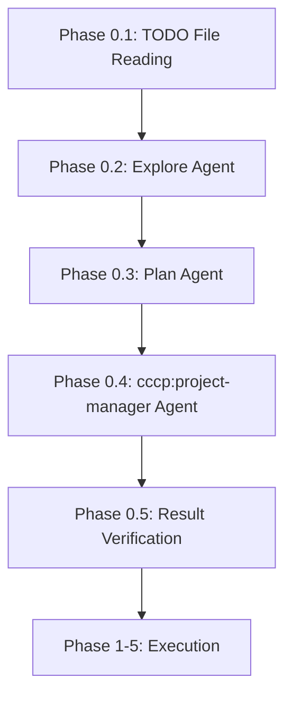
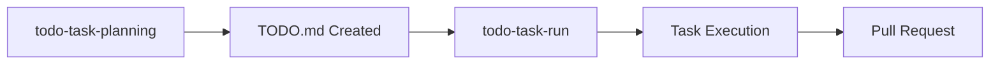
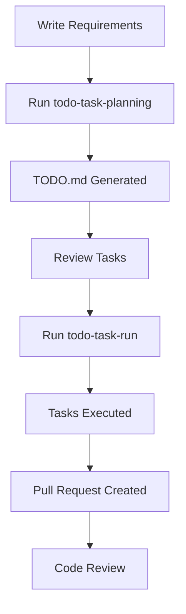

# TODO Task Workflow - Comprehensive How-To Guide

## Overview

[To be completed in Phase 3]

## Creating TODO.md Files

[To be completed in Phase 2]

### Basic TODO.md Format

[To be completed in Phase 2.1]

### Task Granularity Guidelines

[To be completed in Phase 2.2]

### YAGNI Principle in TODO Tasks

[To be completed in Phase 2.3]

### Complete TODO.md Example

[To be completed in Phase 2.4]

## Using todo-task-planning Command

[To be completed in Phase 3]

### Command Overview

[To be completed in Phase 3.1]

### Options: --branch and --pr

[To be completed in Phase 3.2]

### Phase 0 Processing Flow

[To be completed in Phase 3.3]

#### Workflow Diagram

### Usage Examples and Best Practices

[To be completed in Phase 3.4]

## Using todo-task-run Command

[To be completed in Phase 4]

### Command Overview

[To be completed in Phase 4.1]

#### Workflow Diagram

### Processing Flow

[To be completed in Phase 4.2]

### Options: --no-pr and --no-push

[To be completed in Phase 4.3]

### micro-commit Integration

[To be completed in Phase 4.4]

## Best Practices and Examples

[To be completed in Phase 5]

### Complete Workflow Example

[To be completed in Phase 5.1]

#### Overall Workflow Diagram

### Common Usage Patterns

[To be completed in Phase 5.2]

### Troubleshooting

[To be completed in Phase 5.3]

## Appendix

### References

- [todo-task-planning command documentation](commands/todo-task-planning.md)
- [todo-task-run command documentation](commands/todo-task-run.md)
- [CCCP README](README.md)
