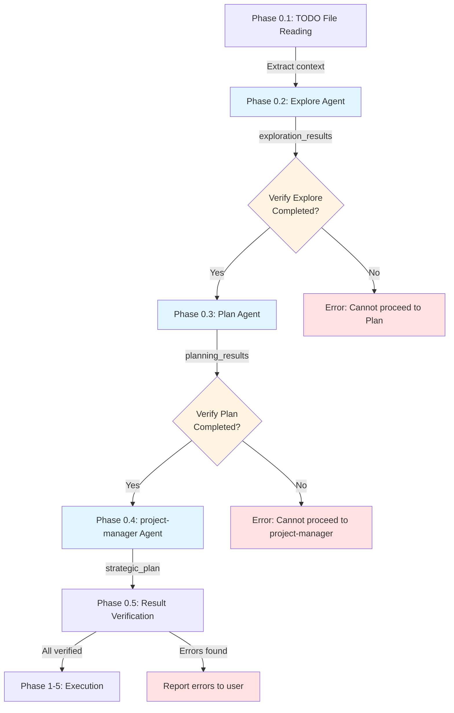
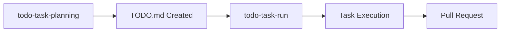
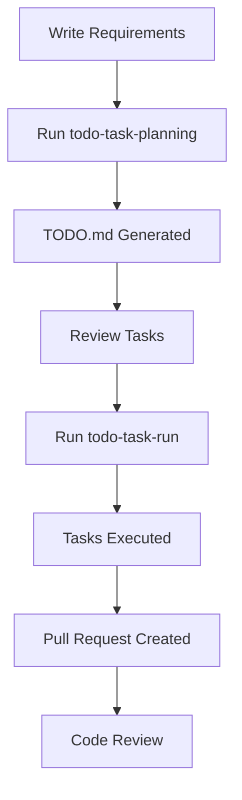

# TODO Task Workflow - Comprehensive How-To Guide

## Overview

[To be completed in Phase 3]

## Creating TODO.md Files

[To be completed in Phase 2]

### Basic TODO.md Format

TODO.md files use a structured Markdown format with checkboxes to track task progress. This format is designed to be both human-readable and machine-parsable by the todo-task-run command.

#### Checkbox Format

Tasks are represented using Markdown checkbox syntax:

- `- [ ]` - Incomplete task
- `- [x]` - Completed task
- `- [🔄]` - In-progress task (optional)

**Example:**
```markdown
- [ ] Implement user authentication
- [x] Set up database schema
- [🔄] Create API endpoints
```

#### Status Markers

Tasks can be prefixed with status markers to indicate their feasibility:

- **✅ Ready** - Clear specifications, technical issues clarified, immediately executable
- **⏳ Pending** - Waiting for dependencies (specify concrete waiting reason and release condition)
- **🔍 Research** - Research required (specify concrete research items and methods)
- **🚧 Blocked** - Important specifications/technical details unclear (specify concrete blocking factors and resolution steps)

**Example:**
```markdown
- [ ] ✅ API authentication system implementation
- [ ] ⏳ Frontend UI integration - After API completion
- [ ] 🔍 Third-party API integration - To research: API documentation
- [ ] 🚧 Payment integration - Blocking factor: Payment provider not decided
```

#### Task Metadata Icons

Use these icons to add context and metadata to tasks:

- **📁** - File references (which files will be created or modified)
- **📊** - Technical rationale or analysis results
- **📋** - Deliverables or output description
- **⏱️** - Time estimation
- **💡** - Implementation guidance or hints

**Example:**
```markdown
- [ ] ✅ Database schema update 📁`prisma/schema.prisma` 📊MySQL support
  - [ ] Update Prisma schema
    - 💡 Follow existing User model pattern
    - ⏱️ Estimated time: 30 minutes
  - [ ] Generate migration
    - 📋 Migration file will be created in `prisma/migrations/`
```

#### Section Division Best Practices

Organize tasks into logical sections based on:

1. **By Status** - Group by feasibility markers (✅⏳🔍🚧)
2. **By Phase** - Group by implementation phases (Phase 0, Phase 1, Phase 2, etc.)
3. **By Feature Area** - Group by functional domain (Authentication, Database, UI, etc.)
4. **By Priority** - Group by execution order based on dependencies

**Example Structure:**
```markdown
## Task List

### Phase 1: Database Setup ✅
- [ ] ✅ 1.1 Create database schema
- [ ] ✅ 1.2 Run migrations

### Phase 2: API Implementation ⏳
- [ ] ⏳ 2.1 Create API endpoints - Waiting for database setup
- [ ] ⏳ 2.2 Add authentication middleware

### Research Tasks 🔍
- [ ] 🔍 Investigate caching strategy
```

#### Describing Dependencies

When tasks have dependencies, clearly specify:

1. **What they depend on** - Name the specific prerequisite task
2. **Why they depend on it** - Explain the technical or logical dependency
3. **When they can proceed** - Specify the release condition

**Example:**
```markdown
- [ ] ⏳ Frontend UI integration 📁`components/LoginForm.vue`
  - Depends on: API authentication system implementation (Phase 1)
  - Reason: Requires `/api/auth/login` endpoint to be available
  - Can proceed: After Phase 1 completion and successful API testing

- [ ] ✅ User profile page implementation 📁`pages/user/profile.vue`
  - No dependencies - can start immediately
```

#### Nested Subtasks

Use 2-space indentation to create nested subtasks:

```markdown
- [ ] ✅ API authentication system implementation
  - [ ] Implement login endpoint
    - [ ] Create POST handler
    - [ ] Add validation middleware
    - [ ] Generate JWT token
  - [ ] Implement token verification middleware
  - [ ] Add session management
```

### Task Granularity Guidelines

Proper task granularity is essential for effective task execution and progress tracking. Tasks should be small enough to complete in a focused session, but large enough to represent meaningful progress.

#### The One File/One Feature Rule

Each task should focus on a single file or a single cohesive feature:

**✅ Good Examples:**
```markdown
- [ ] ✅ Create user authentication model 📁`models/User.ts`
- [ ] ✅ Implement login API endpoint 📁`api/auth/login.ts`
- [ ] ✅ Add email validation utility 📁`utils/validation.ts`
```

**❌ Bad Examples:**
```markdown
- [ ] Implement entire authentication system
  # Too broad - spans multiple files and features

- [ ] Update User.ts and login.ts and validation.ts
  # Multiple files - should be split into separate tasks
```

#### Recommended Task Duration: 30 Minutes to 2 Hours

Tasks should be completable within a single focused work session:

- **Minimum (30 minutes)** - Ensures task has meaningful scope
- **Maximum (2 hours)** - Prevents tasks from becoming too large and unwieldy
- **Sweet spot (45-90 minutes)** - Ideal for most implementation tasks

**Time Estimation Examples:**
```markdown
- [ ] ✅ Create database migration for users table
  - ⏱️ Estimated time: 30 minutes

- [ ] ✅ Implement user registration endpoint with validation
  - ⏱️ Estimated time: 1.5 hours

- [ ] ⏳ Build complete user dashboard UI
  - ⏱️ Estimated time: 4 hours
  # Too long - should be split into smaller tasks
```

#### Clear Dependencies

Dependencies between tasks must be easily identifiable and well-documented:

**✅ Good Dependency Documentation:**
```markdown
### Phase 1: Database Schema ✅
- [ ] ✅ 1.1 Create users table migration 📁`migrations/001_users.sql`
  - No dependencies

- [ ] ✅ 1.2 Create posts table migration 📁`migrations/002_posts.sql`
  - Depends on: 1.1 (requires users table for foreign key)

### Phase 2: API Layer ⏳
- [ ] ⏳ 2.1 Implement user CRUD endpoints 📁`api/users.ts`
  - Depends on: Phase 1 completion (database schema must exist)

- [ ] ⏳ 2.2 Implement post creation endpoint 📁`api/posts.ts`
  - Depends on: 1.2 and 2.1 (requires posts table and user authentication)
```

**❌ Bad Dependency Documentation:**
```markdown
- [ ] Implement user endpoints
  - Depends on: database stuff
  # Vague - unclear what specifically is needed
```

#### Avoiding Overly Broad Tasks

Tasks without specific targets should be broken down into concrete implementation steps:

**❌ Too Broad:**
```markdown
- [ ] Implement user management
- [ ] Fix bugs in authentication
- [ ] Improve performance
```

**✅ Properly Scoped:**
```markdown
- [ ] ✅ Create User model with validation 📁`models/User.ts`
- [ ] ✅ Fix JWT token expiration bug 📁`middleware/auth.ts`
  - 📊 Issue: Tokens not properly validated for expiration
- [ ] ✅ Add database query caching for user lookups 📁`repositories/UserRepository.ts`
  - 📊 Performance: Reduces lookup time from 50ms to 5ms
```

#### Task Breakdown Checklist

Before finalizing tasks, verify each one meets these criteria:

- [ ] Targets a specific file or cohesive feature
- [ ] Can be completed in 30 minutes to 2 hours
- [ ] Has clear, documented dependencies (if any)
- [ ] Includes concrete implementation details (file paths, technical approach)
- [ ] Is not overly broad or vague

#### Example: Breaking Down a Large Task

**Original (too broad):**
```markdown
- [ ] Implement user authentication system
```

**Broken down (proper granularity):**
```markdown
### Phase 1: Authentication Models ✅
- [ ] ✅ 1.1 Create User model 📁`models/User.ts`
  - ⏱️ 45 minutes
  - No dependencies

- [ ] ✅ 1.2 Create Session model 📁`models/Session.ts`
  - ⏱️ 30 minutes
  - Depends on: 1.1 (User model required for foreign key)

### Phase 2: Authentication Endpoints ✅
- [ ] ✅ 2.1 Implement registration endpoint 📁`api/auth/register.ts`
  - ⏱️ 1.5 hours
  - Depends on: 1.1 (User model)

- [ ] ✅ 2.2 Implement login endpoint 📁`api/auth/login.ts`
  - ⏱️ 1 hour
  - Depends on: 1.1, 1.2 (User and Session models)

- [ ] ✅ 2.3 Implement logout endpoint 📁`api/auth/logout.ts`
  - ⏱️ 30 minutes
  - Depends on: 1.2 (Session model)

### Phase 3: Authentication Middleware ✅
- [ ] ✅ 3.1 Create JWT token verification middleware 📁`middleware/auth.ts`
  - ⏱️ 1 hour
  - Depends on: 1.2 (Session model for token validation)
```

### YAGNI Principle in TODO Tasks

YAGNI (You Aren't Gonna Need It) is a fundamental principle in TODO task planning. It means including **only tasks directly necessary to achieve the stated objective**, and explicitly excluding tasks that improve or enhance existing functionality.

#### What is YAGNI in the TODO Context?

When creating TODO.md files, focus exclusively on:

- **New feature implementation** - Building functionality that doesn't exist yet
- **Bug fixes** - Resolving specific reported issues
- **Required infrastructure** - Only what's needed to support the new feature

**Do NOT include tasks that:**
- Improve existing code that already works
- Add "nice to have" features beyond the current objective
- Optimize or enhance code that isn't part of the stated goal

#### What to Exclude from TODO Tasks

The following task types should **NOT** be included unless they are absolutely essential to the stated objective:

##### 1. Refactoring

**❌ Exclude:**
```markdown
- [ ] Refactor user authentication code for better maintainability
- [ ] Reorganize file structure for improved clarity
- [ ] Extract common logic into utility functions
```

**✅ Include only if essential:**
```markdown
- [ ] ✅ Create authentication utility 📁`utils/auth.ts`
  - Note: This is NEW functionality required for the feature, not refactoring
```

##### 2. Log Addition or Enhancement

**❌ Exclude:**
```markdown
- [ ] Add debug logging to authentication flow
- [ ] Improve error logging with more context
- [ ] Add performance logging for API endpoints
```

**✅ Include only if essential:**
```markdown
- [ ] ✅ Implement audit logging for user actions 📁`services/AuditLog.ts`
  - Note: Audit logging is a core feature requirement, not optional logging
```

##### 3. Test Addition for Existing Features

**❌ Exclude:**
```markdown
- [ ] Add tests for existing user registration endpoint
- [ ] Improve test coverage for authentication module
- [ ] Add integration tests for API layer
```

**✅ Include only if essential:**
```markdown
- [ ] ✅ Create tests for new password reset feature 📁`tests/auth/passwordReset.test.ts`
  - Note: Tests for NEW feature implementation, not existing code
```

##### 4. Error Handling Improvements

**❌ Exclude:**
```markdown
- [ ] Add better error handling to existing endpoints
- [ ] Improve validation error messages
- [ ] Strengthen input sanitization in forms
```

**✅ Include only if essential:**
```markdown
- [ ] ✅ Implement error handling for new payment integration 📁`services/PaymentService.ts`
  - Note: Error handling is required for NEW feature, not enhancement
```

##### 5. Documentation

**❌ Exclude:**
```markdown
- [ ] Update API documentation
- [ ] Add JSDoc comments to existing functions
- [ ] Create README for the module
```

**✅ Include only if essential:**
```markdown
- [ ] ✅ Document new webhook integration 📁`docs/webhooks.md`
  - Note: Documentation is required for NEW external-facing feature
```

##### 6. Performance Optimization

**❌ Exclude:**
```markdown
- [ ] Optimize database queries in user lookup
- [ ] Add caching layer for API responses
- [ ] Reduce bundle size with code splitting
```

**✅ Include only if essential:**
```markdown
- [ ] ✅ Implement pagination for new search feature 📁`api/search.ts`
  - Note: Pagination is required for NEW feature to handle large result sets
```

##### 7. Code Quality Improvement

**❌ Exclude:**
```markdown
- [ ] Fix ESLint warnings in codebase
- [ ] Update TypeScript types for better type safety
- [ ] Remove unused imports and dead code
```

##### 8. Security Strengthening (when not essential)

**❌ Exclude:**
```markdown
- [ ] Add rate limiting to existing API endpoints
- [ ] Strengthen password requirements
- [ ] Add CSRF protection to forms
```

**✅ Include only if essential:**
```markdown
- [ ] ✅ Implement OAuth authentication for new SSO feature 📁`services/OAuth.ts`
  - Note: OAuth is the core feature requirement, not a security enhancement
```

##### 9. Pursuit of Perfection

**❌ Exclude:**
```markdown
- [ ] Polish UI animations
- [ ] Fine-tune color scheme for better aesthetics
- [ ] Add loading states to all buttons
```

#### YAGNI Validation Checklist

Before including a task in your TODO.md, ask:

1. **Is this task directly necessary to achieve the stated objective?**
   - Yes → Include it
   - No → Exclude it

2. **Does this task create NEW functionality or fix a specific bug?**
   - Yes → Include it
   - No (it improves existing code) → Exclude it

3. **Would the feature work without this task?**
   - No (it's essential) → Include it
   - Yes (it's an enhancement) → Exclude it

4. **Is this task mentioned in the requirements or objectives?**
   - Yes → Include it
   - No (it's extra work) → Exclude it

#### Example: Applying YAGNI to a Feature

**Objective:** Implement password reset functionality

**❌ Without YAGNI (includes unnecessary tasks):**
```markdown
## Password Reset Feature

- [ ] Refactor existing authentication code
- [ ] Add comprehensive logging to all auth endpoints
- [ ] Update tests for existing login functionality
- [ ] Implement password reset email sending 📁`services/PasswordReset.ts`
- [ ] Create password reset API endpoint 📁`api/auth/reset.ts`
- [ ] Add rate limiting to all endpoints
- [ ] Update API documentation
- [ ] Improve error messages across authentication module
```

**✅ With YAGNI (only essential tasks):**
```markdown
## Password Reset Feature

### Phase 1: Backend Implementation ✅
- [ ] ✅ 1.1 Implement password reset token generation 📁`services/PasswordReset.ts`
  - ⏱️ 1 hour

- [ ] ✅ 1.2 Create password reset API endpoint 📁`api/auth/reset.ts`
  - ⏱️ 1.5 hours
  - Depends on: 1.1

- [ ] ✅ 1.3 Implement email sending for reset link 📁`services/EmailService.ts`
  - ⏱️ 1 hour
  - Depends on: 1.1

### Phase 2: Frontend Implementation ✅
- [ ] ✅ 2.1 Create password reset request form 📁`components/PasswordResetForm.vue`
  - ⏱️ 45 minutes

- [ ] ✅ 2.2 Create password reset confirmation page 📁`pages/auth/reset.vue`
  - ⏱️ 1 hour
  - Depends on: 1.2
```

#### Benefits of YAGNI

Following YAGNI in TODO tasks provides:

1. **Faster delivery** - Focus only on what's needed
2. **Clearer scope** - Avoid scope creep and unnecessary work
3. **Better time estimates** - Predictions are more accurate when scope is well-defined
4. **Reduced complexity** - Simpler implementations are easier to maintain
5. **Lower risk** - Fewer changes mean fewer opportunities for bugs

#### When to Break YAGNI

There are rare cases where you might include "extra" tasks:

1. **Critical security requirements** - If a new feature introduces security vulnerabilities
2. **Regulatory compliance** - If the feature must meet specific legal requirements
3. **Explicit user request** - If the stakeholder specifically asks for improvements
4. **Prerequisite infrastructure** - If existing code must be modified to support the new feature

**Example of acceptable "extra" work:**
```markdown
- [ ] ✅ Implement new user registration endpoint 📁`api/auth/register.ts`

- [ ] ✅ Add password hashing to registration 📁`utils/passwordHash.ts`
  - Note: This is essential for security, not an enhancement
```

### Complete TODO.md Example

Below is a complete, copy-paste ready TODO.md template that demonstrates all the concepts covered in this guide. This example follows best practices for task granularity, YAGNI principles, and proper formatting.

```markdown
# User Profile Enhancement Feature

## 📊 Project Overview

**Goal**: Add user profile editing capability with avatar upload functionality

**Success Criteria**:
- Users can edit their profile information (name, bio, email)
- Users can upload and change their profile avatar
- Changes are validated and persisted to database
- UI provides feedback for successful/failed updates

**Estimated Total Time**: 8-10 hours

**References**:
- 📁 Design mockups: `docs/designs/user-profile-v2.figma`
- 📁 API specification: `docs/api/user-profile-endpoints.md`

## 📋 Task List

### Phase 1: Database and API Setup ✅

- [ ] ✅ 1.1 Update User model schema 📁`models/User.ts`
  - Add `avatarUrl` field to User model
  - Add `bio` field to User model (max 500 chars)
  - 📊 Uses existing Sequelize pattern from User model
  - ⏱️ Estimated time: 30 minutes
  - 💡 Follow existing model structure in `models/User.ts`

- [ ] ✅ 1.2 Create database migration 📁`migrations/YYYYMMDD_add_profile_fields.ts`
  - Depends on: 1.1 (model schema must be defined first)
  - Add `avatar_url` VARCHAR(500) column
  - Add `bio` TEXT column
  - 📊 Migration uses `ALTER TABLE users` statement
  - ⏱️ Estimated time: 20 minutes
  - 💡 Test migration with `npm run migrate:up` and `migrate:down`

- [ ] ✅ 1.3 Run database migration
  - Depends on: 1.2 (migration file must exist)
  - Execute: `npm run migrate:up`
  - Verify columns added with database client
  - ⏱️ Estimated time: 10 minutes

- [ ] ✅ 1.4 Implement profile update API endpoint 📁`api/users/profile.ts`
  - Depends on: 1.3 (database schema must be updated)
  - Create PATCH `/api/users/:id/profile` endpoint
  - Validate input (name length, email format, bio max length)
  - Return updated user object
  - 📊 Uses Express.js request validation pattern
  - ⏱️ Estimated time: 1.5 hours
  - 💡 Reference existing endpoint structure in `api/users/index.ts`

### Phase 2: File Upload Implementation ✅

- [ ] ✅ 2.1 Set up file upload middleware 📁`middleware/upload.ts`
  - Configure multer for image uploads
  - Validate file type (jpeg, png, webp only)
  - Validate file size (max 5MB)
  - 📊 Uses multer middleware with memory storage
  - ⏱️ Estimated time: 1 hour
  - 💡 Reference multer documentation for configuration

- [ ] ✅ 2.2 Implement avatar upload endpoint 📁`api/users/avatar.ts`
  - Depends on: 2.1 (upload middleware must exist)
  - Create POST `/api/users/:id/avatar` endpoint
  - Use upload middleware to handle multipart/form-data
  - Store file in cloud storage (S3 or Cloudinary)
  - Update user's `avatarUrl` in database
  - 📊 Uses AWS S3 SDK or Cloudinary SDK
  - ⏱️ Estimated time: 2 hours
  - 💡 Environment variables: `AWS_BUCKET_NAME`, `AWS_REGION`

- [ ] ✅ 2.3 Execute cccp:micro-commit to commit backend changes
  - Depends on: Phase 1 and Phase 2 completion
  - Command: `/cccp:micro-commit`
  - 📋 Commits will be split by context (model, migration, endpoints, middleware)
  - ⏱️ Estimated time: 5 minutes

### Phase 3: Frontend Implementation ✅

- [ ] ✅ 3.1 Create ProfileEditForm component 📁`components/ProfileEditForm.vue`
  - Depends on: 1.4 (API endpoint must exist)
  - Form fields: name (input), bio (textarea), email (input)
  - Client-side validation (required fields, email format)
  - Call PATCH `/api/users/:id/profile` on submit
  - Display success/error messages
  - 📊 Uses Vue 3 Composition API with `<script setup>`
  - ⏱️ Estimated time: 2 hours
  - 💡 Reference existing form patterns in `components/LoginForm.vue`

- [ ] ✅ 3.2 Create AvatarUpload component 📁`components/AvatarUpload.vue`
  - Depends on: 2.2 (avatar upload endpoint must exist)
  - Display current avatar with fallback to default image
  - File input with "Change Avatar" button
  - Image preview before upload
  - Call POST `/api/users/:id/avatar` on file selection
  - Display upload progress and success/error states
  - 📊 Uses HTML5 FileReader API for preview
  - ⏱️ Estimated time: 1.5 hours
  - 💡 Reference Vue file upload patterns

- [ ] ✅ 3.3 Integrate components into profile page 📁`pages/profile/edit.vue`
  - Depends on: 3.1, 3.2 (components must exist)
  - Import ProfileEditForm and AvatarUpload components
  - Layout: Avatar on left, form on right
  - Add "Save Changes" and "Cancel" buttons
  - Handle navigation after successful update
  - ⏱️ Estimated time: 45 minutes
  - 💡 Use existing page layout from `pages/profile/index.vue`

- [ ] ✅ 3.4 Execute cccp:micro-commit to commit frontend changes
  - Depends on: Phase 3 completion
  - Command: `/cccp:micro-commit`
  - 📋 Commits will be split by component
  - ⏱️ Estimated time: 5 minutes

### Phase 4: Testing and Refinement ✅

- [ ] ✅ 4.1 Manual testing checklist
  - [ ] Test profile update with valid data
  - [ ] Test validation errors (invalid email, bio too long)
  - [ ] Test avatar upload with valid image
  - [ ] Test avatar upload error cases (file too large, wrong format)
  - [ ] Test UI responsiveness on mobile and desktop
  - 📋 Document test results in `docs/testing/profile-edit-test-results.md`
  - ⏱️ Estimated time: 1 hour

- [ ] ✅ 4.2 Execute final cccp:micro-commit
  - Command: `/cccp:micro-commit`
  - 📋 Commit any final adjustments or fixes
  - ⏱️ Estimated time: 5 minutes

## 📈 Progress Status

- **Completed**: 0/14 tasks (0%)
- **In Progress**: Phase 1
- **Next Action**: Start with Task 1.1 (Update User model schema)

## 🎯 Next Actions

1. Begin with Phase 1 tasks (database and API setup)
2. Test each endpoint with Postman or curl before moving to next phase
3. After backend completion, proceed to frontend implementation
4. Perform thorough manual testing before considering complete

## ❓ Questions and Clarifications

- [x] **[Specification]** Which cloud storage service should be used for avatar uploads?
  - Answer: Use AWS S3 (bucket name: `user-avatars-prod`)

- [x] **[UI]** Should there be a character counter for the bio field?
  - Answer: Yes, display "X/500 characters" below textarea

- [ ] **[UX]** Should users be able to remove their avatar (reset to default)?
  - Waiting for product team confirmation

## 📚 Related Documentation

- User model documentation: `docs/models/user.md`
- File upload guidelines: `docs/development/file-uploads.md`
- API authentication: `docs/api/authentication.md`
```

This example demonstrates:

- **Clear project overview** with goals and success criteria
- **Proper task granularity** (each task is 20 minutes to 2 hours)
- **YAGNI compliance** (no refactoring, logging, or documentation tasks unless essential)
- **Status markers** (✅ for all tasks since they're well-defined)
- **File references** (📁 for every implementation task)
- **Dependencies** clearly documented
- **Time estimates** (⏱️) for planning
- **Implementation hints** (💡) to guide execution
- **Nested subtasks** with proper indentation
- **Progress tracking** section
- **Questions section** for clarifications

## Using todo-task-planning Command

The `todo-task-planning` command is a powerful task planning tool that reads a file (typically `TODO.md`), analyzes its contents, and generates a comprehensive, structured task list with detailed implementation guidance.

### Command Overview

The `todo-task-planning` command serves as the **planning phase** of the TODO task workflow. It transforms high-level requirements into actionable, well-organized tasks that are ready for execution.

#### Key Capabilities

**1. Repeatable Execution**

The command is designed to be executed multiple times on the same file:
- Each execution analyzes the file with a fresh perspective
- Previous research results stored in `docs/memory` are utilized to avoid duplication
- Existing tasks are preserved and new tasks are added incrementally
- Question status is tracked across executions (answered/unanswered)

```bash
# First execution - initial planning
/cccp:todo-task-planning TODO.md

# Second execution - refinement and updates
/cccp:todo-task-planning TODO.md

# Third execution - addressing new requirements
/cccp:todo-task-planning TODO.md
```

**2. Phase 0 Multi-Agent Orchestration**

The command orchestrates three specialized agents in **strict sequential order**:

- **Phase 0.2: Explore Agent** - Discovers related files, patterns, and dependencies through codebase exploration
- **Phase 0.3: Plan Agent** - Designs implementation strategy based on exploration results
- **Phase 0.4: cccp:project-manager Agent** - Organizes tasks by feasibility (✅⏳🔍🚧) and extracts user questions

**⚠️ Critical Requirement: Sequential Execution**

The agents **MUST** be executed in sequence, not in parallel:
- Plan agent requires `exploration_results` from Explore agent
- project-manager agent requires both `exploration_results` and `planning_results`
- Executing agents in parallel will cause failures due to missing dependencies

**3. TODO.md Update Behavior**

The command directly updates the specified TODO.md file:

- **Preserves existing content** - Completed tasks and answered questions remain intact
- **Adds new tasks** - New task planning results are added in structured format
- **Updates task status** - Feasibility markers (✅⏳🔍🚧) are added/updated based on analysis
- **Records research trail** - Links to `docs/memory` files for exploration and planning results
- **Manages questions** - New questions are added, answered questions are marked complete

**4. docs/memory Integration**

All research and analysis results are saved in `docs/memory` directory:

```
docs/memory/
├── explorations/
│   └── 2025-01-21-feature-name-exploration.md
├── planning/
│   └── 2025-01-21-feature-name-plan.md
├── questions/
│   └── feature-name-questions.md
└── recommendations/
    └── feature-name-recommendations.md
```

These files serve as:
- **Historical record** - Track decision-making process and rationale
- **Duplicate prevention** - Check past research to avoid redundant work
- **Context for future executions** - Reference previous analysis when file is re-analyzed
- **Team knowledge base** - Share insights across team members

#### When to Use This Command

Use `todo-task-planning` when you need to:

- **Convert requirements into tasks** - Transform high-level feature descriptions into concrete implementation steps
- **Break down complex projects** - Decompose large initiatives into manageable, granular tasks
- **Analyze technical feasibility** - Identify blockers, dependencies, and research needs before implementation
- **Plan with confidence** - Leverage multi-agent exploration and planning for thorough analysis
- **Update existing plans** - Re-run on TODO.md to incorporate new requirements or changes

#### Command Syntax

```bash
/cccp:todo-task-planning <file_path> [--branch [branch_name]] [--pr]
```

**Parameters:**
- `<file_path>` (required) - Path to TODO file to analyze and update
- `--branch [branch_name]` (optional) - Add branch creation task (auto-generates name if omitted)
- `--pr` (optional) - Add pull request creation task (includes branch creation)

See the next section for detailed explanation of `--branch` and `--pr` options.

### Options: --branch and --pr

The `todo-task-planning` command supports two Git workflow options that automatically add branch creation and pull request tasks to your TODO.md file.

#### Option Behavior

##### `--branch [branch_name]` Option

The `--branch` option adds a **branch creation task at the beginning** of your task list:

**With branch name specified:**
```bash
/cccp:todo-task-planning TODO.md --branch feature/user-authentication
```
- Uses the exact branch name you provide
- Validates against Git naming conventions
- Creates task: `git checkout -b feature/user-authentication`

**Without branch name (auto-generation):**
```bash
/cccp:todo-task-planning TODO.md --branch
```
- Analyzes TODO file content to determine appropriate branch name
- Follows Git naming conventions: `{type}/{descriptive-name}`
- Types: `feature/`, `bugfix/`, `refactor/`, `chore/`, `docs/`
- Format: lowercase, hyphen-separated, English

**Branch Name Auto-Generation Rules:**

The command intelligently generates branch names by:
1. Reading TODO file title and content
2. Determining branch type based on task nature:
   - `feature/` - New functionality implementation
   - `bugfix/` - Bug fixes, issue resolution
   - `refactor/` - Code restructuring without behavior change
   - `chore/` - Development environment, dependencies, tooling
   - `docs/` - Documentation updates
3. Extracting key feature/issue name from TODO (2-4 words max)
4. Converting to lowercase, hyphen-separated English
5. Validating against Git naming conventions

**Example Auto-Generation:**
```
TODO Title: "ActionLog Email Notification Implementation"
Generated Branch: feature/actionlog-email-notification

TODO Title: "Fix Authentication Token Expiration Bug"
Generated Branch: bugfix/auth-token-expiration

TODO Title: "Update API Documentation"
Generated Branch: docs/api-documentation-update
```

**What Gets Added to TODO.md:**

A branch creation task is inserted as Phase 0 (before all other phases):

```markdown
### Phase 0: Branch Creation ✅

- [ ] ✅ **Create branch**
  - Command: `git checkout -b feature/actionlog-email-notification`
  - 📋 All changes will be committed to this branch
  - Estimated time: 1 minute
```

**Use Cases for --branch:**
- You want to work on a feature branch but don't need a PR yet
- You're doing exploratory work and want isolation from main branch
- You want to organize work by branch but will create PR manually later
- You prefer to have branch creation as an explicit task in your checklist

##### `--pr` Option

The `--pr` option includes **all --branch functionality** plus adds a **pull request creation task at the end**:

```bash
/cccp:todo-task-planning TODO.md --pr
```

**What Happens:**
1. Branch creation task is added at the beginning (auto-generates name if `--branch` not also specified)
2. All implementation tasks assume work will be on this branch
3. Pull request creation task is added as the final phase

**What Gets Added to TODO.md:**

Both branch creation (Phase 0) and PR creation (final phase) tasks:

```markdown
### Phase 0: Branch Creation ✅

- [ ] ✅ **Create branch**
  - Command: `git checkout -b feature/user-profile-edit`
  - 📋 All changes will be committed to this branch
  - Estimated time: 1 minute

### Phase 3: Pull Request Creation ✅

- [ ] ✅ 3.1 Create pull request
  - [ ] Read PR template from `.github/PULL_REQUEST_TEMPLATE.md`
  - [ ] Write PR description including:
    - Development reason (why this feature is needed)
    - Development content (what was implemented)
    - Impact analysis (what will be affected)
  - [ ] Execute: `gh pr create --title "..." --body "..."`
  - 📋 PR will include all commits from this branch
  - Estimated time: 10 minutes

- [ ] ⏳ 3.2 Code review and merge
  - [ ] Wait for team review
  - [ ] Address review feedback if needed
  - [ ] Execute merge after approval: `gh pr merge`
```

**PR Template Integration:**

If your project has PR template instructions in `CLAUDE.md` or `.github/PULL_REQUEST_TEMPLATE.md`, the command will note to follow those templates when creating the PR.

**Use Cases for --pr:**
- You want a complete workflow from feature start to PR creation
- You're implementing a feature that will definitely need review
- You want the entire Git workflow as part of your task checklist
- You're working in a team environment with PR-based workflows

#### Combined Usage with --branch and --pr

You can combine both options to specify a custom branch name AND create a PR:

```bash
/cccp:todo-task-planning TODO.md --pr --branch feature/custom-name
```

This gives you:
- Branch creation task with your specified name
- All implementation tasks
- Pull request creation task at the end

#### Five Usage Patterns

Here are the five common usage patterns with `todo-task-planning`:

**Pattern 1: Basic Planning (No Git Workflow)**
```bash
/cccp:todo-task-planning TODO.md
```
- No branch creation task
- No PR creation task
- Focus purely on implementation tasks
- **Use when:** Working directly on main branch or managing Git workflow manually

**Pattern 2: Branch Only (Auto-Generated Name)**
```bash
/cccp:todo-task-planning TODO.md --branch
```
- Adds branch creation task with auto-generated name
- No PR creation task
- **Use when:** You want branch isolation but will create PR manually later

**Pattern 3: Branch Only (Custom Name)**
```bash
/cccp:todo-task-planning TODO.md --branch feature/my-custom-feature
```
- Adds branch creation task with your specified name
- No PR creation task
- **Use when:** You have a specific branch naming convention or want control over the name

**Pattern 4: Complete Workflow (Auto-Generated Branch)**
```bash
/cccp:todo-task-planning TODO.md --pr
```
- Adds branch creation task with auto-generated name
- Adds PR creation task at the end
- Complete Git workflow from start to finish
- **Use when:** You want full automation and trust the auto-generated branch name

**Pattern 5: Complete Workflow (Custom Branch)**
```bash
/cccp:todo-task-planning TODO.md --pr --branch feature/my-feature
```
- Adds branch creation task with your specified name
- Adds PR creation task at the end
- Full control over branch name with complete workflow
- **Use when:** You need both workflow automation and specific branch naming

#### Important Notes

**File References in Git Tasks:**
- Branch creation tasks do NOT include 📁 file references (it's a Git operation, not a file operation)
- PR creation tasks do NOT include 📁 file references (it's a Git operation, not a file operation)
- Only implementation tasks that modify files include 📁 references

**Task Execution Order:**
- Branch creation (Phase 0) always comes first
- Implementation tasks come in the middle
- PR creation always comes last
- This ensures proper Git workflow sequence

### Phase 0 Processing Flow

Phase 0 is the **multi-agent orchestration phase** where the `todo-task-planning` command coordinates three specialized agents to thoroughly analyze your TODO file and create a comprehensive implementation plan.

#### Why Phase 0 Exists

Traditional task planning often jumps directly from requirements to tasks, missing critical analysis steps:
- **Missing context** - What files exist? What patterns are already in use?
- **Incomplete planning** - How should the feature be implemented? What are the trade-offs?
- **Unclear feasibility** - Which tasks are ready? Which are blocked?

Phase 0 solves these problems by systematically:
1. **Exploring** the codebase to understand what exists
2. **Planning** the implementation strategy based on exploration findings
3. **Organizing** tasks by feasibility and extracting questions that need answers

#### Sequential Execution Requirement

**⚠️ CRITICAL: Agents Must Run in Sequence, NOT in Parallel**

The three agents in Phase 0 have strict dependencies:

```
Phase 0.2 (Explore) → exploration_results
                          ↓
Phase 0.3 (Plan) → planning_results
                          ↓
Phase 0.4 (project-manager) → strategic_plan
```

**Why Sequential Execution is Required:**

1. **Plan agent needs Explore results** - The Plan agent requires `exploration_results` to design an implementation strategy based on what files, patterns, and dependencies exist
2. **project-manager agent needs both** - The project-manager agent requires both `exploration_results` and `planning_results` to organize tasks by feasibility and extract questions

**What Happens if You Run in Parallel:**
- Plan agent will fail or produce incomplete results (missing exploration context)
- project-manager agent will fail or produce incomplete results (missing both contexts)
- Tasks will be poorly organized or miss critical dependencies

#### Phase 0 Steps in Detail

##### Phase 0.1: TODO File Reading and Context Extraction

**Purpose:** Read and analyze the TODO file to prepare for agent orchestration

**What Happens:**
1. Read the specified file with Read tool
2. Extract information on tasks, requirements, and tech stack
3. Determine exploration thoroughness (quick/medium/very thorough)
4. Check for `--branch` and `--pr` options
5. Generate branch name if `--branch` is specified without a value

**Output:**
- Extracted requirements and context
- Branch workflow variables (HAS_BRANCH_OPTION, HAS_PR_OPTION, BRANCH_NAME)
- Exploration scope determined

##### Phase 0.2: Explore Agent Execution

**Purpose:** Discover related files, patterns, and dependencies through comprehensive codebase exploration

**How It Works:**
The main Claude executor calls the Explore agent using the Task tool:

```typescript
const exploration_results = await Task({
  subagent_type: "Explore",
  description: "Codebase exploration for user authentication feature",
  prompt: `
    # Codebase Exploration Request

    ## Context from TODO File
    User authentication system implementation

    ## Exploration Goals
    Find and organize:
    1. Related Files - Models, controllers, views for auth
    2. Dependencies - Import/export relationships
    3. Test Files - Corresponding test patterns
    4. Project Structure - File structure and naming conventions

    ## Thoroughness
    medium
  `
});
```

**What Explore Agent Does:**
- Searches codebase for relevant files using Glob and Grep tools
- Analyzes existing patterns and architecture
- Identifies tech stack (frameworks, libraries)
- Discovers potential blockers and constraints
- Provides recommendations for planning phase

**Output Saved To:**
- Variable: `exploration_results` (used by Plan agent)
- File: `docs/memory/explorations/YYYY-MM-DD-[feature]-exploration.md`

**Example Exploration Results:**
```markdown
# User Authentication Feature - Exploration Results

## Summary
Found existing authentication patterns using JWT tokens.
Project uses Express.js with TypeScript.

## Key Files Discovered
- `models/User.ts` - User model with password hashing
- `middleware/auth.ts` - JWT verification middleware
- `controllers/auth.ts` - Login/logout endpoints
- `tests/auth.test.ts` - Existing auth test patterns

## Existing Patterns
- JWT token generation using jsonwebtoken library
- Password hashing with bcrypt
- Session storage in Redis

## Tech Stack
- Express.js 4.18.x
- TypeScript 5.x
- Sequelize ORM
- Redis for sessions

## Potential Blockers
- Redis connection configuration needed
- JWT secret must be in environment variables

## Recommendations for Planning
- Follow existing JWT pattern
- Extend User model for new fields
- Use existing auth middleware pattern
```

**⚠️ WAIT: Before Proceeding to Phase 0.3**

Verify that:
- [ ] Explore agent Task has completed successfully
- [ ] `exploration_results` variable contains valid data
- [ ] `docs/memory/explorations/` file has been created
- [ ] NO errors occurred during exploration

**ONLY after confirming the above, proceed to Phase 0.3.**

##### Phase 0.3: Plan Agent Execution

**Purpose:** Design implementation strategy based on exploration results

**⚠️ MANDATORY PRECONDITION: Phase 0.2 MUST Be Completed First**

**How It Works:**
The main Claude executor calls the Plan agent using the Task tool, passing exploration results:

```typescript
// Verify exploration_results exists before proceeding
if (!exploration_results) {
  throw new Error("Cannot proceed to Plan agent: exploration_results not found");
}

const planning_results = await Task({
  subagent_type: "Plan",
  description: "Implementation planning for user authentication",
  prompt: `
    # Implementation Planning Request

    ## Context from Exploration Results

    ### Summary
    ${exploration_results.summary}

    ### Key Files
    - models/User.ts - User model with password hashing
    - middleware/auth.ts - JWT verification middleware

    ### Tech Stack
    Express.js, TypeScript, Sequelize, Redis

    ## Planning Goals
    Design a detailed plan to implement user authentication feature

    ## Items to Include in Plan
    1. Implementation Approach
    2. Step-by-Step Tasks
    3. Critical Files
    4. Trade-offs and Decisions
    5. Risks and Mitigation
    6. Feasibility Assessment (✅⏳🔍🚧)
  `
});
```

**What Plan Agent Does:**
- Analyzes exploration results to understand existing codebase
- Designs overall implementation strategy (2-3 paragraphs)
- Creates step-by-step task breakdown
- Identifies critical files to create or modify
- Evaluates trade-offs when multiple approaches exist
- Assesses risks and proposes mitigation strategies
- Assigns feasibility markers (✅⏳🔍🚧) to each task

**Output Saved To:**
- Variable: `planning_results` (used by project-manager agent)
- File: `docs/memory/planning/YYYY-MM-DD-[feature]-plan.md`

**Example Planning Results:**
```markdown
# User Authentication Feature - Implementation Plan

## Approach
We will implement user authentication by extending the existing
JWT-based pattern. The implementation will add registration and
login endpoints, session management, and password reset functionality.

We'll leverage the existing User model and auth middleware, adding
only what's needed for the new features. This approach minimizes
risk and maintains consistency with the current architecture.

## Task Breakdown

### Phase 1: User Registration ✅
- ✅ Task 1.1: Add registration endpoint `controllers/auth.ts`
  - Create POST /api/auth/register route
  - Validate email format and password strength
  - Hash password with bcrypt
  - Create user in database
  - Return JWT token

### Phase 2: Login System ✅
- ✅ Task 2.1: Implement login endpoint `controllers/auth.ts`
  - Create POST /api/auth/login route
  - Validate credentials
  - Generate JWT token
  - Store session in Redis

- ⏳ Task 2.2: Add logout endpoint
  - Depends on: 2.1 (login must work first)
  - Clear session from Redis

### Phase 3: Password Reset 🔍
- 🔍 Task 3.1: Research email service integration
  - Research needed: Which email service to use (SendGrid vs AWS SES)
  - Estimated research time: 1 hour

## Critical Files
- `controllers/auth.ts` - New registration, login, logout endpoints
- `models/User.ts` - May need to add email verification fields
- `middleware/auth.ts` - Existing middleware, no changes needed
- `services/EmailService.ts` - New file for password reset emails

## Trade-offs and Decisions
- JWT vs Session cookies: Using JWT for consistency with existing code
- Password reset via email vs SMS: Email is sufficient for MVP

## Risks and Mitigation
- Risk: JWT secret exposure
  - Mitigation: Store in environment variables, never commit
- Risk: Redis connection failure
  - Mitigation: Add connection retry logic and fallback

## Feasibility Assessment
- ✅ Ready: 3 tasks (registration, login, logout)
- ⏳ Pending: 1 task (logout depends on login)
- 🔍 Research: 1 task (email service selection)
- 🚧 Blocked: 0 tasks
```

**⚠️ WAIT: Before Proceeding to Phase 0.4**

Verify that:
- [ ] Plan agent Task has completed successfully
- [ ] `planning_results` variable contains valid data
- [ ] `docs/memory/planning/` file has been created
- [ ] NO errors occurred during planning

**ONLY after confirming the above, proceed to Phase 0.4.**

##### Phase 0.4: cccp:project-manager Agent Execution

**Purpose:** Integrate exploration and planning results and organize strategically

**⚠️ MANDATORY PRECONDITION: Both Phase 0.2 AND Phase 0.3 MUST Be Completed First**

**How It Works:**
The main Claude executor calls the project-manager agent, passing both exploration and planning results:

```typescript
// Verify both results exist before proceeding
if (!exploration_results || !planning_results) {
  throw new Error("Cannot proceed to project-manager agent");
}

const strategic_plan = await Task({
  subagent_type: "cccp:project-manager",
  description: "Strategic organization for user authentication",
  prompt: `
    # Strategic Project Planning Request

    ## Context

    ### Exploration Results Summary
    ${exploration_results.summary}
    Details: docs/memory/explorations/2025-01-21-user-auth-exploration.md

    ### Planning Results Summary
    ${planning_results.approach_summary}
    Task count: ${planning_results.tasks.length}
    Details: docs/memory/planning/2025-01-21-user-auth-plan.md

    ## Goals
    1. Organization by Feasibility (✅⏳🔍🚧)
    2. User Question Extraction
    3. Checklist Structure Preparation
    4. YAGNI Principle Validation
  `
});
```

**What project-manager Agent Does:**
- Organizes tasks by feasibility markers (✅ Ready, ⏳ Pending, 🔍 Research, 🚧 Blocked)
- Prioritizes ✅ Ready tasks for immediate execution
- Clarifies dependencies of ⏳ Pending tasks
- Creates research plan for 🔍 Research tasks
- Proposes solutions for 🚧 Blocked tasks
- Extracts user questions (specification ambiguities, technical choices, UI/UX decisions)
- Prepares checklist structure in TODO.md format
- Validates YAGNI principle (excludes refactoring, logging, tests for existing code, etc.)
- Provides implementation recommendations

**Output Saved To:**
- Variable: `strategic_plan` (used in Phase 1-5)
- Contains:
  - `tasks_by_feasibility` - Tasks organized by ✅⏳🔍🚧
  - `user_questions` - Structured questions for user
  - `checklist_structure` - Complete TODO.md structure
  - `implementation_recommendations` - Next actions and quality metrics

**Example Strategic Plan Results:**
```typescript
{
  tasks_by_feasibility: {
    ready: [
      "1.1 Add registration endpoint",
      "2.1 Implement login endpoint"
    ],
    pending: [
      "2.2 Add logout endpoint - Depends on: 2.1 (login must work first)"
    ],
    research: [
      "3.1 Research email service integration - SendGrid vs AWS SES"
    ],
    blocked: []
  },

  user_questions: [
    {
      question: "Which email service should we use for password reset?",
      header: "Email Service",
      options: [
        { label: "SendGrid", description: "Easy setup, 100 emails/day free tier" },
        { label: "AWS SES", description: "More scalable, requires AWS account" }
      ],
      multiSelect: false
    }
  ],

  checklist_structure: `
### Phase 1: User Registration ✅
- [ ] ✅ 1.1 Add registration endpoint 📁\`controllers/auth.ts\`
  - [ ] Create POST /api/auth/register route
  - [ ] Validate email format and password strength
  ...
  `,

  implementation_recommendations: {
    next_actions: [
      "Start with Phase 1 (User Registration)",
      "Answer email service question before starting Phase 3"
    ],
    risks: ["JWT secret must be in .env file"],
    quality_metrics: ["All endpoints must have error handling"]
  }
}
```

##### Phase 0.5: Result Verification and Preparation

**Purpose:** Verify all agents completed successfully and prepare for next phases

**What Happens:**
1. **Verify Sequential Execution Order:**
   - [ ] Phase 0.2 (Explore) completed FIRST
   - [ ] Phase 0.3 (Plan) completed SECOND (after Explore)
   - [ ] Phase 0.4 (project-manager) completed THIRD (after Plan)

2. **Verify All Variables Exist:**
   - [ ] `exploration_results` exists and contains valid data
   - [ ] `planning_results` exists and contains valid data
   - [ ] `strategic_plan` exists and contains valid data

3. **Verify docs/memory Files Created:**
   - [ ] `docs/memory/explorations/YYYY-MM-DD-[feature]-exploration.md`
   - [ ] `docs/memory/planning/YYYY-MM-DD-[feature]-plan.md`

4. **Prepare for Next Phases:**
   - Extract `strategic_plan.user_questions` for Phase 3
   - Extract `strategic_plan.checklist_structure` for Phase 4
   - Retain `exploration_results` and `planning_results` as reference

5. **Report Errors if Any:**
   - Clearly state which phase failed
   - Explain impact on subsequent phases
   - Recommend corrective action

**After Verification:**
Proceed to Phase 1-5 (existing phases) using agent results

#### Workflow Diagram

This diagram shows the sequential flow of Phase 0 agents and their dependencies:



**Key Points:**
- **Blue boxes** - Agent execution steps
- **Yellow diamonds** - Verification checkpoints
- **Red boxes** - Error states (execution halts)
- **Green boxes** - Success states (proceed to next phase)

#### What Gets Saved in docs/memory

After Phase 0 completes, you'll have comprehensive documentation:

```
docs/memory/
├── explorations/
│   └── 2025-01-21-user-auth-exploration.md
│       - Summary of codebase exploration
│       - Key files discovered
│       - Existing patterns and architecture
│       - Tech stack identification
│       - Potential blockers
│       - Recommendations for planning
│
├── planning/
│   └── 2025-01-21-user-auth-plan.md
│       - Implementation approach (2-3 paragraphs)
│       - Task breakdown with feasibility markers
│       - Critical files to create/modify
│       - Trade-offs and decisions
│       - Risks and mitigation strategies
│       - Feasibility assessment
│
├── questions/
│   └── user-auth-questions.md
│       - User questions extracted by project-manager
│       - Question status (answered/unanswered)
│       - Question history across executions
│
└── recommendations/
    └── user-auth-recommendations.md
        - Technical recommendations
        - Specification recommendations
        - Rationale and reasoning
```

These files serve as:
- **Decision log** - Track why certain choices were made
- **Team knowledge base** - Share context across team members
- **Duplicate prevention** - Check before re-researching the same topics
- **Future reference** - Understand project evolution over time

### Usage Examples and Best Practices

This section provides practical guidance on when and how to use each agent in Phase 0, along with common mistakes to avoid.

#### When to Use Explore Agent

The Explore agent is used in **Phase 0.2** by the main Claude executor to discover and analyze your codebase before planning implementation.

**Use Explore Agent When:**

1. **Codebase Exploration Needed**
   - Finding files, patterns, or keywords across the project
   - Understanding how different parts of the codebase relate to each other
   - Discovering existing implementations of similar features

   **Example:**
   ```bash
   /cccp:todo-task-planning TODO.md
   # Explore agent will search for authentication-related files
   # if TODO contains authentication requirements
   ```

2. **Relationship Discovery Required**
   - Understanding how components/models/controllers relate
   - Tracing data flow through the application
   - Identifying dependencies between modules

   **Example Scenario:**
   ```
   TODO: "Add email notifications to action logs"

   Explore Agent Will Find:
   - ActionLog model and its relationships
   - Existing notification patterns in the codebase
   - Email service implementations if they exist
   - Related controllers and services
   ```

3. **File Structure Analysis Needed**
   - Mapping out project organization
   - Understanding naming conventions
   - Identifying where new files should be placed

4. **Dependency Identification**
   - Finding what files depend on or are used by others
   - Understanding import/export relationships
   - Identifying potential breaking changes

5. **Test File Discovery**
   - Locating corresponding test files
   - Understanding existing test patterns
   - Identifying test coverage gaps

**Setting Exploration Thoroughness:**

The Explore agent supports different thoroughness levels:

- **"quick"** - Fast search for simple features (1-2 minutes)
  - Use when: Adding small, isolated features
  - Example: Adding a single utility function

- **"medium"** - Standard exploration (3-5 minutes)
  - Use when: Most feature implementations
  - Example: Adding a new API endpoint
  - **This is the default and recommended setting**

- **"very thorough"** - Comprehensive analysis (10-15 minutes)
  - Use when: Large features affecting multiple areas
  - Example: Implementing a new authentication system

**Explore Agent Output:**

The agent produces:
- Summary of findings
- List of key files with their purposes
- Existing patterns and architecture
- Tech stack identification
- Potential blockers and constraints
- Recommendations for planning phase

**Saved to:** `docs/memory/explorations/YYYY-MM-DD-[feature]-exploration.md`

#### When to Use Plan Agent

The Plan agent is used in **Phase 0.3** by the main Claude executor to design implementation strategy based on Explore agent findings.

**⚠️ PREREQUISITE: Explore Agent Must Complete First**

The Plan agent **requires** exploration results to function properly. Never attempt to use Plan agent without running Explore first.

**Use Plan Agent When:**

1. **Implementation Strategy Needed**
   - Designing how to implement a feature
   - Determining the sequence of implementation steps
   - Creating a roadmap from current state to desired state

   **Example:**
   ```
   Explore Agent Found:
   - Existing JWT authentication pattern
   - User model with password hashing
   - Auth middleware for token verification

   Plan Agent Will Design:
   - How to extend existing pattern for password reset
   - Where to add new endpoints
   - How to integrate email service
   - Step-by-step implementation tasks
   ```

2. **Architecture Decisions Required**
   - Choosing between different approaches
   - Evaluating trade-offs of each option
   - Recommending best approach based on codebase

   **Example Scenario:**
   ```
   Question: How to implement file uploads?

   Plan Agent Will Evaluate:
   - Option 1: Store files locally (simple, limited scalability)
   - Option 2: Use S3 (scalable, requires AWS setup)
   - Option 3: Use Cloudinary (easy integration, third-party dependency)

   Recommendation: S3 (project already uses AWS, team familiar with it)
   ```

3. **Impact Analysis Needed**
   - Evaluating changes across multiple files
   - Identifying ripple effects of modifications
   - Planning migration strategies

4. **Technical Design Required**
   - Creating detailed implementation plans
   - Specifying file-by-file changes
   - Defining data structures and APIs

5. **Trade-off Evaluation Needed**
   - Comparing different solutions
   - Balancing performance vs. complexity
   - Choosing between maintainability and speed

**Plan Agent Output:**

The agent produces:
- Implementation approach (2-3 paragraphs)
- Step-by-step task breakdown
- Critical files to create/modify
- Trade-offs and decisions with rationale
- Risks and mitigation strategies
- Feasibility assessment (✅⏳🔍🚧 markers)

**Saved to:** `docs/memory/planning/YYYY-MM-DD-[feature]-plan.md`

#### When to Use cccp:project-manager Agent

The cccp:project-manager agent is used in **Phase 0.4** by the main Claude executor to organize and structure the implementation plan.

**⚠️ PREREQUISITE: Both Explore AND Plan Agents Must Complete First**

The project-manager agent **requires** both exploration and planning results. It cannot function without these inputs.

**Use project-manager Agent When:**

1. **Strategic Organization Needed**
   - Organizing tasks by feasibility (✅ Ready, ⏳ Pending, 🔍 Research, 🚧 Blocked)
   - Prioritizing what can be done immediately vs. what needs preparation
   - Creating clear execution roadmap

   **Example:**
   ```
   Plan Agent Created 10 Tasks

   project-manager Agent Organizes:
   - ✅ Ready: 6 tasks (can start immediately)
   - ⏳ Pending: 2 tasks (waiting for database migration)
   - 🔍 Research: 1 task (need to choose email service)
   - 🚧 Blocked: 1 task (waiting for API key from ops team)
   ```

2. **User Question Extraction Required**
   - Identifying specification ambiguities
   - Finding technical choices that need user input
   - Extracting UI/UX decisions

   **Example Questions Extracted:**
   ```typescript
   [
     {
       question: "Which email service should we use?",
       header: "Email Service",
       options: [
         { label: "SendGrid", description: "100 emails/day free" },
         { label: "AWS SES", description: "Requires AWS account" }
       ],
       multiSelect: false
     },
     {
       question: "Should password reset links expire?",
       header: "Link Expiry",
       options: [
         { label: "15 minutes", description: "More secure" },
         { label: "1 hour", description: "User-friendly" },
         { label: "24 hours", description: "Very lenient" }
       ],
       multiSelect: false
     }
   ]
   ```

3. **Checklist Structure Preparation**
   - Converting planning results into TODO.md format
   - Adding proper task markers and icons
   - Creating nested subtask structure
   - Adding file references and time estimates

4. **YAGNI Principle Validation**
   - Ensuring only necessary tasks are included
   - Removing refactoring, logging, or documentation tasks
   - Excluding tests for existing features
   - Focusing purely on new feature implementation

   **Example YAGNI Filtering:**
   ```
   Plan Agent Suggested:
   - Implement password reset endpoint ✅ KEEP
   - Refactor existing auth code ❌ REMOVE (YAGNI)
   - Add logging to password reset ❌ REMOVE (YAGNI)
   - Create tests for password reset ✅ KEEP (new feature)
   - Update API documentation ❌ REMOVE (YAGNI)
   - Improve error messages ❌ REMOVE (YAGNI)
   ```

**project-manager Agent Output:**

The agent produces:
- Tasks organized by feasibility (ready/pending/research/blocked)
- Structured user questions with answer options
- Complete checklist structure for TODO.md
- Implementation recommendations and next actions

**Used in:** Phase 1-5 for updating TODO.md and asking user questions

#### Common Mistakes to Avoid

##### ❌ MISTAKE 1: Running Agents in Parallel

**Wrong:**
```typescript
// DO NOT DO THIS
const [explore, plan] = await Promise.all([
  Task({ subagent_type: "Explore", ... }),
  Task({ subagent_type: "Plan", ... })  // Plan needs exploration_results!
]);
```

**Why It Fails:**
- Plan agent expects `exploration_results` in its prompt
- When run in parallel, Plan starts before Explore completes
- Plan agent produces incomplete or incorrect results

**Correct:**
```typescript
// Execute agents one by one
const exploration_results = await Task({
  subagent_type: "Explore",
  ...
});

// Verify Explore completed
if (!exploration_results) {
  throw new Error("Explore agent failed");
}

// NOW we can safely run Plan agent
const planning_results = await Task({
  subagent_type: "Plan",
  prompt: `
    ## Context from Exploration Results
    ${exploration_results.summary}
    ...
  `
});
```

##### ❌ MISTAKE 2: Skipping Exploration Phase

**Wrong:**
```bash
# User thinks: "I know the codebase, I'll just plan directly"
# Manually creates TODO.md without running Explore agent
```

**Why It's Bad:**
- Misses existing patterns that could be reused
- Overlooks dependencies and constraints
- May plan changes that conflict with existing code
- No documentation of research process in docs/memory

**Correct:**
```bash
# Always run full Phase 0, even if you think you know the codebase
/cccp:todo-task-planning TODO.md

# Let Explore agent discover patterns you might have forgotten
# Let Plan agent design approach based on what actually exists
```

##### ❌ MISTAKE 3: Ignoring Feasibility Markers

**Wrong:**
```
User: "Let's start with task 3.1"
# Task 3.1 is marked 🚧 Blocked (needs API key)
# User tries to implement it anyway
# Gets stuck and wastes time
```

**Why It's Bad:**
- Blocked tasks (🚧) cannot be completed until blockers are resolved
- Pending tasks (⏳) require dependencies to complete first
- Research tasks (🔍) need investigation before implementation

**Correct:**
```
# Always start with ✅ Ready tasks
# Resolve blockers before attempting 🚧 Blocked tasks
# Complete research before attempting 🔍 Research tasks
# Respect dependencies of ⏳ Pending tasks
```

##### ❌ MISTAKE 4: Not Using docs/memory Files

**Wrong:**
```bash
# User runs todo-task-planning multiple times
# Never reads docs/memory exploration or planning files
# Duplicates research that was already done
```

**Why It's Bad:**
- Wastes time re-researching the same topics
- Loses context from previous planning sessions
- Cannot track decision rationale
- No team knowledge sharing

**Correct:**
```bash
# After running todo-task-planning, read the docs/memory files:
cat docs/memory/explorations/2025-01-21-auth-exploration.md
cat docs/memory/planning/2025-01-21-auth-plan.md

# Reference these files when making implementation decisions
# Share them with team members for context
# Update them if you discover new information
```

##### ❌ MISTAKE 5: Assuming Agents Work Without Prerequisites

**Wrong:**
```
User: "I'll just use cccp:project-manager agent directly"
# Calls project-manager without running Explore or Plan first
# Agent fails or produces incomplete results
```

**Why It Fails:**
- project-manager agent expects `exploration_results` and `planning_results`
- Without these inputs, it cannot organize tasks or extract questions
- No context to work with

**Correct:**
```
# Always follow the complete Phase 0 sequence:
# 1. Phase 0.2: Explore Agent (discovers codebase)
# 2. Phase 0.3: Plan Agent (designs strategy)
# 3. Phase 0.4: project-manager Agent (organizes and structures)
#
# Each agent builds on the previous agent's results
```

#### Best Practices Summary

**✅ DO:**
- Always run agents in sequence (Explore → Plan → project-manager)
- Verify each agent completes successfully before proceeding
- Read and reference docs/memory files for context
- Start with ✅ Ready tasks and respect feasibility markers
- Use the full Phase 0 flow even for small features
- Trust the auto-generated branch names (they follow Git conventions)
- Answer user questions before starting blocked tasks

**❌ DON'T:**
- Run agents in parallel
- Skip Explore phase "because you know the codebase"
- Ignore feasibility markers (✅⏳🔍🚧)
- Start with blocked or research tasks
- Delete docs/memory files (they're valuable context)
- Assume agents work without prerequisites
- Proceed with assumptions instead of asking user questions

#### Real-World Example Workflow

**Scenario:** Implement email notifications for action logs

**Step 1: Create TODO.md**
```markdown
# Email Notifications for Action Logs

Add email notifications when important action logs are created.
```

**Step 2: Run todo-task-planning**
```bash
/cccp:todo-task-planning TODO.md --pr
```

**Step 3: Phase 0.2 - Explore Agent Runs**
- Finds `ActionLog` model
- Discovers existing email service in `services/EmailService.ts`
- Identifies notification patterns in other features
- Tech stack: Node.js, Express, PostgreSQL, SendGrid

**Step 4: Phase 0.3 - Plan Agent Runs**
- Designs approach: Extend ActionLog model, reuse EmailService
- Creates 5 tasks: Add notification flag, create email template, implement trigger, test, deploy
- Identifies trade-off: Immediate vs queued email sending
- Recommends: Queue emails using existing job processor

**Step 5: Phase 0.4 - project-manager Agent Runs**
- Organizes: 4 tasks ✅ Ready, 1 task 🔍 Research (email template design)
- Extracts question: "Should all action logs trigger emails or only specific types?"
- Creates checklist structure for TODO.md
- Validates YAGNI: Removes "add tests for existing EmailService"

**Step 6: TODO.md Updated**
- Branch creation task added (auto-generated: `feature/actionlog-email-notification`)
- 4 phases with 5 tasks total
- User question section added
- PR creation task added at the end
- Links to docs/memory files

**Step 7: User Answers Questions**
User answers: "Only critical action logs (severity >= HIGH)"

**Step 8: Ready for Execution**
```bash
# Now run todo-task-run to execute the plan
/cccp:todo-task-run TODO.md
```

This workflow demonstrates the power of Phase 0 multi-agent orchestration, resulting in a well-researched, thoroughly planned, and properly structured implementation plan.

## Using todo-task-run Command

[To be completed in Phase 4]

### Command Overview

[To be completed in Phase 4.1]

#### Workflow Diagram



### Processing Flow

[To be completed in Phase 4.2]

### Options: --no-pr and --no-push

[To be completed in Phase 4.3]

### micro-commit Integration

[To be completed in Phase 4.4]

## Best Practices and Examples

[To be completed in Phase 5]

### Complete Workflow Example

[To be completed in Phase 5.1]

#### Overall Workflow Diagram



### Common Usage Patterns

[To be completed in Phase 5.2]

### Troubleshooting

[To be completed in Phase 5.3]

## Appendix

### References

- [todo-task-planning command documentation](commands/todo-task-planning.md)
- [todo-task-run command documentation](commands/todo-task-run.md)
- [CCCP README](README.md)
