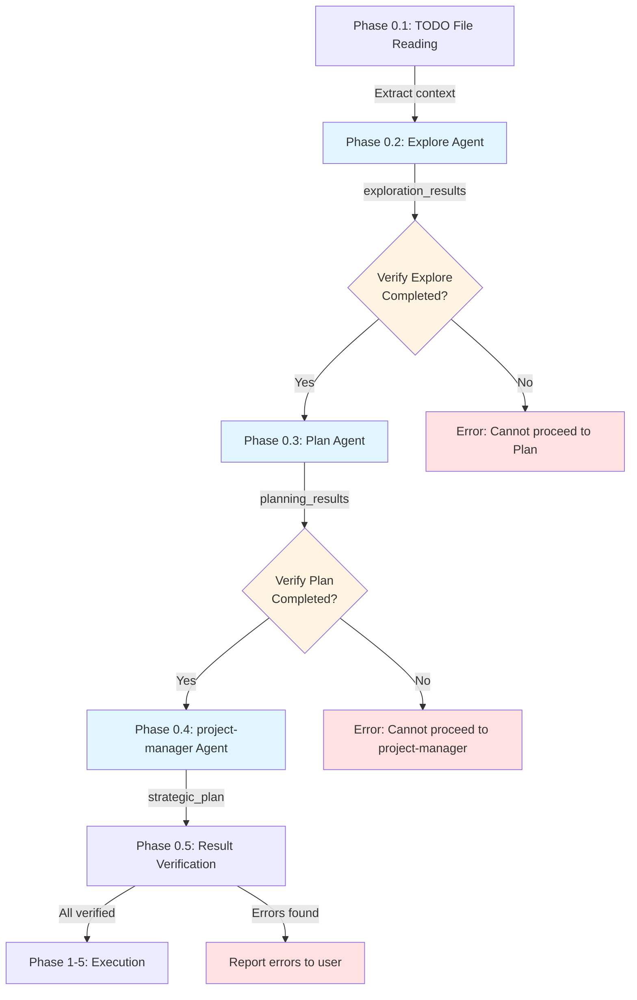
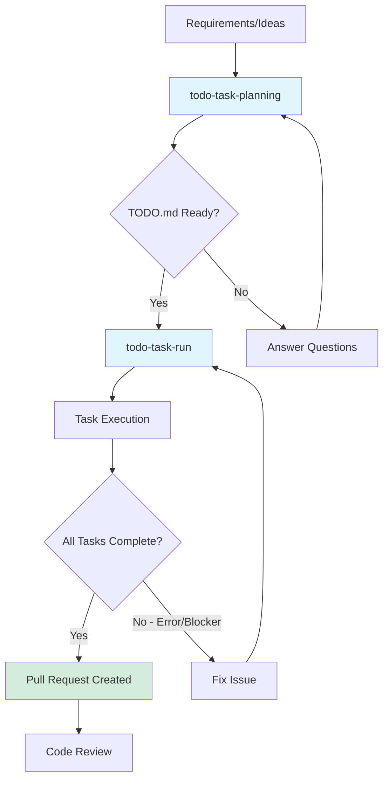
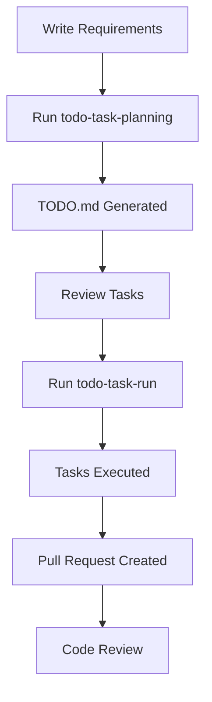

# TODO Task Workflow - Comprehensive How-To Guide

## Overview

[To be completed in Phase 3]

## Creating TODO.md Files

[To be completed in Phase 2]

### Basic TODO.md Format

TODO.md files use a structured Markdown format with checkboxes to track task progress. This format is designed to be both human-readable and machine-parsable by the todo-task-run command.

#### Checkbox Format

Tasks are represented using Markdown checkbox syntax:

- `- [ ]` - Incomplete task
- `- [x]` - Completed task
- `- [🔄]` - In-progress task (optional)

**Example:**
```markdown
- [ ] Implement user authentication
- [x] Set up database schema
- [🔄] Create API endpoints
```

#### Status Markers

Tasks can be prefixed with status markers to indicate their feasibility:

- **✅ Ready** - Clear specifications, technical issues clarified, immediately executable
- **⏳ Pending** - Waiting for dependencies (specify concrete waiting reason and release condition)
- **🔍 Research** - Research required (specify concrete research items and methods)
- **🚧 Blocked** - Important specifications/technical details unclear (specify concrete blocking factors and resolution steps)

**Example:**
```markdown
- [ ] ✅ API authentication system implementation
- [ ] ⏳ Frontend UI integration - After API completion
- [ ] 🔍 Third-party API integration - To research: API documentation
- [ ] 🚧 Payment integration - Blocking factor: Payment provider not decided
```

#### Task Metadata Icons

Use these icons to add context and metadata to tasks:

- **📁** - File references (which files will be created or modified)
- **📊** - Technical rationale or analysis results
- **📋** - Deliverables or output description
- **⏱️** - Time estimation
- **💡** - Implementation guidance or hints

**Example:**
```markdown
- [ ] ✅ Database schema update 📁`prisma/schema.prisma` 📊MySQL support
  - [ ] Update Prisma schema
    - 💡 Follow existing User model pattern
    - ⏱️ Estimated time: 30 minutes
  - [ ] Generate migration
    - 📋 Migration file will be created in `prisma/migrations/`
```

#### Section Division Best Practices

Organize tasks into logical sections based on:

1. **By Status** - Group by feasibility markers (✅⏳🔍🚧)
2. **By Phase** - Group by implementation phases (Phase 0, Phase 1, Phase 2, etc.)
3. **By Feature Area** - Group by functional domain (Authentication, Database, UI, etc.)
4. **By Priority** - Group by execution order based on dependencies

**Example Structure:**
```markdown
## Task List

### Phase 1: Database Setup ✅
- [ ] ✅ 1.1 Create database schema
- [ ] ✅ 1.2 Run migrations

### Phase 2: API Implementation ⏳
- [ ] ⏳ 2.1 Create API endpoints - Waiting for database setup
- [ ] ⏳ 2.2 Add authentication middleware

### Research Tasks 🔍
- [ ] 🔍 Investigate caching strategy
```

#### Describing Dependencies

When tasks have dependencies, clearly specify:

1. **What they depend on** - Name the specific prerequisite task
2. **Why they depend on it** - Explain the technical or logical dependency
3. **When they can proceed** - Specify the release condition

**Example:**
```markdown
- [ ] ⏳ Frontend UI integration 📁`components/LoginForm.vue`
  - Depends on: API authentication system implementation (Phase 1)
  - Reason: Requires `/api/auth/login` endpoint to be available
  - Can proceed: After Phase 1 completion and successful API testing

- [ ] ✅ User profile page implementation 📁`pages/user/profile.vue`
  - No dependencies - can start immediately
```

#### Nested Subtasks

Use 2-space indentation to create nested subtasks:

```markdown
- [ ] ✅ API authentication system implementation
  - [ ] Implement login endpoint
    - [ ] Create POST handler
    - [ ] Add validation middleware
    - [ ] Generate JWT token
  - [ ] Implement token verification middleware
  - [ ] Add session management
```

### Task Granularity Guidelines

Proper task granularity is essential for effective task execution and progress tracking. Tasks should be small enough to complete in a focused session, but large enough to represent meaningful progress.

#### The One File/One Feature Rule

Each task should focus on a single file or a single cohesive feature:

**✅ Good Examples:**
```markdown
- [ ] ✅ Create user authentication model 📁`models/User.ts`
- [ ] ✅ Implement login API endpoint 📁`api/auth/login.ts`
- [ ] ✅ Add email validation utility 📁`utils/validation.ts`
```

**❌ Bad Examples:**
```markdown
- [ ] Implement entire authentication system
  # Too broad - spans multiple files and features

- [ ] Update User.ts and login.ts and validation.ts
  # Multiple files - should be split into separate tasks
```

#### Recommended Task Duration: 30 Minutes to 2 Hours

Tasks should be completable within a single focused work session:

- **Minimum (30 minutes)** - Ensures task has meaningful scope
- **Maximum (2 hours)** - Prevents tasks from becoming too large and unwieldy
- **Sweet spot (45-90 minutes)** - Ideal for most implementation tasks

**Time Estimation Examples:**
```markdown
- [ ] ✅ Create database migration for users table
  - ⏱️ Estimated time: 30 minutes

- [ ] ✅ Implement user registration endpoint with validation
  - ⏱️ Estimated time: 1.5 hours

- [ ] ⏳ Build complete user dashboard UI
  - ⏱️ Estimated time: 4 hours
  # Too long - should be split into smaller tasks
```

#### Clear Dependencies

Dependencies between tasks must be easily identifiable and well-documented:

**✅ Good Dependency Documentation:**
```markdown
### Phase 1: Database Schema ✅
- [ ] ✅ 1.1 Create users table migration 📁`migrations/001_users.sql`
  - No dependencies

- [ ] ✅ 1.2 Create posts table migration 📁`migrations/002_posts.sql`
  - Depends on: 1.1 (requires users table for foreign key)

### Phase 2: API Layer ⏳
- [ ] ⏳ 2.1 Implement user CRUD endpoints 📁`api/users.ts`
  - Depends on: Phase 1 completion (database schema must exist)

- [ ] ⏳ 2.2 Implement post creation endpoint 📁`api/posts.ts`
  - Depends on: 1.2 and 2.1 (requires posts table and user authentication)
```

**❌ Bad Dependency Documentation:**
```markdown
- [ ] Implement user endpoints
  - Depends on: database stuff
  # Vague - unclear what specifically is needed
```

#### Avoiding Overly Broad Tasks

Tasks without specific targets should be broken down into concrete implementation steps:

**❌ Too Broad:**
```markdown
- [ ] Implement user management
- [ ] Fix bugs in authentication
- [ ] Improve performance
```

**✅ Properly Scoped:**
```markdown
- [ ] ✅ Create User model with validation 📁`models/User.ts`
- [ ] ✅ Fix JWT token expiration bug 📁`middleware/auth.ts`
  - 📊 Issue: Tokens not properly validated for expiration
- [ ] ✅ Add database query caching for user lookups 📁`repositories/UserRepository.ts`
  - 📊 Performance: Reduces lookup time from 50ms to 5ms
```

#### Task Breakdown Checklist

Before finalizing tasks, verify each one meets these criteria:

- [ ] Targets a specific file or cohesive feature
- [ ] Can be completed in 30 minutes to 2 hours
- [ ] Has clear, documented dependencies (if any)
- [ ] Includes concrete implementation details (file paths, technical approach)
- [ ] Is not overly broad or vague

#### Example: Breaking Down a Large Task

**Original (too broad):**
```markdown
- [ ] Implement user authentication system
```

**Broken down (proper granularity):**
```markdown
### Phase 1: Authentication Models ✅
- [ ] ✅ 1.1 Create User model 📁`models/User.ts`
  - ⏱️ 45 minutes
  - No dependencies

- [ ] ✅ 1.2 Create Session model 📁`models/Session.ts`
  - ⏱️ 30 minutes
  - Depends on: 1.1 (User model required for foreign key)

### Phase 2: Authentication Endpoints ✅
- [ ] ✅ 2.1 Implement registration endpoint 📁`api/auth/register.ts`
  - ⏱️ 1.5 hours
  - Depends on: 1.1 (User model)

- [ ] ✅ 2.2 Implement login endpoint 📁`api/auth/login.ts`
  - ⏱️ 1 hour
  - Depends on: 1.1, 1.2 (User and Session models)

- [ ] ✅ 2.3 Implement logout endpoint 📁`api/auth/logout.ts`
  - ⏱️ 30 minutes
  - Depends on: 1.2 (Session model)

### Phase 3: Authentication Middleware ✅
- [ ] ✅ 3.1 Create JWT token verification middleware 📁`middleware/auth.ts`
  - ⏱️ 1 hour
  - Depends on: 1.2 (Session model for token validation)
```

### YAGNI Principle in TODO Tasks

YAGNI (You Aren't Gonna Need It) is a fundamental principle in TODO task planning. It means including **only tasks directly necessary to achieve the stated objective**, and explicitly excluding tasks that improve or enhance existing functionality.

#### What is YAGNI in the TODO Context?

When creating TODO.md files, focus exclusively on:

- **New feature implementation** - Building functionality that doesn't exist yet
- **Bug fixes** - Resolving specific reported issues
- **Required infrastructure** - Only what's needed to support the new feature

**Do NOT include tasks that:**
- Improve existing code that already works
- Add "nice to have" features beyond the current objective
- Optimize or enhance code that isn't part of the stated goal

#### What to Exclude from TODO Tasks

The following task types should **NOT** be included unless they are absolutely essential to the stated objective:

##### 1. Refactoring

**❌ Exclude:**
```markdown
- [ ] Refactor user authentication code for better maintainability
- [ ] Reorganize file structure for improved clarity
- [ ] Extract common logic into utility functions
```

**✅ Include only if essential:**
```markdown
- [ ] ✅ Create authentication utility 📁`utils/auth.ts`
  - Note: This is NEW functionality required for the feature, not refactoring
```

##### 2. Log Addition or Enhancement

**❌ Exclude:**
```markdown
- [ ] Add debug logging to authentication flow
- [ ] Improve error logging with more context
- [ ] Add performance logging for API endpoints
```

**✅ Include only if essential:**
```markdown
- [ ] ✅ Implement audit logging for user actions 📁`services/AuditLog.ts`
  - Note: Audit logging is a core feature requirement, not optional logging
```

##### 3. Test Addition for Existing Features

**❌ Exclude:**
```markdown
- [ ] Add tests for existing user registration endpoint
- [ ] Improve test coverage for authentication module
- [ ] Add integration tests for API layer
```

**✅ Include only if essential:**
```markdown
- [ ] ✅ Create tests for new password reset feature 📁`tests/auth/passwordReset.test.ts`
  - Note: Tests for NEW feature implementation, not existing code
```

##### 4. Error Handling Improvements

**❌ Exclude:**
```markdown
- [ ] Add better error handling to existing endpoints
- [ ] Improve validation error messages
- [ ] Strengthen input sanitization in forms
```

**✅ Include only if essential:**
```markdown
- [ ] ✅ Implement error handling for new payment integration 📁`services/PaymentService.ts`
  - Note: Error handling is required for NEW feature, not enhancement
```

##### 5. Documentation

**❌ Exclude:**
```markdown
- [ ] Update API documentation
- [ ] Add JSDoc comments to existing functions
- [ ] Create README for the module
```

**✅ Include only if essential:**
```markdown
- [ ] ✅ Document new webhook integration 📁`docs/webhooks.md`
  - Note: Documentation is required for NEW external-facing feature
```

##### 6. Performance Optimization

**❌ Exclude:**
```markdown
- [ ] Optimize database queries in user lookup
- [ ] Add caching layer for API responses
- [ ] Reduce bundle size with code splitting
```

**✅ Include only if essential:**
```markdown
- [ ] ✅ Implement pagination for new search feature 📁`api/search.ts`
  - Note: Pagination is required for NEW feature to handle large result sets
```

##### 7. Code Quality Improvement

**❌ Exclude:**
```markdown
- [ ] Fix ESLint warnings in codebase
- [ ] Update TypeScript types for better type safety
- [ ] Remove unused imports and dead code
```

##### 8. Security Strengthening (when not essential)

**❌ Exclude:**
```markdown
- [ ] Add rate limiting to existing API endpoints
- [ ] Strengthen password requirements
- [ ] Add CSRF protection to forms
```

**✅ Include only if essential:**
```markdown
- [ ] ✅ Implement OAuth authentication for new SSO feature 📁`services/OAuth.ts`
  - Note: OAuth is the core feature requirement, not a security enhancement
```

##### 9. Pursuit of Perfection

**❌ Exclude:**
```markdown
- [ ] Polish UI animations
- [ ] Fine-tune color scheme for better aesthetics
- [ ] Add loading states to all buttons
```

#### YAGNI Validation Checklist

Before including a task in your TODO.md, ask:

1. **Is this task directly necessary to achieve the stated objective?**
   - Yes → Include it
   - No → Exclude it

2. **Does this task create NEW functionality or fix a specific bug?**
   - Yes → Include it
   - No (it improves existing code) → Exclude it

3. **Would the feature work without this task?**
   - No (it's essential) → Include it
   - Yes (it's an enhancement) → Exclude it

4. **Is this task mentioned in the requirements or objectives?**
   - Yes → Include it
   - No (it's extra work) → Exclude it

#### Example: Applying YAGNI to a Feature

**Objective:** Implement password reset functionality

**❌ Without YAGNI (includes unnecessary tasks):**
```markdown
## Password Reset Feature

- [ ] Refactor existing authentication code
- [ ] Add comprehensive logging to all auth endpoints
- [ ] Update tests for existing login functionality
- [ ] Implement password reset email sending 📁`services/PasswordReset.ts`
- [ ] Create password reset API endpoint 📁`api/auth/reset.ts`
- [ ] Add rate limiting to all endpoints
- [ ] Update API documentation
- [ ] Improve error messages across authentication module
```

**✅ With YAGNI (only essential tasks):**
```markdown
## Password Reset Feature

### Phase 1: Backend Implementation ✅
- [ ] ✅ 1.1 Implement password reset token generation 📁`services/PasswordReset.ts`
  - ⏱️ 1 hour

- [ ] ✅ 1.2 Create password reset API endpoint 📁`api/auth/reset.ts`
  - ⏱️ 1.5 hours
  - Depends on: 1.1

- [ ] ✅ 1.3 Implement email sending for reset link 📁`services/EmailService.ts`
  - ⏱️ 1 hour
  - Depends on: 1.1

### Phase 2: Frontend Implementation ✅
- [ ] ✅ 2.1 Create password reset request form 📁`components/PasswordResetForm.vue`
  - ⏱️ 45 minutes

- [ ] ✅ 2.2 Create password reset confirmation page 📁`pages/auth/reset.vue`
  - ⏱️ 1 hour
  - Depends on: 1.2
```

#### Benefits of YAGNI

Following YAGNI in TODO tasks provides:

1. **Faster delivery** - Focus only on what's needed
2. **Clearer scope** - Avoid scope creep and unnecessary work
3. **Better time estimates** - Predictions are more accurate when scope is well-defined
4. **Reduced complexity** - Simpler implementations are easier to maintain
5. **Lower risk** - Fewer changes mean fewer opportunities for bugs

#### When to Break YAGNI

There are rare cases where you might include "extra" tasks:

1. **Critical security requirements** - If a new feature introduces security vulnerabilities
2. **Regulatory compliance** - If the feature must meet specific legal requirements
3. **Explicit user request** - If the stakeholder specifically asks for improvements
4. **Prerequisite infrastructure** - If existing code must be modified to support the new feature

**Example of acceptable "extra" work:**
```markdown
- [ ] ✅ Implement new user registration endpoint 📁`api/auth/register.ts`

- [ ] ✅ Add password hashing to registration 📁`utils/passwordHash.ts`
  - Note: This is essential for security, not an enhancement
```

### Complete TODO.md Example

Below is a complete, copy-paste ready TODO.md template that demonstrates all the concepts covered in this guide. This example follows best practices for task granularity, YAGNI principles, and proper formatting.

```markdown
# User Profile Enhancement Feature

## 📊 Project Overview

**Goal**: Add user profile editing capability with avatar upload functionality

**Success Criteria**:
- Users can edit their profile information (name, bio, email)
- Users can upload and change their profile avatar
- Changes are validated and persisted to database
- UI provides feedback for successful/failed updates

**Estimated Total Time**: 8-10 hours

**References**:
- 📁 Design mockups: `docs/designs/user-profile-v2.figma`
- 📁 API specification: `docs/api/user-profile-endpoints.md`

## 📋 Task List

### Phase 1: Database and API Setup ✅

- [ ] ✅ 1.1 Update User model schema 📁`models/User.ts`
  - Add `avatarUrl` field to User model
  - Add `bio` field to User model (max 500 chars)
  - 📊 Uses existing Sequelize pattern from User model
  - ⏱️ Estimated time: 30 minutes
  - 💡 Follow existing model structure in `models/User.ts`

- [ ] ✅ 1.2 Create database migration 📁`migrations/YYYYMMDD_add_profile_fields.ts`
  - Depends on: 1.1 (model schema must be defined first)
  - Add `avatar_url` VARCHAR(500) column
  - Add `bio` TEXT column
  - 📊 Migration uses `ALTER TABLE users` statement
  - ⏱️ Estimated time: 20 minutes
  - 💡 Test migration with `npm run migrate:up` and `migrate:down`

- [ ] ✅ 1.3 Run database migration
  - Depends on: 1.2 (migration file must exist)
  - Execute: `npm run migrate:up`
  - Verify columns added with database client
  - ⏱️ Estimated time: 10 minutes

- [ ] ✅ 1.4 Implement profile update API endpoint 📁`api/users/profile.ts`
  - Depends on: 1.3 (database schema must be updated)
  - Create PATCH `/api/users/:id/profile` endpoint
  - Validate input (name length, email format, bio max length)
  - Return updated user object
  - 📊 Uses Express.js request validation pattern
  - ⏱️ Estimated time: 1.5 hours
  - 💡 Reference existing endpoint structure in `api/users/index.ts`

### Phase 2: File Upload Implementation ✅

- [ ] ✅ 2.1 Set up file upload middleware 📁`middleware/upload.ts`
  - Configure multer for image uploads
  - Validate file type (jpeg, png, webp only)
  - Validate file size (max 5MB)
  - 📊 Uses multer middleware with memory storage
  - ⏱️ Estimated time: 1 hour
  - 💡 Reference multer documentation for configuration

- [ ] ✅ 2.2 Implement avatar upload endpoint 📁`api/users/avatar.ts`
  - Depends on: 2.1 (upload middleware must exist)
  - Create POST `/api/users/:id/avatar` endpoint
  - Use upload middleware to handle multipart/form-data
  - Store file in cloud storage (S3 or Cloudinary)
  - Update user's `avatarUrl` in database
  - 📊 Uses AWS S3 SDK or Cloudinary SDK
  - ⏱️ Estimated time: 2 hours
  - 💡 Environment variables: `AWS_BUCKET_NAME`, `AWS_REGION`

- [ ] ✅ 2.3 Execute cccp:micro-commit to commit backend changes
  - Depends on: Phase 1 and Phase 2 completion
  - Command: `/cccp:micro-commit`
  - 📋 Commits will be split by context (model, migration, endpoints, middleware)
  - ⏱️ Estimated time: 5 minutes

### Phase 3: Frontend Implementation ✅

- [ ] ✅ 3.1 Create ProfileEditForm component 📁`components/ProfileEditForm.vue`
  - Depends on: 1.4 (API endpoint must exist)
  - Form fields: name (input), bio (textarea), email (input)
  - Client-side validation (required fields, email format)
  - Call PATCH `/api/users/:id/profile` on submit
  - Display success/error messages
  - 📊 Uses Vue 3 Composition API with `<script setup>`
  - ⏱️ Estimated time: 2 hours
  - 💡 Reference existing form patterns in `components/LoginForm.vue`

- [ ] ✅ 3.2 Create AvatarUpload component 📁`components/AvatarUpload.vue`
  - Depends on: 2.2 (avatar upload endpoint must exist)
  - Display current avatar with fallback to default image
  - File input with "Change Avatar" button
  - Image preview before upload
  - Call POST `/api/users/:id/avatar` on file selection
  - Display upload progress and success/error states
  - 📊 Uses HTML5 FileReader API for preview
  - ⏱️ Estimated time: 1.5 hours
  - 💡 Reference Vue file upload patterns

- [ ] ✅ 3.3 Integrate components into profile page 📁`pages/profile/edit.vue`
  - Depends on: 3.1, 3.2 (components must exist)
  - Import ProfileEditForm and AvatarUpload components
  - Layout: Avatar on left, form on right
  - Add "Save Changes" and "Cancel" buttons
  - Handle navigation after successful update
  - ⏱️ Estimated time: 45 minutes
  - 💡 Use existing page layout from `pages/profile/index.vue`

- [ ] ✅ 3.4 Execute cccp:micro-commit to commit frontend changes
  - Depends on: Phase 3 completion
  - Command: `/cccp:micro-commit`
  - 📋 Commits will be split by component
  - ⏱️ Estimated time: 5 minutes

### Phase 4: Testing and Refinement ✅

- [ ] ✅ 4.1 Manual testing checklist
  - [ ] Test profile update with valid data
  - [ ] Test validation errors (invalid email, bio too long)
  - [ ] Test avatar upload with valid image
  - [ ] Test avatar upload error cases (file too large, wrong format)
  - [ ] Test UI responsiveness on mobile and desktop
  - 📋 Document test results in `docs/testing/profile-edit-test-results.md`
  - ⏱️ Estimated time: 1 hour

- [ ] ✅ 4.2 Execute final cccp:micro-commit
  - Command: `/cccp:micro-commit`
  - 📋 Commit any final adjustments or fixes
  - ⏱️ Estimated time: 5 minutes

## 📈 Progress Status

- **Completed**: 0/14 tasks (0%)
- **In Progress**: Phase 1
- **Next Action**: Start with Task 1.1 (Update User model schema)

## 🎯 Next Actions

1. Begin with Phase 1 tasks (database and API setup)
2. Test each endpoint with Postman or curl before moving to next phase
3. After backend completion, proceed to frontend implementation
4. Perform thorough manual testing before considering complete

## ❓ Questions and Clarifications

- [x] **[Specification]** Which cloud storage service should be used for avatar uploads?
  - Answer: Use AWS S3 (bucket name: `user-avatars-prod`)

- [x] **[UI]** Should there be a character counter for the bio field?
  - Answer: Yes, display "X/500 characters" below textarea

- [ ] **[UX]** Should users be able to remove their avatar (reset to default)?
  - Waiting for product team confirmation

## 📚 Related Documentation

- User model documentation: `docs/models/user.md`
- File upload guidelines: `docs/development/file-uploads.md`
- API authentication: `docs/api/authentication.md`
```

This example demonstrates:

- **Clear project overview** with goals and success criteria
- **Proper task granularity** (each task is 20 minutes to 2 hours)
- **YAGNI compliance** (no refactoring, logging, or documentation tasks unless essential)
- **Status markers** (✅ for all tasks since they're well-defined)
- **File references** (📁 for every implementation task)
- **Dependencies** clearly documented
- **Time estimates** (⏱️) for planning
- **Implementation hints** (💡) to guide execution
- **Nested subtasks** with proper indentation
- **Progress tracking** section
- **Questions section** for clarifications

## Using todo-task-planning Command

The `todo-task-planning` command is a powerful task planning tool that reads a file (typically `TODO.md`), analyzes its contents, and generates a comprehensive, structured task list with detailed implementation guidance.

### Command Overview

The `todo-task-planning` command serves as the **planning phase** of the TODO task workflow. It transforms high-level requirements into actionable, well-organized tasks that are ready for execution.

#### Key Capabilities

**1. Repeatable Execution**

The command is designed to be executed multiple times on the same file:
- Each execution analyzes the file with a fresh perspective
- Previous research results stored in `docs/memory` are utilized to avoid duplication
- Existing tasks are preserved and new tasks are added incrementally
- Question status is tracked across executions (answered/unanswered)

```bash
# First execution - initial planning
/cccp:todo-task-planning TODO.md

# Second execution - refinement and updates
/cccp:todo-task-planning TODO.md

# Third execution - addressing new requirements
/cccp:todo-task-planning TODO.md
```

**2. Phase 0 Multi-Agent Orchestration**

The command orchestrates three specialized agents in **strict sequential order**:

- **Phase 0.2: Explore Agent** - Discovers related files, patterns, and dependencies through codebase exploration
- **Phase 0.3: Plan Agent** - Designs implementation strategy based on exploration results
- **Phase 0.4: cccp:project-manager Agent** - Organizes tasks by feasibility (✅⏳🔍🚧) and extracts user questions

**⚠️ Critical Requirement: Sequential Execution**

The agents **MUST** be executed in sequence, not in parallel:
- Plan agent requires `exploration_results` from Explore agent
- project-manager agent requires both `exploration_results` and `planning_results`
- Executing agents in parallel will cause failures due to missing dependencies

**3. TODO.md Update Behavior**

The command directly updates the specified TODO.md file:

- **Preserves existing content** - Completed tasks and answered questions remain intact
- **Adds new tasks** - New task planning results are added in structured format
- **Updates task status** - Feasibility markers (✅⏳🔍🚧) are added/updated based on analysis
- **Records research trail** - Links to `docs/memory` files for exploration and planning results
- **Manages questions** - New questions are added, answered questions are marked complete

**4. docs/memory Integration**

All research and analysis results are saved in `docs/memory` directory:

```
docs/memory/
├── explorations/
│   └── 2025-01-21-feature-name-exploration.md
├── planning/
│   └── 2025-01-21-feature-name-plan.md
├── questions/
│   └── feature-name-questions.md
└── recommendations/
    └── feature-name-recommendations.md
```

These files serve as:
- **Historical record** - Track decision-making process and rationale
- **Duplicate prevention** - Check past research to avoid redundant work
- **Context for future executions** - Reference previous analysis when file is re-analyzed
- **Team knowledge base** - Share insights across team members

#### When to Use This Command

Use `todo-task-planning` when you need to:

- **Convert requirements into tasks** - Transform high-level feature descriptions into concrete implementation steps
- **Break down complex projects** - Decompose large initiatives into manageable, granular tasks
- **Analyze technical feasibility** - Identify blockers, dependencies, and research needs before implementation
- **Plan with confidence** - Leverage multi-agent exploration and planning for thorough analysis
- **Update existing plans** - Re-run on TODO.md to incorporate new requirements or changes

#### Command Syntax

```bash
/cccp:todo-task-planning <file_path> [--branch [branch_name]] [--pr]
```

**Parameters:**
- `<file_path>` (required) - Path to TODO file to analyze and update
- `--branch [branch_name]` (optional) - Add branch creation task (auto-generates name if omitted)
- `--pr` (optional) - Add pull request creation task (includes branch creation)

See the next section for detailed explanation of `--branch` and `--pr` options.

### Options: --branch and --pr

The `todo-task-planning` command supports two Git workflow options that automatically add branch creation and pull request tasks to your TODO.md file.

#### Option Behavior

##### `--branch [branch_name]` Option

The `--branch` option adds a **branch creation task at the beginning** of your task list:

**With branch name specified:**
```bash
/cccp:todo-task-planning TODO.md --branch feature/user-authentication
```
- Uses the exact branch name you provide
- Validates against Git naming conventions
- Creates task: `git checkout -b feature/user-authentication`

**Without branch name (auto-generation):**
```bash
/cccp:todo-task-planning TODO.md --branch
```
- Analyzes TODO file content to determine appropriate branch name
- Follows Git naming conventions: `{type}/{descriptive-name}`
- Types: `feature/`, `bugfix/`, `refactor/`, `chore/`, `docs/`
- Format: lowercase, hyphen-separated, English

**Branch Name Auto-Generation Rules:**

The command intelligently generates branch names by:
1. Reading TODO file title and content
2. Determining branch type based on task nature:
   - `feature/` - New functionality implementation
   - `bugfix/` - Bug fixes, issue resolution
   - `refactor/` - Code restructuring without behavior change
   - `chore/` - Development environment, dependencies, tooling
   - `docs/` - Documentation updates
3. Extracting key feature/issue name from TODO (2-4 words max)
4. Converting to lowercase, hyphen-separated English
5. Validating against Git naming conventions

**Example Auto-Generation:**
```
TODO Title: "ActionLog Email Notification Implementation"
Generated Branch: feature/actionlog-email-notification

TODO Title: "Fix Authentication Token Expiration Bug"
Generated Branch: bugfix/auth-token-expiration

TODO Title: "Update API Documentation"
Generated Branch: docs/api-documentation-update
```

**What Gets Added to TODO.md:**

A branch creation task is inserted as Phase 0 (before all other phases):

```markdown
### Phase 0: Branch Creation ✅

- [ ] ✅ **Create branch**
  - Command: `git checkout -b feature/actionlog-email-notification`
  - 📋 All changes will be committed to this branch
  - Estimated time: 1 minute
```

**Use Cases for --branch:**
- You want to work on a feature branch but don't need a PR yet
- You're doing exploratory work and want isolation from main branch
- You want to organize work by branch but will create PR manually later
- You prefer to have branch creation as an explicit task in your checklist

##### `--pr` Option

The `--pr` option includes **all --branch functionality** plus adds a **pull request creation task at the end**:

```bash
/cccp:todo-task-planning TODO.md --pr
```

**What Happens:**
1. Branch creation task is added at the beginning (auto-generates name if `--branch` not also specified)
2. All implementation tasks assume work will be on this branch
3. Pull request creation task is added as the final phase

**What Gets Added to TODO.md:**

Both branch creation (Phase 0) and PR creation (final phase) tasks:

```markdown
### Phase 0: Branch Creation ✅

- [ ] ✅ **Create branch**
  - Command: `git checkout -b feature/user-profile-edit`
  - 📋 All changes will be committed to this branch
  - Estimated time: 1 minute

### Phase 3: Pull Request Creation ✅

- [ ] ✅ 3.1 Create pull request
  - [ ] Read PR template from `.github/PULL_REQUEST_TEMPLATE.md`
  - [ ] Write PR description including:
    - Development reason (why this feature is needed)
    - Development content (what was implemented)
    - Impact analysis (what will be affected)
  - [ ] Execute: `gh pr create --title "..." --body "..."`
  - 📋 PR will include all commits from this branch
  - Estimated time: 10 minutes

- [ ] ⏳ 3.2 Code review and merge
  - [ ] Wait for team review
  - [ ] Address review feedback if needed
  - [ ] Execute merge after approval: `gh pr merge`
```

**PR Template Integration:**

If your project has PR template instructions in `CLAUDE.md` or `.github/PULL_REQUEST_TEMPLATE.md`, the command will note to follow those templates when creating the PR.

**Use Cases for --pr:**
- You want a complete workflow from feature start to PR creation
- You're implementing a feature that will definitely need review
- You want the entire Git workflow as part of your task checklist
- You're working in a team environment with PR-based workflows

#### Combined Usage with --branch and --pr

You can combine both options to specify a custom branch name AND create a PR:

```bash
/cccp:todo-task-planning TODO.md --pr --branch feature/custom-name
```

This gives you:
- Branch creation task with your specified name
- All implementation tasks
- Pull request creation task at the end

#### Five Usage Patterns

Here are the five common usage patterns with `todo-task-planning`:

**Pattern 1: Basic Planning (No Git Workflow)**
```bash
/cccp:todo-task-planning TODO.md
```
- No branch creation task
- No PR creation task
- Focus purely on implementation tasks
- **Use when:** Working directly on main branch or managing Git workflow manually

**Pattern 2: Branch Only (Auto-Generated Name)**
```bash
/cccp:todo-task-planning TODO.md --branch
```
- Adds branch creation task with auto-generated name
- No PR creation task
- **Use when:** You want branch isolation but will create PR manually later

**Pattern 3: Branch Only (Custom Name)**
```bash
/cccp:todo-task-planning TODO.md --branch feature/my-custom-feature
```
- Adds branch creation task with your specified name
- No PR creation task
- **Use when:** You have a specific branch naming convention or want control over the name

**Pattern 4: Complete Workflow (Auto-Generated Branch)**
```bash
/cccp:todo-task-planning TODO.md --pr
```
- Adds branch creation task with auto-generated name
- Adds PR creation task at the end
- Complete Git workflow from start to finish
- **Use when:** You want full automation and trust the auto-generated branch name

**Pattern 5: Complete Workflow (Custom Branch)**
```bash
/cccp:todo-task-planning TODO.md --pr --branch feature/my-feature
```
- Adds branch creation task with your specified name
- Adds PR creation task at the end
- Full control over branch name with complete workflow
- **Use when:** You need both workflow automation and specific branch naming

#### Important Notes

**File References in Git Tasks:**
- Branch creation tasks do NOT include 📁 file references (it's a Git operation, not a file operation)
- PR creation tasks do NOT include 📁 file references (it's a Git operation, not a file operation)
- Only implementation tasks that modify files include 📁 references

**Task Execution Order:**
- Branch creation (Phase 0) always comes first
- Implementation tasks come in the middle
- PR creation always comes last
- This ensures proper Git workflow sequence

### Phase 0 Processing Flow

Phase 0 is the **multi-agent orchestration phase** where the `todo-task-planning` command coordinates three specialized agents to thoroughly analyze your TODO file and create a comprehensive implementation plan.

#### Why Phase 0 Exists

Traditional task planning often jumps directly from requirements to tasks, missing critical analysis steps:
- **Missing context** - What files exist? What patterns are already in use?
- **Incomplete planning** - How should the feature be implemented? What are the trade-offs?
- **Unclear feasibility** - Which tasks are ready? Which are blocked?

Phase 0 solves these problems by systematically:
1. **Exploring** the codebase to understand what exists
2. **Planning** the implementation strategy based on exploration findings
3. **Organizing** tasks by feasibility and extracting questions that need answers

#### Sequential Execution Requirement

**⚠️ CRITICAL: Agents Must Run in Sequence, NOT in Parallel**

The three agents in Phase 0 have strict dependencies:

```
Phase 0.2 (Explore) → exploration_results
                          ↓
Phase 0.3 (Plan) → planning_results
                          ↓
Phase 0.4 (project-manager) → strategic_plan
```

**Why Sequential Execution is Required:**

1. **Plan agent needs Explore results** - The Plan agent requires `exploration_results` to design an implementation strategy based on what files, patterns, and dependencies exist
2. **project-manager agent needs both** - The project-manager agent requires both `exploration_results` and `planning_results` to organize tasks by feasibility and extract questions

**What Happens if You Run in Parallel:**
- Plan agent will fail or produce incomplete results (missing exploration context)
- project-manager agent will fail or produce incomplete results (missing both contexts)
- Tasks will be poorly organized or miss critical dependencies

#### Phase 0 Steps in Detail

##### Phase 0.1: TODO File Reading and Context Extraction

**Purpose:** Read and analyze the TODO file to prepare for agent orchestration

**What Happens:**
1. Read the specified file with Read tool
2. Extract information on tasks, requirements, and tech stack
3. Determine exploration thoroughness (quick/medium/very thorough)
4. Check for `--branch` and `--pr` options
5. Generate branch name if `--branch` is specified without a value

**Output:**
- Extracted requirements and context
- Branch workflow variables (HAS_BRANCH_OPTION, HAS_PR_OPTION, BRANCH_NAME)
- Exploration scope determined

##### Phase 0.2: Explore Agent Execution

**Purpose:** Discover related files, patterns, and dependencies through comprehensive codebase exploration

**How It Works:**
The main Claude executor calls the Explore agent using the Task tool:

```typescript
const exploration_results = await Task({
  subagent_type: "Explore",
  description: "Codebase exploration for user authentication feature",
  prompt: `
    # Codebase Exploration Request

    ## Context from TODO File
    User authentication system implementation

    ## Exploration Goals
    Find and organize:
    1. Related Files - Models, controllers, views for auth
    2. Dependencies - Import/export relationships
    3. Test Files - Corresponding test patterns
    4. Project Structure - File structure and naming conventions

    ## Thoroughness
    medium
  `
});
```

**What Explore Agent Does:**
- Searches codebase for relevant files using Glob and Grep tools
- Analyzes existing patterns and architecture
- Identifies tech stack (frameworks, libraries)
- Discovers potential blockers and constraints
- Provides recommendations for planning phase

**Output Saved To:**
- Variable: `exploration_results` (used by Plan agent)
- File: `docs/memory/explorations/YYYY-MM-DD-[feature]-exploration.md`

**Example Exploration Results:**
```markdown
# User Authentication Feature - Exploration Results

## Summary
Found existing authentication patterns using JWT tokens.
Project uses Express.js with TypeScript.

## Key Files Discovered
- `models/User.ts` - User model with password hashing
- `middleware/auth.ts` - JWT verification middleware
- `controllers/auth.ts` - Login/logout endpoints
- `tests/auth.test.ts` - Existing auth test patterns

## Existing Patterns
- JWT token generation using jsonwebtoken library
- Password hashing with bcrypt
- Session storage in Redis

## Tech Stack
- Express.js 4.18.x
- TypeScript 5.x
- Sequelize ORM
- Redis for sessions

## Potential Blockers
- Redis connection configuration needed
- JWT secret must be in environment variables

## Recommendations for Planning
- Follow existing JWT pattern
- Extend User model for new fields
- Use existing auth middleware pattern
```

**⚠️ WAIT: Before Proceeding to Phase 0.3**

Verify that:
- [ ] Explore agent Task has completed successfully
- [ ] `exploration_results` variable contains valid data
- [ ] `docs/memory/explorations/` file has been created
- [ ] NO errors occurred during exploration

**ONLY after confirming the above, proceed to Phase 0.3.**

##### Phase 0.3: Plan Agent Execution

**Purpose:** Design implementation strategy based on exploration results

**⚠️ MANDATORY PRECONDITION: Phase 0.2 MUST Be Completed First**

**How It Works:**
The main Claude executor calls the Plan agent using the Task tool, passing exploration results:

```typescript
// Verify exploration_results exists before proceeding
if (!exploration_results) {
  throw new Error("Cannot proceed to Plan agent: exploration_results not found");
}

const planning_results = await Task({
  subagent_type: "Plan",
  description: "Implementation planning for user authentication",
  prompt: `
    # Implementation Planning Request

    ## Context from Exploration Results

    ### Summary
    ${exploration_results.summary}

    ### Key Files
    - models/User.ts - User model with password hashing
    - middleware/auth.ts - JWT verification middleware

    ### Tech Stack
    Express.js, TypeScript, Sequelize, Redis

    ## Planning Goals
    Design a detailed plan to implement user authentication feature

    ## Items to Include in Plan
    1. Implementation Approach
    2. Step-by-Step Tasks
    3. Critical Files
    4. Trade-offs and Decisions
    5. Risks and Mitigation
    6. Feasibility Assessment (✅⏳🔍🚧)
  `
});
```

**What Plan Agent Does:**
- Analyzes exploration results to understand existing codebase
- Designs overall implementation strategy (2-3 paragraphs)
- Creates step-by-step task breakdown
- Identifies critical files to create or modify
- Evaluates trade-offs when multiple approaches exist
- Assesses risks and proposes mitigation strategies
- Assigns feasibility markers (✅⏳🔍🚧) to each task

**Output Saved To:**
- Variable: `planning_results` (used by project-manager agent)
- File: `docs/memory/planning/YYYY-MM-DD-[feature]-plan.md`

**Example Planning Results:**
```markdown
# User Authentication Feature - Implementation Plan

## Approach
We will implement user authentication by extending the existing
JWT-based pattern. The implementation will add registration and
login endpoints, session management, and password reset functionality.

We'll leverage the existing User model and auth middleware, adding
only what's needed for the new features. This approach minimizes
risk and maintains consistency with the current architecture.

## Task Breakdown

### Phase 1: User Registration ✅
- ✅ Task 1.1: Add registration endpoint `controllers/auth.ts`
  - Create POST /api/auth/register route
  - Validate email format and password strength
  - Hash password with bcrypt
  - Create user in database
  - Return JWT token

### Phase 2: Login System ✅
- ✅ Task 2.1: Implement login endpoint `controllers/auth.ts`
  - Create POST /api/auth/login route
  - Validate credentials
  - Generate JWT token
  - Store session in Redis

- ⏳ Task 2.2: Add logout endpoint
  - Depends on: 2.1 (login must work first)
  - Clear session from Redis

### Phase 3: Password Reset 🔍
- 🔍 Task 3.1: Research email service integration
  - Research needed: Which email service to use (SendGrid vs AWS SES)
  - Estimated research time: 1 hour

## Critical Files
- `controllers/auth.ts` - New registration, login, logout endpoints
- `models/User.ts` - May need to add email verification fields
- `middleware/auth.ts` - Existing middleware, no changes needed
- `services/EmailService.ts` - New file for password reset emails

## Trade-offs and Decisions
- JWT vs Session cookies: Using JWT for consistency with existing code
- Password reset via email vs SMS: Email is sufficient for MVP

## Risks and Mitigation
- Risk: JWT secret exposure
  - Mitigation: Store in environment variables, never commit
- Risk: Redis connection failure
  - Mitigation: Add connection retry logic and fallback

## Feasibility Assessment
- ✅ Ready: 3 tasks (registration, login, logout)
- ⏳ Pending: 1 task (logout depends on login)
- 🔍 Research: 1 task (email service selection)
- 🚧 Blocked: 0 tasks
```

**⚠️ WAIT: Before Proceeding to Phase 0.4**

Verify that:
- [ ] Plan agent Task has completed successfully
- [ ] `planning_results` variable contains valid data
- [ ] `docs/memory/planning/` file has been created
- [ ] NO errors occurred during planning

**ONLY after confirming the above, proceed to Phase 0.4.**

##### Phase 0.4: cccp:project-manager Agent Execution

**Purpose:** Integrate exploration and planning results and organize strategically

**⚠️ MANDATORY PRECONDITION: Both Phase 0.2 AND Phase 0.3 MUST Be Completed First**

**How It Works:**
The main Claude executor calls the project-manager agent, passing both exploration and planning results:

```typescript
// Verify both results exist before proceeding
if (!exploration_results || !planning_results) {
  throw new Error("Cannot proceed to project-manager agent");
}

const strategic_plan = await Task({
  subagent_type: "cccp:project-manager",
  description: "Strategic organization for user authentication",
  prompt: `
    # Strategic Project Planning Request

    ## Context

    ### Exploration Results Summary
    ${exploration_results.summary}
    Details: docs/memory/explorations/2025-01-21-user-auth-exploration.md

    ### Planning Results Summary
    ${planning_results.approach_summary}
    Task count: ${planning_results.tasks.length}
    Details: docs/memory/planning/2025-01-21-user-auth-plan.md

    ## Goals
    1. Organization by Feasibility (✅⏳🔍🚧)
    2. User Question Extraction
    3. Checklist Structure Preparation
    4. YAGNI Principle Validation
  `
});
```

**What project-manager Agent Does:**
- Organizes tasks by feasibility markers (✅ Ready, ⏳ Pending, 🔍 Research, 🚧 Blocked)
- Prioritizes ✅ Ready tasks for immediate execution
- Clarifies dependencies of ⏳ Pending tasks
- Creates research plan for 🔍 Research tasks
- Proposes solutions for 🚧 Blocked tasks
- Extracts user questions (specification ambiguities, technical choices, UI/UX decisions)
- Prepares checklist structure in TODO.md format
- Validates YAGNI principle (excludes refactoring, logging, tests for existing code, etc.)
- Provides implementation recommendations

**Output Saved To:**
- Variable: `strategic_plan` (used in Phase 1-5)
- Contains:
  - `tasks_by_feasibility` - Tasks organized by ✅⏳🔍🚧
  - `user_questions` - Structured questions for user
  - `checklist_structure` - Complete TODO.md structure
  - `implementation_recommendations` - Next actions and quality metrics

**Example Strategic Plan Results:**
```typescript
{
  tasks_by_feasibility: {
    ready: [
      "1.1 Add registration endpoint",
      "2.1 Implement login endpoint"
    ],
    pending: [
      "2.2 Add logout endpoint - Depends on: 2.1 (login must work first)"
    ],
    research: [
      "3.1 Research email service integration - SendGrid vs AWS SES"
    ],
    blocked: []
  },

  user_questions: [
    {
      question: "Which email service should we use for password reset?",
      header: "Email Service",
      options: [
        { label: "SendGrid", description: "Easy setup, 100 emails/day free tier" },
        { label: "AWS SES", description: "More scalable, requires AWS account" }
      ],
      multiSelect: false
    }
  ],

  checklist_structure: `
### Phase 1: User Registration ✅
- [ ] ✅ 1.1 Add registration endpoint 📁\`controllers/auth.ts\`
  - [ ] Create POST /api/auth/register route
  - [ ] Validate email format and password strength
  ...
  `,

  implementation_recommendations: {
    next_actions: [
      "Start with Phase 1 (User Registration)",
      "Answer email service question before starting Phase 3"
    ],
    risks: ["JWT secret must be in .env file"],
    quality_metrics: ["All endpoints must have error handling"]
  }
}
```

##### Phase 0.5: Result Verification and Preparation

**Purpose:** Verify all agents completed successfully and prepare for next phases

**What Happens:**
1. **Verify Sequential Execution Order:**
   - [ ] Phase 0.2 (Explore) completed FIRST
   - [ ] Phase 0.3 (Plan) completed SECOND (after Explore)
   - [ ] Phase 0.4 (project-manager) completed THIRD (after Plan)

2. **Verify All Variables Exist:**
   - [ ] `exploration_results` exists and contains valid data
   - [ ] `planning_results` exists and contains valid data
   - [ ] `strategic_plan` exists and contains valid data

3. **Verify docs/memory Files Created:**
   - [ ] `docs/memory/explorations/YYYY-MM-DD-[feature]-exploration.md`
   - [ ] `docs/memory/planning/YYYY-MM-DD-[feature]-plan.md`

4. **Prepare for Next Phases:**
   - Extract `strategic_plan.user_questions` for Phase 3
   - Extract `strategic_plan.checklist_structure` for Phase 4
   - Retain `exploration_results` and `planning_results` as reference

5. **Report Errors if Any:**
   - Clearly state which phase failed
   - Explain impact on subsequent phases
   - Recommend corrective action

**After Verification:**
Proceed to Phase 1-5 (existing phases) using agent results

#### Workflow Diagram

This diagram shows the sequential flow of Phase 0 agents and their dependencies:



**Key Points:**
- **Blue boxes** - Agent execution steps
- **Yellow diamonds** - Verification checkpoints
- **Red boxes** - Error states (execution halts)
- **Green boxes** - Success states (proceed to next phase)

#### What Gets Saved in docs/memory

After Phase 0 completes, you'll have comprehensive documentation:

```
docs/memory/
├── explorations/
│   └── 2025-01-21-user-auth-exploration.md
│       - Summary of codebase exploration
│       - Key files discovered
│       - Existing patterns and architecture
│       - Tech stack identification
│       - Potential blockers
│       - Recommendations for planning
│
├── planning/
│   └── 2025-01-21-user-auth-plan.md
│       - Implementation approach (2-3 paragraphs)
│       - Task breakdown with feasibility markers
│       - Critical files to create/modify
│       - Trade-offs and decisions
│       - Risks and mitigation strategies
│       - Feasibility assessment
│
├── questions/
│   └── user-auth-questions.md
│       - User questions extracted by project-manager
│       - Question status (answered/unanswered)
│       - Question history across executions
│
└── recommendations/
    └── user-auth-recommendations.md
        - Technical recommendations
        - Specification recommendations
        - Rationale and reasoning
```

These files serve as:
- **Decision log** - Track why certain choices were made
- **Team knowledge base** - Share context across team members
- **Duplicate prevention** - Check before re-researching the same topics
- **Future reference** - Understand project evolution over time

### Usage Examples and Best Practices

This section provides practical guidance on when and how to use each agent in Phase 0, along with common mistakes to avoid.

#### When to Use Explore Agent

The Explore agent is used in **Phase 0.2** by the main Claude executor to discover and analyze your codebase before planning implementation.

**Use Explore Agent When:**

1. **Codebase Exploration Needed**
   - Finding files, patterns, or keywords across the project
   - Understanding how different parts of the codebase relate to each other
   - Discovering existing implementations of similar features

   **Example:**
   ```bash
   /cccp:todo-task-planning TODO.md
   # Explore agent will search for authentication-related files
   # if TODO contains authentication requirements
   ```

2. **Relationship Discovery Required**
   - Understanding how components/models/controllers relate
   - Tracing data flow through the application
   - Identifying dependencies between modules

   **Example Scenario:**
   ```
   TODO: "Add email notifications to action logs"

   Explore Agent Will Find:
   - ActionLog model and its relationships
   - Existing notification patterns in the codebase
   - Email service implementations if they exist
   - Related controllers and services
   ```

3. **File Structure Analysis Needed**
   - Mapping out project organization
   - Understanding naming conventions
   - Identifying where new files should be placed

4. **Dependency Identification**
   - Finding what files depend on or are used by others
   - Understanding import/export relationships
   - Identifying potential breaking changes

5. **Test File Discovery**
   - Locating corresponding test files
   - Understanding existing test patterns
   - Identifying test coverage gaps

**Setting Exploration Thoroughness:**

The Explore agent supports different thoroughness levels:

- **"quick"** - Fast search for simple features (1-2 minutes)
  - Use when: Adding small, isolated features
  - Example: Adding a single utility function

- **"medium"** - Standard exploration (3-5 minutes)
  - Use when: Most feature implementations
  - Example: Adding a new API endpoint
  - **This is the default and recommended setting**

- **"very thorough"** - Comprehensive analysis (10-15 minutes)
  - Use when: Large features affecting multiple areas
  - Example: Implementing a new authentication system

**Explore Agent Output:**

The agent produces:
- Summary of findings
- List of key files with their purposes
- Existing patterns and architecture
- Tech stack identification
- Potential blockers and constraints
- Recommendations for planning phase

**Saved to:** `docs/memory/explorations/YYYY-MM-DD-[feature]-exploration.md`

#### When to Use Plan Agent

The Plan agent is used in **Phase 0.3** by the main Claude executor to design implementation strategy based on Explore agent findings.

**⚠️ PREREQUISITE: Explore Agent Must Complete First**

The Plan agent **requires** exploration results to function properly. Never attempt to use Plan agent without running Explore first.

**Use Plan Agent When:**

1. **Implementation Strategy Needed**
   - Designing how to implement a feature
   - Determining the sequence of implementation steps
   - Creating a roadmap from current state to desired state

   **Example:**
   ```
   Explore Agent Found:
   - Existing JWT authentication pattern
   - User model with password hashing
   - Auth middleware for token verification

   Plan Agent Will Design:
   - How to extend existing pattern for password reset
   - Where to add new endpoints
   - How to integrate email service
   - Step-by-step implementation tasks
   ```

2. **Architecture Decisions Required**
   - Choosing between different approaches
   - Evaluating trade-offs of each option
   - Recommending best approach based on codebase

   **Example Scenario:**
   ```
   Question: How to implement file uploads?

   Plan Agent Will Evaluate:
   - Option 1: Store files locally (simple, limited scalability)
   - Option 2: Use S3 (scalable, requires AWS setup)
   - Option 3: Use Cloudinary (easy integration, third-party dependency)

   Recommendation: S3 (project already uses AWS, team familiar with it)
   ```

3. **Impact Analysis Needed**
   - Evaluating changes across multiple files
   - Identifying ripple effects of modifications
   - Planning migration strategies

4. **Technical Design Required**
   - Creating detailed implementation plans
   - Specifying file-by-file changes
   - Defining data structures and APIs

5. **Trade-off Evaluation Needed**
   - Comparing different solutions
   - Balancing performance vs. complexity
   - Choosing between maintainability and speed

**Plan Agent Output:**

The agent produces:
- Implementation approach (2-3 paragraphs)
- Step-by-step task breakdown
- Critical files to create/modify
- Trade-offs and decisions with rationale
- Risks and mitigation strategies
- Feasibility assessment (✅⏳🔍🚧 markers)

**Saved to:** `docs/memory/planning/YYYY-MM-DD-[feature]-plan.md`

#### When to Use cccp:project-manager Agent

The cccp:project-manager agent is used in **Phase 0.4** by the main Claude executor to organize and structure the implementation plan.

**⚠️ PREREQUISITE: Both Explore AND Plan Agents Must Complete First**

The project-manager agent **requires** both exploration and planning results. It cannot function without these inputs.

**Use project-manager Agent When:**

1. **Strategic Organization Needed**
   - Organizing tasks by feasibility (✅ Ready, ⏳ Pending, 🔍 Research, 🚧 Blocked)
   - Prioritizing what can be done immediately vs. what needs preparation
   - Creating clear execution roadmap

   **Example:**
   ```
   Plan Agent Created 10 Tasks

   project-manager Agent Organizes:
   - ✅ Ready: 6 tasks (can start immediately)
   - ⏳ Pending: 2 tasks (waiting for database migration)
   - 🔍 Research: 1 task (need to choose email service)
   - 🚧 Blocked: 1 task (waiting for API key from ops team)
   ```

2. **User Question Extraction Required**
   - Identifying specification ambiguities
   - Finding technical choices that need user input
   - Extracting UI/UX decisions

   **Example Questions Extracted:**
   ```typescript
   [
     {
       question: "Which email service should we use?",
       header: "Email Service",
       options: [
         { label: "SendGrid", description: "100 emails/day free" },
         { label: "AWS SES", description: "Requires AWS account" }
       ],
       multiSelect: false
     },
     {
       question: "Should password reset links expire?",
       header: "Link Expiry",
       options: [
         { label: "15 minutes", description: "More secure" },
         { label: "1 hour", description: "User-friendly" },
         { label: "24 hours", description: "Very lenient" }
       ],
       multiSelect: false
     }
   ]
   ```

3. **Checklist Structure Preparation**
   - Converting planning results into TODO.md format
   - Adding proper task markers and icons
   - Creating nested subtask structure
   - Adding file references and time estimates

4. **YAGNI Principle Validation**
   - Ensuring only necessary tasks are included
   - Removing refactoring, logging, or documentation tasks
   - Excluding tests for existing features
   - Focusing purely on new feature implementation

   **Example YAGNI Filtering:**
   ```
   Plan Agent Suggested:
   - Implement password reset endpoint ✅ KEEP
   - Refactor existing auth code ❌ REMOVE (YAGNI)
   - Add logging to password reset ❌ REMOVE (YAGNI)
   - Create tests for password reset ✅ KEEP (new feature)
   - Update API documentation ❌ REMOVE (YAGNI)
   - Improve error messages ❌ REMOVE (YAGNI)
   ```

**project-manager Agent Output:**

The agent produces:
- Tasks organized by feasibility (ready/pending/research/blocked)
- Structured user questions with answer options
- Complete checklist structure for TODO.md
- Implementation recommendations and next actions

**Used in:** Phase 1-5 for updating TODO.md and asking user questions

#### Common Mistakes to Avoid

##### ❌ MISTAKE 1: Running Agents in Parallel

**Wrong:**
```typescript
// DO NOT DO THIS
const [explore, plan] = await Promise.all([
  Task({ subagent_type: "Explore", ... }),
  Task({ subagent_type: "Plan", ... })  // Plan needs exploration_results!
]);
```

**Why It Fails:**
- Plan agent expects `exploration_results` in its prompt
- When run in parallel, Plan starts before Explore completes
- Plan agent produces incomplete or incorrect results

**Correct:**
```typescript
// Execute agents one by one
const exploration_results = await Task({
  subagent_type: "Explore",
  ...
});

// Verify Explore completed
if (!exploration_results) {
  throw new Error("Explore agent failed");
}

// NOW we can safely run Plan agent
const planning_results = await Task({
  subagent_type: "Plan",
  prompt: `
    ## Context from Exploration Results
    ${exploration_results.summary}
    ...
  `
});
```

##### ❌ MISTAKE 2: Skipping Exploration Phase

**Wrong:**
```bash
# User thinks: "I know the codebase, I'll just plan directly"
# Manually creates TODO.md without running Explore agent
```

**Why It's Bad:**
- Misses existing patterns that could be reused
- Overlooks dependencies and constraints
- May plan changes that conflict with existing code
- No documentation of research process in docs/memory

**Correct:**
```bash
# Always run full Phase 0, even if you think you know the codebase
/cccp:todo-task-planning TODO.md

# Let Explore agent discover patterns you might have forgotten
# Let Plan agent design approach based on what actually exists
```

##### ❌ MISTAKE 3: Ignoring Feasibility Markers

**Wrong:**
```
User: "Let's start with task 3.1"
# Task 3.1 is marked 🚧 Blocked (needs API key)
# User tries to implement it anyway
# Gets stuck and wastes time
```

**Why It's Bad:**
- Blocked tasks (🚧) cannot be completed until blockers are resolved
- Pending tasks (⏳) require dependencies to complete first
- Research tasks (🔍) need investigation before implementation

**Correct:**
```
# Always start with ✅ Ready tasks
# Resolve blockers before attempting 🚧 Blocked tasks
# Complete research before attempting 🔍 Research tasks
# Respect dependencies of ⏳ Pending tasks
```

##### ❌ MISTAKE 4: Not Using docs/memory Files

**Wrong:**
```bash
# User runs todo-task-planning multiple times
# Never reads docs/memory exploration or planning files
# Duplicates research that was already done
```

**Why It's Bad:**
- Wastes time re-researching the same topics
- Loses context from previous planning sessions
- Cannot track decision rationale
- No team knowledge sharing

**Correct:**
```bash
# After running todo-task-planning, read the docs/memory files:
cat docs/memory/explorations/2025-01-21-auth-exploration.md
cat docs/memory/planning/2025-01-21-auth-plan.md

# Reference these files when making implementation decisions
# Share them with team members for context
# Update them if you discover new information
```

##### ❌ MISTAKE 5: Assuming Agents Work Without Prerequisites

**Wrong:**
```
User: "I'll just use cccp:project-manager agent directly"
# Calls project-manager without running Explore or Plan first
# Agent fails or produces incomplete results
```

**Why It Fails:**
- project-manager agent expects `exploration_results` and `planning_results`
- Without these inputs, it cannot organize tasks or extract questions
- No context to work with

**Correct:**
```
# Always follow the complete Phase 0 sequence:
# 1. Phase 0.2: Explore Agent (discovers codebase)
# 2. Phase 0.3: Plan Agent (designs strategy)
# 3. Phase 0.4: project-manager Agent (organizes and structures)
#
# Each agent builds on the previous agent's results
```

#### Best Practices Summary

**✅ DO:**
- Always run agents in sequence (Explore → Plan → project-manager)
- Verify each agent completes successfully before proceeding
- Read and reference docs/memory files for context
- Start with ✅ Ready tasks and respect feasibility markers
- Use the full Phase 0 flow even for small features
- Trust the auto-generated branch names (they follow Git conventions)
- Answer user questions before starting blocked tasks

**❌ DON'T:**
- Run agents in parallel
- Skip Explore phase "because you know the codebase"
- Ignore feasibility markers (✅⏳🔍🚧)
- Start with blocked or research tasks
- Delete docs/memory files (they're valuable context)
- Assume agents work without prerequisites
- Proceed with assumptions instead of asking user questions

#### Real-World Example Workflow

**Scenario:** Implement email notifications for action logs

**Step 1: Create TODO.md**
```markdown
# Email Notifications for Action Logs

Add email notifications when important action logs are created.
```

**Step 2: Run todo-task-planning**
```bash
/cccp:todo-task-planning TODO.md --pr
```

**Step 3: Phase 0.2 - Explore Agent Runs**
- Finds `ActionLog` model
- Discovers existing email service in `services/EmailService.ts`
- Identifies notification patterns in other features
- Tech stack: Node.js, Express, PostgreSQL, SendGrid

**Step 4: Phase 0.3 - Plan Agent Runs**
- Designs approach: Extend ActionLog model, reuse EmailService
- Creates 5 tasks: Add notification flag, create email template, implement trigger, test, deploy
- Identifies trade-off: Immediate vs queued email sending
- Recommends: Queue emails using existing job processor

**Step 5: Phase 0.4 - project-manager Agent Runs**
- Organizes: 4 tasks ✅ Ready, 1 task 🔍 Research (email template design)
- Extracts question: "Should all action logs trigger emails or only specific types?"
- Creates checklist structure for TODO.md
- Validates YAGNI: Removes "add tests for existing EmailService"

**Step 6: TODO.md Updated**
- Branch creation task added (auto-generated: `feature/actionlog-email-notification`)
- 4 phases with 5 tasks total
- User question section added
- PR creation task added at the end
- Links to docs/memory files

**Step 7: User Answers Questions**
User answers: "Only critical action logs (severity >= HIGH)"

**Step 8: Ready for Execution**
```bash
# Now run todo-task-run to execute the plan
/cccp:todo-task-run TODO.md
```

This workflow demonstrates the power of Phase 0 multi-agent orchestration, resulting in a well-researched, thoroughly planned, and properly structured implementation plan.

## Using todo-task-run Command

The `todo-task-run` command is the **execution phase** of the TODO task workflow. While `todo-task-planning` converts requirements into actionable tasks, `todo-task-run` takes those tasks and systematically executes them, managing the entire implementation lifecycle from start to finish.

### Command Overview

The `todo-task-run` command serves as the **orchestration manager** for task execution. It doesn't just run tasks—it coordinates the workflow, manages Git operations, tracks progress, and creates pull requests.

#### Role and Responsibility

The command acts as an **execution orchestrator** with these core responsibilities:

**1. Task Execution Management**
- Reads TODO.md file and identifies incomplete tasks (`- [ ]`)
- Executes tasks sequentially, passing context between tasks
- Updates task status (`- [ ]` → `- [x]`) as work progresses
- Tracks progress and manages dependencies

**2. Git Workflow Automation**
- Creates or updates pull requests (unless `--no-pr` flag is used)
- Manages branch operations through specialized Git agent
- Commits changes using `/cccp:micro-commit` skill
- Pushes to remote repository (unless `--no-push` flag is used)

**3. Progress Tracking and Context Accumulation**
- Maintains memory files in `docs/memory/` for cross-task context
- Records implementation decisions and blockers
- Passes results from completed tasks to subsequent tasks
- Provides complete audit trail of execution

**What This Command DOES:**
- ✅ Orchestrate task execution from pre-existing TODO.md
- ✅ Manage Git operations (branch, commit, push, PR)
- ✅ Track progress and update TODO.md with completion status
- ✅ Coordinate multiple agent types (Explore, general-purpose, Git specialist)
- ✅ Accumulate context across tasks for informed decision-making

**What This Command DOES NOT DO:**
- ❌ Create tasks or convert requirements into TODO.md (use `todo-task-planning` for that)
- ❌ Analyze requirements or design implementation strategy
- ❌ Run Phase 0 multi-agent orchestration (that's planning phase)

#### Difference from todo-task-planning

The two commands work together as complementary phases of a complete workflow:

| Aspect | todo-task-planning | todo-task-run |
|--------|-------------------|---------------|
| **Phase** | Planning | Execution |
| **Input** | High-level requirements or existing TODO.md | Pre-created TODO.md with actionable tasks |
| **Output** | Structured TODO.md with tasks | Completed implementation + Pull Request |
| **Multi-Agent** | Yes (Explore → Plan → project-manager) | Yes (Explore/General/Git agents per task) |
| **Creates Tasks** | Yes | No |
| **Executes Tasks** | No | Yes |
| **Git Operations** | Adds Git tasks to TODO.md | Executes actual Git commands |
| **PR Creation** | Adds PR creation task | Creates/updates actual PR |
| **Repeatable** | Yes (refine plan) | Yes (resume after errors) |

**When to Use Which:**

```
Use todo-task-planning when:
- You have requirements but no TODO.md yet
- You want to analyze feasibility and break down complex work
- You need to update existing TODO.md with new requirements
- You want multi-agent exploration and planning

Use todo-task-run when:
- You have a TODO.md with well-defined tasks
- You're ready to execute implementation
- You want automated Git workflow management
- You want systematic task-by-task execution with context passing
```

#### Relationship: Planning → Execution

The two commands form a **sequential workflow**:



**Workflow Explanation:**

1. **Requirements/Ideas** - Start with what you want to build
2. **todo-task-planning** - Analyze, explore codebase, create structured tasks
3. **TODO.md Ready?** - Check if all questions are answered and tasks are clear
4. **Answer Questions** - If blocked, resolve specification questions
5. **todo-task-run** - Execute tasks systematically
6. **Task Execution** - Implement, commit, push for each task
7. **All Tasks Complete?** - Check if work is finished or blocked
8. **Fix Issue** - If error occurs, fix and re-run (forward-only policy)
9. **Pull Request Created** - Automated PR creation with completion details
10. **Code Review** - Team reviews and merges

**Key Insight:** Both commands are **repeatable**. If execution is interrupted or errors occur, you can re-run `todo-task-run` to resume. It will skip completed tasks and continue from where it left off.

#### Command Syntax

```bash
/cccp:todo-task-run <file_path> [--no-pr] [--no-push]
```

**Parameters:**
- `<file_path>` (required) - Path to TODO.md file with tasks to execute
- `--no-pr` (optional) - Skip pull request creation/update
- `--no-push` (optional) - Skip git push operations to remote

**Examples:**

```bash
# Standard execution with full Git workflow
/cccp:todo-task-run TODO.md

# Execute tasks but don't create/update pull request
/cccp:todo-task-run TODO.md --no-pr

# Execute tasks but don't push to remote (local commits only)
/cccp:todo-task-run TODO.md --no-push

# Execute tasks with no Git remote operations
/cccp:todo-task-run TODO.md --no-pr --no-push
```

See the "Options: --no-pr and --no-push" section for detailed explanation of these flags.

### Processing Flow

The `todo-task-run` command follows a structured execution flow with four main phases: Initial Setup, Task Execution Loop, Error Handling, and Final Completion. Understanding this flow helps you anticipate what the command will do and how to respond to errors.

#### Phase 1: Initial Setup

Before executing any tasks, the command performs essential setup operations:

**1. Read and Parse TODO.md**
```typescript
// Read the specified TODO file
const todoContent = await Read({ file_path: $ARGUMENTS });

// Parse tasks and extract metadata
const tasks = parseTasks(todoContent);
const incompleteTasks = tasks.filter(t => t.status === "incomplete");

console.log(`Found ${incompleteTasks.length} incomplete tasks to execute`);
```

**2. Execute Git Fetch**
```bash
git fetch -a -p
```
- Fetches all remote branches and prunes deleted references
- Ensures local Git state is synchronized with remote
- Required before any Git operations

**3. Classify Tasks by Agent Type**

The command analyzes each task description and determines which agent should handle it:

| Task Pattern | Agent Type | Examples |
|--------------|------------|----------|
| Git operations (commit, push, branch, PR) | `cccp:git-operations-specialist` | "Create feature branch", "Commit changes", "Push to remote" |
| Investigation (explore, research, find) | `Explore` | "Investigate codebase", "Research email service options" |
| Implementation (implement, add, create, update) | `general-purpose` | "Add login endpoint", "Create User model", "Update configuration" |

**Classification Logic:**
```typescript
function classifyTask(taskDescription: string): AgentType {
  const keywords = {
    git: ['commit', 'push', 'branch', 'merge', 'pr', 'pull request'],
    explore: ['investigate', 'explore', 'research', 'find', 'analyze'],
    implement: ['implement', 'add', 'create', 'update', 'modify', 'build']
  };

  if (keywords.git.some(kw => taskDescription.toLowerCase().includes(kw))) {
    return 'cccp:git-operations-specialist';
  } else if (keywords.explore.some(kw => taskDescription.toLowerCase().includes(kw))) {
    return 'Explore';
  } else {
    return 'general-purpose'; // Default for implementation tasks
  }
}
```

**4. Pull Request Creation (unless `--no-pr` flag is used)**

If the `--no-pr` flag is **NOT** specified, the command creates or updates a pull request:

```typescript
if (!flags.includes('--no-pr')) {
  // Use /cccp:pull-request skill
  await Skill({
    skill: 'cccp:pull-request',
    args: '' // No issue number, PR will be created for current branch
  });

  // The skill handles:
  // - Branch creation if not on feature branch
  // - Empty initial commit (if needed)
  // - PR creation with template
  // - Linking to existing PR if already open
}
```

**What Happens:**
- If you're on `main` branch, a new feature branch is created automatically
- An empty commit is made to enable PR creation
- Pull request is created using `.github/PULL_REQUEST_TEMPLATE.md` template
- If a PR already exists for the branch, it's linked (no duplicate PR created)

**If `--no-pr` flag is specified:**
- Skips PR creation entirely
- Continues work on current branch
- You're responsible for creating PR manually later

**5. Initialize Memory System**

The command sets up memory files for context tracking:

```typescript
// Create progress tracking file
const progressFile = 'docs/memory/todo-task-run-progress.md';
await Write({
  file_path: progressFile,
  content: `# Task Execution Progress - ${new Date().toISOString()}

## Overview
Executing tasks from: ${$ARGUMENTS}
Total tasks: ${incompleteTasks.length}

## Execution Log
(Tasks will be logged here as they execute)
`
});

// Initialize context accumulation variables
TASK_CONTEXT = {};
MEMORY_FILES = {
  progress: progressFile,
  planning: findMemoryFile('docs/memory/planning/*.md'),
  exploration: findMemoryFile('docs/memory/explorations/*.md')
};
INVESTIGATION_FINDINGS = [];
```

**After Initial Setup:**
- [ ] TODO.md file is loaded and parsed
- [ ] Git state is synchronized with remote
- [ ] All tasks are classified by agent type
- [ ] Pull request is created (or skipped if `--no-pr`)
- [ ] Memory system is initialized

The command is now ready to begin task execution.

#### Phase 2: Task Execution Loop

Tasks are executed **sequentially** using the Task tool. Each task receives context from previous tasks, creating a continuous flow of information.

**Sequential Execution Pattern:**

```typescript
// Task 1
const task_1_result = await Task({
  subagent_type: "Explore", // Determined in classification
  description: "Execute task 1: Investigate authentication patterns",
  prompt: `
    ## Task Context
    Task 1 of 8: Investigate authentication patterns
    Target File: ${$ARGUMENTS}

    ## Previous Task Results
    This is the first task - no previous results

    ## Memory Files
    - Progress: ${MEMORY_FILES.progress}
    - Planning: ${MEMORY_FILES.planning}

    [... detailed task instructions ...]
  `
});

// ⚠️ WAIT for task_1 to complete, THEN proceed

// Task 2
const task_2_result = await Task({
  subagent_type: "general-purpose",
  description: "Execute task 2: Implement login endpoint",
  prompt: `
    ## Task Context
    Task 2 of 8: Implement login endpoint
    Target File: ${$ARGUMENTS}

    ## Previous Task Results
    ${task_1_result.summary}
    Files discovered: ${task_1_result.files_modified.join(', ')}
    Key findings: ${task_1_result.key_findings}

    ## Memory Files
    - Progress: ${MEMORY_FILES.progress}
    - Exploration: ${task_1_result.investigation_file}

    [... detailed task instructions ...]
  `
});

// ⚠️ WAIT for task_2 to complete, THEN proceed

// Task 3 (and so on...)
```

**For Each Task, the Command:**

1. **Determines Agent Type** (from classification in Phase 1)
2. **Constructs Prompt** with:
   - Current task description and context
   - Results from previous tasks
   - Memory file references
   - Task-specific instructions based on agent type
3. **Executes Task** using Task tool
4. **Verifies Completion** (see verification gates below)
5. **Updates TODO.md** - Changes `- [ ]` to `- [x]`
6. **Commits Changes** - Uses `/cccp:micro-commit` skill
7. **Pushes to Remote** (unless `--no-push` flag is used)
8. **Updates Progress Memory** - Records completion in `docs/memory/todo-task-run-progress.md`
9. **Stores Result** - Saves result for next task's context

**Verification Gates:**

After each task execution, the command verifies success:

```typescript
const task_N_result = await Task({ ... });

// Verification gate
if (!task_N_result) {
  throw new Error('Task N returned no result');
}

if (task_N_result.blockers) {
  // Mark task as blocked in TODO.md
  await updateTodoStatus(taskId, '🚧', task_N_result.blockers);

  // Record blocker in progress memory
  await appendToProgressFile(`
## Task ${taskId} - BLOCKED
- Blocker: ${task_N_result.blockers}
- Attempted solutions: ${task_N_result.attempted_solutions}
- Next steps: Fix with new commit, not rollback
  `);

  // Stop execution and report to user
  throw new Error(`Task ${taskId} blocked: ${task_N_result.blockers}`);
}

// Verify expected outputs exist
if (!task_N_result.summary || !task_N_result.files_modified) {
  console.warn('Task completed but missing expected output format');
  // Continue execution (non-critical warning)
}

// ✅ Verification passed, proceed to next task
```

**Context Accumulation:**

Each task's results are passed to subsequent tasks:

```typescript
// Task N provides context to Task N+1
const task_N_plus_1_result = await Task({
  subagent_type: determineAgent(taskN_plus_1),
  description: taskN_plus_1.description,
  prompt: `
    ## Previous Task Results
    ${task_N_result.summary}

    Files modified: ${task_N_result.files_modified.join(', ')}
    Key findings: ${task_N_result.key_findings}

    ## Accumulated Context
    ${TASK_CONTEXT[taskN_minus_1]?.summary || ''}

    [... rest of prompt ...]
  `
});

// Store result for future tasks
TASK_CONTEXT[taskN_plus_1] = task_N_plus_1_result;
```

**Loop Continues Until:**
- ✅ All tasks are marked `- [x]` (completed), OR
- 🚧 A task is blocked (execution stops, user must intervene)

#### Phase 3: Error Handling Workflow

When a task encounters an error or blocker, the command follows a **forward-only error recovery policy**.

**CRITICAL - Forward-Only Error Recovery:**

**❌ NEVER use these commands:**
- `git reset` - No rollbacks
- `git restore` - No undoing changes
- `git revert` - No commit reversal

**✅ ALWAYS fix forward:**
- Create new commits to fix errors
- Keep complete history transparent
- Document fixes in progress memory

**Error Recovery Steps:**

**1. Detect Error**
```typescript
const task_N_result = await Task({ ... });

if (task_N_result.blockers) {
  // Error detected - begin recovery protocol
}
```

**2. Mark Task Status in TODO.md**
```markdown
- [ ] 🚧 Task N: Implement feature X (BLOCKED: API endpoint returns 500 error)
```

**3. Record in Progress Memory**
```markdown
## Task N - BLOCKED

**Blocker:** API endpoint `/api/auth/login` returns 500 error when testing
**Attempted Solutions:**
- Checked endpoint implementation - found missing error handling
- Verified database connection - connection is stable

**Root Cause:** Missing try-catch block in login handler

**Recovery Approach:**
- Add error handling to login endpoint (NEW commit, not rollback)
- Test endpoint again
- Update TODO.md with resolution

**Next Steps:**
1. Create fix in new commit
2. Test locally
3. Mark task as complete after verification
```

**4. Report to User**

The command provides clear output:
```
⚠️ Task 5 Blocked

Blocker Details:
- Task: Implement login endpoint
- Error: API returns 500 error during testing
- Impact: Cannot proceed to Task 6 (frontend integration)

Recommended Resolution:
1. Fix error handling in login endpoint
2. Create new commit with fix (DO NOT use git reset)
3. Re-run /cccp:todo-task-run TODO.md to resume

The command will skip completed tasks and continue from Task 5.
```

**5. STOP Execution**

The command halts and waits for user intervention:
- DO NOT proceed to next task
- DO NOT attempt automatic rollback
- Wait for user to fix the issue

**6. User Fixes Issue**

User creates a forward-only fix:
```bash
# User manually fixes the code
# Commits the fix
/cccp:micro-commit

# Re-runs todo-task-run to resume
/cccp:todo-task-run TODO.md
```

**7. Command Resumes**

On re-run, the command:
- Reads TODO.md and identifies last completed task
- Skips all `- [x]` completed tasks
- Resumes from first `- [ ]` incomplete task
- Continues execution with accumulated context intact

**Error Recovery Example:**

```
Initial Run:
✅ Task 1: Complete
✅ Task 2: Complete
✅ Task 3: Complete
🚧 Task 4: Blocked (database migration failed)
⏸️  Execution stopped

User fixes migration:
- Corrects migration SQL syntax
- Commits fix with /cccp:micro-commit
- Runs migration manually: npm run migrate:up

Re-run:
⏭️  Task 1: Skipped (already complete)
⏭️  Task 2: Skipped (already complete)
⏭️  Task 3: Skipped (already complete)
✅ Task 4: Complete (retry succeeded)
✅ Task 5: Complete
... execution continues
```

#### Phase 4: Final Completion Process

When all tasks are completed, the command performs final wrap-up operations:

**1. Final Push Confirmation (unless `--no-push`)**

If `--no-push` flag is **NOT** specified:
```bash
# Verify all changes are committed
git status

# Push to remote
git push

# Verify push succeeded
git log --oneline -5
```

If `--no-push` flag **IS** specified:
- Skip all push operations
- All commits remain local
- User must push manually when ready

**2. Update TODO.md File**

Mark all tasks as complete and add completion metadata:
```markdown
## 📈 Progress Status

- **Completed**: 14/14 tasks (100%) ✅
- **Completion Date**: 2025-01-21 14:30:00 UTC
- **Total Execution Time**: 3 hours 45 minutes

## 🎯 Implementation Summary

All planned features have been successfully implemented:
- Database schema updated with user profile fields
- File upload middleware configured
- Avatar upload endpoint created
- Frontend components integrated
- Manual testing completed

## 📚 Reference Files Created

- `docs/memory/todo-task-run-progress.md` - Execution audit trail
- `docs/memory/investigation-2025-01-21-file-upload.md` - File upload research
- `docs/memory/patterns/avatar-upload-pattern.md` - Reusable pattern documentation
```

**3. Final Memory Consolidation**

Update progress memory file with final summary:
```markdown
# Task Execution Complete - 2025-01-21 14:30:00 UTC

## Execution Summary
- Total tasks: 14
- Completed: 14
- Blocked: 0
- Execution time: 3 hours 45 minutes

## Key Achievements
- User profile editing fully functional
- Avatar upload working with S3 storage
- Frontend components integrated and tested

## Technical Decisions
- Chose S3 over Cloudinary (team already familiar with AWS)
- Used multer middleware for file handling
- Implemented client-side image preview with FileReader API

## Files Created/Modified
- models/User.ts (updated)
- migrations/20250121_add_profile_fields.ts (created)
- api/users/profile.ts (created)
- api/users/avatar.ts (created)
- middleware/upload.ts (created)
- components/ProfileEditForm.vue (created)
- components/AvatarUpload.vue (created)
- pages/profile/edit.vue (updated)

## Lessons Learned
- S3 bucket CORS configuration required manual setup
- Image preview improves user experience significantly
- Multer memory storage works well for files under 5MB

## Future Maintenance Notes
- Avatar files stored in S3 bucket: user-avatars-prod
- Image size limit: 5MB (configured in middleware/upload.ts)
- Supported formats: jpeg, png, webp
```

**4. Update Pull Request (unless `--no-pr`)**

If `--no-pr` flag is **NOT** specified:
```typescript
// Use /cccp:pull-request skill to update PR
await Skill({
  skill: 'cccp:pull-request',
  args: '' // Updates existing PR
});

// The skill will:
// - Update PR title if needed
// - Update PR description with:
//   - Completed features list
//   - Files changed summary
//   - Testing notes
//   - Technical value delivered
// - Add completion comment to PR
// - Mark PR as ready for review
```

**PR Update Example:**
```markdown
# User Profile Enhancement Feature

## Summary
✅ All 14 tasks completed successfully

Implemented user profile editing with avatar upload:
- Database: Added avatarUrl and bio fields to User model
- API: Created profile update and avatar upload endpoints
- Frontend: Built ProfileEditForm and AvatarUpload components
- Testing: Manual testing completed, all scenarios verified

## Files Changed (8 files)
- models/User.ts
- migrations/20250121_add_profile_fields.ts
- api/users/profile.ts
- api/users/avatar.ts
- middleware/upload.ts
- components/ProfileEditForm.vue
- components/AvatarUpload.vue
- pages/profile/edit.vue

## Technical Value
- User profile editing: ✅ Complete
- Avatar upload with S3: ✅ Complete
- Frontend integration: ✅ Complete
- Manual testing: ✅ Passed

## Quality Metrics
- Code quality: ✅ Follows existing patterns
- Error handling: ✅ Comprehensive
- User experience: ✅ Smooth workflows

Ready for code review! 🚀
```

If `--no-pr` flag **IS** specified:
- Skip PR update entirely
- User responsible for PR management

**5. Final Report to User**

The command provides comprehensive completion report:
```
✅ Task Execution Complete!

Summary:
- Total tasks: 14
- Completed: 14 (100%)
- Blocked: 0
- Execution time: 3 hours 45 minutes

Git Operations:
- Commits: 14 (via /cccp:micro-commit)
- Pushes: 14 (to remote)
- Pull Request: Updated with completion details

Files Modified:
- models/User.ts
- migrations/20250121_add_profile_fields.ts
- api/users/profile.ts
- api/users/avatar.ts
- middleware/upload.ts
- components/ProfileEditForm.vue
- components/AvatarUpload.vue
- pages/profile/edit.vue

Memory Files:
- docs/memory/todo-task-run-progress.md (execution audit trail)
- docs/memory/investigation-2025-01-21-file-upload.md (research findings)
- docs/memory/patterns/avatar-upload-pattern.md (reusable pattern)

Next Steps:
1. Review pull request: [PR URL]
2. Request code review from team
3. Address review feedback if needed
4. Merge after approval

The feature is complete and ready for review! 🎉
```

**Execution Flow Summary:**

```
Phase 1: Initial Setup
  ├─ Read TODO.md
  ├─ Git fetch
  ├─ Classify tasks
  ├─ Create PR (unless --no-pr)
  └─ Initialize memory

Phase 2: Task Execution Loop
  ├─ For each task:
  │   ├─ Execute with Task tool
  │   ├─ Verify completion
  │   ├─ Update TODO.md
  │   ├─ Commit (micro-commit)
  │   ├─ Push (unless --no-push)
  │   └─ Store result for next task
  └─ Continue until all complete or blocked

Phase 3: Error Handling (if needed)
  ├─ Mark task as blocked
  ├─ Record in memory
  ├─ Report to user
  ├─ Stop execution
  └─ Wait for user to fix (forward-only)

Phase 4: Final Completion
  ├─ Final push (unless --no-push)
  ├─ Update TODO.md with summary
  ├─ Consolidate memory files
  ├─ Update PR (unless --no-pr)
  └─ Report completion to user
```

### Options: --no-pr and --no-push

The `todo-task-run` command provides two optional flags that control Git workflow automation. These flags give you fine-grained control over pull request creation and remote push operations.

#### Overview of Flags

| Flag | Default Behavior | With Flag | Use Case |
|------|-----------------|-----------|----------|
| (none) | Creates/updates PR + Pushes to remote | Full automation | Standard team workflow |
| `--no-pr` | Skips PR creation/update | Local/remote commits only | Working on exploratory branch |
| `--no-push` | Skips remote push | Local commits only | Offline work or local testing |
| `--no-pr --no-push` | Skips both | Fully local workflow | Experimental work |

#### --no-pr Flag Behavior

The `--no-pr` flag **disables pull request creation and updates** during task execution.

**Default Behavior (without --no-pr):**
```bash
/cccp:todo-task-run TODO.md
```

**What Happens:**
1. **Initial Setup Phase:**
   - Uses `/cccp:pull-request` skill to create PR
   - If on `main` branch, creates new feature branch automatically
   - Creates empty initial commit to enable PR
   - Opens pull request with template from `.github/PULL_REQUEST_TEMPLATE.md`
   - Links to existing PR if one is already open for the branch

2. **During Task Execution:**
   - Tasks are committed and pushed
   - PR description is not updated mid-execution (only at completion)

3. **Final Completion Phase:**
   - Uses `/cccp:pull-request` skill to update PR
   - Updates PR title and description with:
     - List of completed features
     - Files changed summary
     - Testing status
     - Technical value delivered
   - Adds completion comment to PR
   - Marks PR as ready for review
   - Outputs PR URL for user

**With --no-pr Flag:**
```bash
/cccp:todo-task-run TODO.md --no-pr
```

**What Changes:**
1. **Initial Setup Phase:**
   - **Skips** `/cccp:pull-request` skill entirely
   - Works on current branch (no branch creation)
   - No empty commit created
   - No PR opened

2. **During Task Execution:**
   - Tasks are executed normally
   - Changes are committed (via `/cccp:micro-commit`)
   - Changes are pushed to remote (unless `--no-push` also used)
   - **No PR description updates**

3. **Final Completion Phase:**
   - **Skips** PR update
   - **No PR-related output**
   - User responsible for creating PR manually later

**When to Use --no-pr:**

✅ **Use --no-pr when:**
- You're doing exploratory work and don't want a PR yet
- You want to keep commits on a branch without opening a PR
- You're working on a personal fork and will create PR manually
- You want to accumulate multiple TODO.md executions before creating PR
- You're testing the workflow locally and don't need a PR
- You're working on a branch that will be merged via another method

❌ **Don't use --no-pr when:**
- You're following standard team PR workflow
- You want automated PR creation and updates
- You need PR template to be filled automatically
- You want the full Git workflow automation

**Example Workflow with --no-pr:**

```bash
# Scenario: Exploratory work on email notification feature

# Step 1: Create TODO.md with tasks
cat > TODO.md << 'EOF'
# Email Notification Research

- [ ] Investigate existing email libraries
- [ ] Research SendGrid vs AWS SES pricing
- [ ] Create proof-of-concept email sender
EOF

# Step 2: Run without PR (exploratory work)
/cccp:todo-task-run TODO.md --no-pr

# Execution:
# - Tasks executed
# - Changes committed locally
# - Changes pushed to current branch
# - NO PR created

# Step 3: Later, when ready for PR
gh pr create --title "Email Notification Implementation" --body "..."

# OR: Run todo-task-planning with --pr for next phase
/cccp:todo-task-planning TODO-phase2.md --pr
/cccp:todo-task-run TODO-phase2.md
```

#### --no-push Flag Behavior

The `--no-push` flag **disables remote push operations** during task execution.

**Default Behavior (without --no-push):**
```bash
/cccp:todo-task-run TODO.md
```

**What Happens:**
1. **During Task Execution:**
   - After each task completion:
     - Changes committed via `/cccp:micro-commit`
     - **Immediately pushed to remote:** `git push`
     - Push verified before proceeding to next task

2. **Final Completion Phase:**
   - Final verification push: `git push`
   - Confirms all commits are on remote

**With --no-push Flag:**
```bash
/cccp:todo-task-run TODO.md --no-push
```

**What Changes:**
1. **During Task Execution:**
   - After each task completion:
     - Changes committed via `/cccp:micro-commit`
     - **Skips push to remote** (no `git push`)
     - All commits remain local only

2. **Final Completion Phase:**
   - **Skips final push**
   - User must manually push when ready: `git push`

**Important Notes:**
- Commits are still created (via `/cccp:micro-commit`)
- PR is still created/updated (unless `--no-pr` also used)
- All changes remain on local branch until manual push

**When to Use --no-push:**

✅ **Use --no-push when:**
- You're working offline or have intermittent internet
- You want to review all commits locally before pushing
- You're testing changes and may need to modify commits
- You want to batch push all commits at once at the end
- You're working on a sensitive branch and want manual push control
- Network conditions are poor and you want to avoid repeated push attempts

❌ **Don't use --no-push when:**
- You want continuous integration tests to run on each commit
- You're working in a team and want others to see progress
- You want backup of work on remote server immediately
- You're following standard continuous deployment workflow

**Example Workflow with --no-push:**

```bash
# Scenario: Working offline on a plane

# Step 1: Run task execution without pushing
/cccp:todo-task-run TODO.md --no-push

# Execution:
# - All tasks executed
# - 14 commits created locally
# - Changes staged in local branch
# - NO pushes to remote

# Step 2: Check local commits
git log --oneline -14

# Output:
# abc1234 Add AvatarUpload component
# abc1235 Create ProfileEditForm component
# abc1236 Implement avatar upload endpoint
# ... (14 commits total)

# Step 3: When back online, push all at once
git push

# OR: Let the PR update push for you
/cccp:pull-request  # This will push and update PR
```

#### Combining Both Flags

You can use both `--no-pr` and `--no-push` together for fully local workflow.

**Command:**
```bash
/cccp:todo-task-run TODO.md --no-pr --no-push
```

**Behavior:**
- **Initial Setup:** No PR creation, works on current branch
- **Task Execution:** Tasks executed, changes committed locally, no pushes
- **Final Completion:** No PR update, no push, all work remains local

**When to Use Both:**

✅ **Use --no-pr --no-push when:**
- You're doing experimental work that may be discarded
- You're working completely offline
- You want full manual control over all Git operations
- You're testing the command behavior without affecting remote
- You're developing on a local-only branch

**Example Workflow with Both Flags:**

```bash
# Scenario: Experimental feature that may not ship

# Step 1: Create experimental TODO
cat > TODO-experiment.md << 'EOF'
# Experimental: Real-time Notifications

- [ ] Research WebSocket libraries
- [ ] Create WebSocket server prototype
- [ ] Test with 100 concurrent connections
EOF

# Step 2: Run fully local
/cccp:todo-task-run TODO-experiment.md --no-pr --no-push

# Execution:
# - All tasks executed locally
# - Commits created on current branch
# - NO PR created
# - NO pushes to remote
# - Fully contained on local machine

# Step 3: Decision point

# If experiment succeeds:
git push
gh pr create --title "Real-time Notifications" --body "..."

# If experiment fails:
git reset --hard origin/main  # Safe because nothing was pushed
# OR keep commits for future reference
```

#### Comparison Table: Flag Combinations

| Flags | PR Creation | Commits | Push | Use Case |
|-------|------------|---------|------|----------|
| (none) | ✅ Yes | ✅ Yes | ✅ Yes | **Standard team workflow** - Full automation |
| `--no-pr` | ❌ No | ✅ Yes | ✅ Yes | **Exploratory work** - Keep commits, defer PR |
| `--no-push` | ✅ Yes | ✅ Yes | ❌ No | **Offline work** - PR created, commits local |
| `--no-pr --no-push` | ❌ No | ✅ Yes | ❌ No | **Experimental** - Fully local, no remote ops |

#### Flag Order and Syntax

**Flags can be specified in any order:**
```bash
# Both are equivalent:
/cccp:todo-task-run TODO.md --no-pr --no-push
/cccp:todo-task-run TODO.md --no-push --no-pr

# File path must come first, flags after:
✅ /cccp:todo-task-run TODO.md --no-pr
❌ /cccp:todo-task-run --no-pr TODO.md  # Won't work
```

#### Important Considerations

**1. PR Creation Requires Push**

If you use `--no-push` but NOT `--no-pr`, note that:
- PR will be created with initial commit
- PR description will be updated at completion
- However, **task commits won't appear in PR** until you manually push
- GitHub PR won't show latest changes until `git push` is executed

**Recommendation:** If using `--no-push`, consider also using `--no-pr`, then create PR after manual push.

**2. Resuming After Errors**

If execution stops due to error:
```bash
# Fix the error manually
# Commit the fix
/cccp:micro-commit

# Resume with SAME flags as original run
/cccp:todo-task-run TODO.md --no-pr  # If originally used --no-pr
```

**Important:** Use the same flags when resuming to maintain consistent behavior.

**3. Pull Request Updates**

Without `--no-pr`, the PR is updated at **completion**, not during execution:
- Initial PR created at start (empty or with initial commit)
- Tasks execute and commit/push
- **PR description updated only at the end** with final summary

This means the PR will show commits as they're pushed, but the description won't reflect progress until all tasks complete.

#### Quick Reference Guide

**Choose your workflow:**

**Full Automation (Recommended for Teams):**
```bash
/cccp:todo-task-run TODO.md
# Creates PR, commits, pushes, updates PR on completion
```

**Exploratory Work (Keep Commits, No PR Yet):**
```bash
/cccp:todo-task-run TODO.md --no-pr
# Commits and pushes, but no PR created
```

**Offline Work (Create PR, Batch Push Later):**
```bash
/cccp:todo-task-run TODO.md --no-push
# Creates PR, commits locally, manual push later
```

**Experimental Work (Fully Local):**
```bash
/cccp:todo-task-run TODO.md --no-pr --no-push
# Everything stays local, full manual control
```

### micro-commit Integration

The `todo-task-run` command integrates tightly with the `/cccp:micro-commit` skill to implement **Lucas Rocha's micro-commit methodology**. This integration ensures every task execution produces clean, meaningful commit history that follows the "one change, one commit" principle.

#### What is Micro-Commit Methodology?

Micro-commit methodology, pioneered by Lucas Rocha, is a Git workflow based on **test-driven development cycles** where each commit represents a single, atomic change. The core principle is:

> **1 change = 1 commit**

This approach creates:
- **Granular history** - Easy to understand what changed and why
- **Reversible changes** - Each commit can be reverted independently
- **Reviewable code** - Reviewers can examine changes step-by-step
- **Traceable bugs** - `git bisect` works effectively to find when bugs were introduced
- **Clean timeline** - Project evolution is clear and logical

#### Lucas Rocha's Principles

The methodology follows strict test-driven change cycles:

**1. One Change Per Commit**
- Each commit contains exactly one logical change
- Changes are not split across multiple commits
- Multiple unrelated changes are not bundled in one commit

**2. Test-Driven Cycles**
- Write test → Implement → Commit (Red-Green-Refactor)
- Each cycle produces one commit
- Commits always leave code in working state

**3. Context-Based Grouping**
- Changes are grouped by context (feature, file, component)
- Related changes stay together logically
- Unrelated changes are separated into different commits

**4. Meaningful Messages**
- Each commit message clearly describes the change
- Messages follow conventional commit format
- Context is preserved in commit history

#### How todo-task-run Uses /cccp:micro-commit

The `todo-task-run` command **automatically invokes** the `/cccp:micro-commit` skill after each task completion:

**Automatic Integration Flow:**

```typescript
// After task execution completes
const task_result = await Task({
  subagent_type: "general-purpose",
  description: "Implement login endpoint",
  prompt: `...`
});

// Verify task succeeded
if (!task_result.blockers) {
  // Automatically invoke micro-commit skill
  await Skill({
    skill: 'cccp:micro-commit',
    args: '' // No args needed, skill analyzes staged changes
  });

  // Skill will:
  // 1. Analyze all staged changes (git diff --staged)
  // 2. Group changes by context (file, feature, component)
  // 3. Create fine-grained commits, one per context
  // 4. Generate meaningful commit messages
  // 5. Follow conventional commit format
}
```

**What the Skill Does:**

1. **Analyzes Staged Changes**
   ```bash
   git diff --staged
   ```
   - Examines all files in staging area
   - Identifies change contexts (models, controllers, views, tests, etc.)

2. **Groups Changes by Context**
   - Model changes → One commit
   - Controller changes → Separate commit
   - View changes → Separate commit
   - Test changes → Separate commit (if for NEW feature)
   - Configuration changes → Separate commit

3. **Creates Commits**
   - One commit per context group
   - Each commit is atomic and self-contained
   - Commits follow conventional format: `type(scope): description`

4. **Generates Messages**
   - Analyzes code diff to understand intent
   - Writes clear, descriptive commit messages
   - Follows project commit message conventions

**Example: Single Task → Multiple Commits**

**Task:** Implement user registration endpoint

**Files Changed:**
- `models/User.ts` - Add validation methods
- `controllers/auth.ts` - Add registration endpoint
- `tests/auth.test.ts` - Add registration tests
- `config/routes.ts` - Register new route

**Micro-Commit Skill Creates:**

```bash
# Commit 1: Model changes
feat(models): add email and password validation to User model

- Add isValidEmail() method for email format validation
- Add isStrongPassword() method for password strength check
- Add validateRegistration() method combining validations

# Commit 2: Controller changes
feat(auth): implement user registration endpoint

- Create POST /api/auth/register route handler
- Validate registration data using User.validateRegistration()
- Hash password with bcrypt before saving
- Return JWT token and user data on success
- Handle duplicate email error with 409 response

# Commit 3: Route configuration
chore(routes): register user registration endpoint

- Add POST /api/auth/register to route table
- Map route to auth.register controller method

# Commit 4: Test changes (if YAGNI-compliant)
test(auth): add tests for user registration feature

- Test successful registration with valid data
- Test validation errors for invalid email
- Test validation errors for weak password
- Test duplicate email handling
```

**Result:** 4 commits instead of 1 monolithic commit. Each commit is:
- ✅ Atomic - Can be reverted independently
- ✅ Focused - One change per commit
- ✅ Meaningful - Clear purpose and description
- ✅ Reviewable - Easy to understand in PR

#### Benefits of Micro-Commit in todo-task-run

**1. Clean History Per Task**

Each task execution creates logically grouped commits:
```
Task 1: Investigate auth patterns
└─ (no commits - investigation task)

Task 2: Implement login endpoint
├─ feat(models): add User.authenticate() method
├─ feat(auth): implement login endpoint
└─ chore(routes): register login route

Task 3: Add session management
├─ feat(models): create Session model
├─ feat(auth): integrate session storage in login
└─ chore(config): configure Redis session store
```

**2. Better Code Review**

Reviewers can examine commits individually:
- Each commit has clear purpose
- Changes are easier to understand in isolation
- Review feedback can reference specific commits

**3. Easier Debugging**

When bugs are found:
```bash
# Use git bisect to find which commit introduced bug
git bisect start
git bisect bad HEAD
git bisect good v1.0.0

# Git will binary search through commits
# Micro-commits make it easy to identify exact change that broke things
```

**4. Flexible Rollback**

If a specific change needs to be reverted:
```bash
# Revert just the session storage commit
git revert abc123  # Reverts "feat(auth): integrate session storage"

# Other commits remain intact
# Much harder with monolithic commits
```

#### Micro-Commit vs Manual Commits

**Without Micro-Commit (Manual):**
```bash
# User stages all changes
git add .

# User writes generic commit message
git commit -m "Implement user registration"

# Result: 1 monolithic commit with all changes
# - Hard to review
# - Hard to revert specific changes
# - Loses context about what changed where
```

**With Micro-Commit (Automatic via todo-task-run):**
```bash
# todo-task-run automatically:
# 1. Stages changes
# 2. Invokes /cccp:micro-commit skill
# 3. Skill analyzes and groups changes
# 4. Creates 4 focused commits

# Result: 4 atomic commits
# - Easy to review (one context per commit)
# - Easy to revert (pick specific commits)
# - Preserves context (clear what changed in each file)
```

#### When Micro-Commits Are Created

**During Task Execution:**

The `/cccp:micro-commit` skill is invoked:
- **After each task completes successfully**
- **Before pushing to remote** (unless `--no-push`)
- **Only if there are staged changes**

**Not Invoked For:**
- Investigation tasks (no code changes)
- Tasks that fail or are blocked
- Tasks with no file modifications

**Execution Flow:**

```
Task N Execution:
1. Execute task (modify files)
2. Stage changes (git add)
3. Invoke /cccp:micro-commit skill ✅
4. Skill creates commits (1 or more)
5. Push to remote (unless --no-push)
6. Update TODO.md status
7. Update progress memory
8. Proceed to Task N+1
```

#### Micro-Commit Skill Details

**Full Command Reference:**
```bash
/cccp:micro-commit

# No arguments needed
# Skill automatically analyzes staged changes and creates commits
```

**What the Skill Analyzes:**
- File paths and extensions (determines context)
- Code diff content (understands what changed)
- Project structure (follows existing patterns)
- Commit message conventions (adheres to conventional format)

**Commit Message Format:**

The skill generates commits following [Conventional Commits](https://www.conventionalcommits.org/):

```
<type>(<scope>): <description>

[optional body]

[optional footer]
```

**Types Used:**
- `feat` - New feature implementation
- `fix` - Bug fix
- `refactor` - Code restructuring (only if essential)
- `test` - Test addition (for new features)
- `chore` - Configuration, dependencies, tooling
- `docs` - Documentation (only if essential)

**Scope Examples:**
- `(models)` - Model layer changes
- `(auth)` - Authentication feature
- `(api)` - API endpoints
- `(ui)` - User interface
- `(config)` - Configuration files

**Description Rules:**
- Start with lowercase verb (add, implement, update, fix)
- Be concise but descriptive
- Focus on "what" and "why", not "how"

#### Example: Multi-File Task → Micro-Commits

**Scenario:** Task to implement avatar upload feature

**Files Modified:**
```
models/User.ts              (added avatarUrl field)
api/users/avatar.ts         (created upload endpoint)
middleware/upload.ts        (created multer config)
config/s3.ts                (created S3 client)
components/AvatarUpload.vue (created upload component)
```

**Manual Approach (1 commit):**
```bash
git add .
git commit -m "Add avatar upload feature"
# All 5 files in one commit
```

**Micro-Commit Approach (5 commits):**

```bash
# Commit 1
feat(models): add avatarUrl field to User model

# Commit 2
feat(middleware): create upload middleware with multer

- Configure multer for memory storage
- Validate image file types (jpeg, png, webp)
- Enforce 5MB file size limit

# Commit 3
chore(config): configure AWS S3 client

- Create S3 client with credentials from env
- Configure bucket name and region
- Add helper methods for upload and delete

# Commit 4
feat(api): implement avatar upload endpoint

- Create POST /api/users/:id/avatar endpoint
- Use upload middleware for multipart handling
- Upload image to S3 bucket
- Update user avatarUrl in database
- Return updated user object

# Commit 5
feat(ui): create AvatarUpload component

- Add file input with image preview
- Display current avatar with fallback
- Show upload progress indicator
- Handle upload errors with user feedback
- Integrate with avatar upload API endpoint
```

**Advantages:**
- ✅ Each commit has single responsibility
- ✅ Commits can be reviewed independently
- ✅ Easy to revert S3 config without affecting UI
- ✅ Clear progression from backend to frontend
- ✅ Git history tells the story of implementation

#### Best Practices with Micro-Commit

**1. Trust the Skill**

Let `/cccp:micro-commit` handle commit creation:
- ✅ **DO:** Let skill analyze and group changes automatically
- ❌ **DON'T:** Manually stage files before running skill
- ❌ **DON'T:** Try to outsmart the skill's grouping logic

**2. Stage All Changes Before Skill**

The skill expects all task changes to be staged:
```bash
# This is done automatically by todo-task-run:
git add <files_modified_by_task>

# Then skill is invoked
/cccp:micro-commit
```

**3. One Task = One Skill Invocation**

Don't invoke the skill multiple times per task:
- ✅ **DO:** Complete task, stage all changes, invoke skill once
- ❌ **DON'T:** Invoke skill multiple times for partial changes

**4. Review Generated Commits**

After skill completes, verify commits:
```bash
# Check commits created
git log --oneline -5

# Review each commit's changes
git show abc123
git show def456
```

**5. Forward-Only Policy**

Never use `git reset` or `git revert` to undo commits:
- ✅ **DO:** Fix issues with new commits
- ❌ **DON'T:** Rollback or amend commits (breaks micro-commit principle)

#### Integration with Task Workflow

**Complete Workflow Example:**

```
1. todo-task-planning creates TODO.md:
   - Task 1: Implement login endpoint
   - Task 2: Add session management
   - Task 3: Create frontend login form

2. todo-task-run executes tasks:

   Task 1: Implement login endpoint
   ├─ Execute implementation
   ├─ Files modified: models/User.ts, controllers/auth.ts, routes.ts
   ├─ Stage changes: git add models/ controllers/ routes.ts
   ├─ Invoke /cccp:micro-commit ✅
   │   ├─ Commit 1: feat(models): add User.authenticate() method
   │   ├─ Commit 2: feat(auth): implement login endpoint
   │   └─ Commit 3: chore(routes): register login route
   ├─ Push commits: git push
   └─ Update TODO.md: Task 1 complete ✅

   Task 2: Add session management
   ├─ Execute implementation
   ├─ Files modified: models/Session.ts, services/SessionStore.ts, config/redis.ts
   ├─ Stage changes: git add models/ services/ config/
   ├─ Invoke /cccp:micro-commit ✅
   │   ├─ Commit 4: feat(models): create Session model
   │   ├─ Commit 5: feat(services): implement session store with Redis
   │   └─ Commit 6: chore(config): configure Redis connection
   ├─ Push commits: git push
   └─ Update TODO.md: Task 2 complete ✅

   Task 3: Create frontend login form
   ├─ Execute implementation
   ├─ Files modified: components/LoginForm.vue, pages/login.vue
   ├─ Stage changes: git add components/ pages/
   ├─ Invoke /cccp:micro-commit ✅
   │   ├─ Commit 7: feat(components): create LoginForm component
   │   └─ Commit 8: feat(pages): integrate LoginForm in login page
   ├─ Push commits: git push
   └─ Update TODO.md: Task 3 complete ✅

3. Final result:
   - 3 tasks completed
   - 8 atomic micro-commits created
   - Clean, reviewable Git history
   - PR ready for review with meaningful commit history
```

#### Troubleshooting Micro-Commit

**Issue: "No changes to commit"**

**Cause:** No files were modified or staged by task

**Solution:** Verify task actually made changes:
```bash
git status
git diff
```

---

**Issue: "Commits are too granular"**

**Cause:** Skill is working correctly - micro-commits are intentionally granular

**Solution:** This is expected behavior. Granular commits are beneficial for:
- Code review (easier to review small commits)
- Debugging (git bisect works better)
- Rollback (can revert specific changes)

---

**Issue: "Want to combine commits before pushing"**

**Cause:** Desire to squash commits into one

**Solution:** **DON'T squash commits** - this defeats the micro-commit methodology:
- ❌ Breaks granular history
- ❌ Makes code review harder
- ❌ Loses context about individual changes

If you must squash, do it during PR merge (GitHub's "Squash and merge" option).

---

**Issue: "Commit message doesn't match my intent"**

**Cause:** Skill inferred intent from code changes

**Solution:** Use `git commit --amend` carefully:
```bash
# View the commit
git log -1 --stat

# If message is inaccurate, amend it
git commit --amend -m "Better description"

# CAUTION: Only amend if not yet pushed
# After push, accept the message or create corrective commit
```

#### Summary: Why Micro-Commit Integration Matters

The integration of `/cccp:micro-commit` into `todo-task-run` provides:

1. **Automatic Excellence** - No need to manually craft commits, skill does it perfectly
2. **Consistent History** - All tasks follow same commit pattern
3. **Reviewable Changes** - Each commit is small, focused, and understandable
4. **Traceable Evolution** - Git history clearly shows how project evolved
5. **Flexible Rollback** - Individual changes can be reverted without affecting others
6. **Best Practices Enforced** - Lucas Rocha's methodology applied automatically

**Key Takeaway:**

> The combination of `todo-task-run` (task orchestration) and `/cccp:micro-commit` (commit creation) produces **professional-grade Git history** without any manual effort. Each task execution leaves a trail of meaningful, atomic commits that tell the story of your implementation.

## Best Practices and Examples

[To be completed in Phase 5]

### Complete Workflow Example

[To be completed in Phase 5.1]

#### Overall Workflow Diagram



### Common Usage Patterns

[To be completed in Phase 5.2]

### Troubleshooting

[To be completed in Phase 5.3]

## Appendix

### References

- [todo-task-planning command documentation](commands/todo-task-planning.md)
- [todo-task-run command documentation](commands/todo-task-run.md)
- [CCCP README](README.md)
